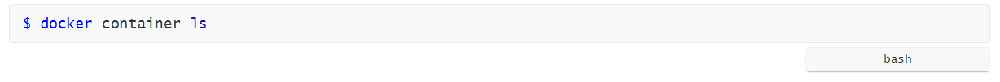

### 문서작업이 편해지는 마크다운

저는 최근 몇년 전부터 마크다운을 이용하여 문서들을 정리하고 보관하고 있습니다. 예를 들면 ``제품메뉴얼``, ``설계자료``, ``제가 새로 배우는 개념들`` , ``어떤 프로그램 설치과정``,  ``개인적인 일상`` 등등 마크다운으로 작성하고 있습니다.

### 이 글이 전하고 싶은 내용

제가 적는 글은 **마크다운 사용법에 대해서 말씀 드리진 않습니다**. 사용법에 대한 내용들은 다른 블로그에서도 많은 자료를 찾아보실 수 있으십니다. 기술블로그에 글을 올릴 때에 마크다운이 장애물이 되어서는 안된다고 생각하기에 블로그를 처음 시작하시는 분들이나 이미 시작하고 계신분들에게 조금 더 편하게 사용하실 수 있게 제가 경험했던 내용들을 공유드리고 도움이 되셨으면 합니다.

### Typora

 Typora는 마크다운 에디터로써 다음과 같은 이점을 제공합니다.

* 이미지복사가 쉽다
* 마크다운에 대한 문서작성이 굉장히 쉽다

저는 문서 작성시 이미지를 많이 사용합니다. ``vscode`` 플러그인을 통해 처음 사용하였었습니다만 이미지복사에 대한 불편함이 제일 크게 다가왔습니다. 하지만 Typora는 단순히 이미지 복사를 통해 이미지 폴더 및 이미지를 저장해주는 편의성이 있습니다.

### 사용법

#### 1. Header

```bash
CTRL + 1 : H1
CTRL + 2 : H2
CTRL + 3 : H3
CTRL + 4 : H4
```

#### 2. 소스코드

\`\`\`문자뒤에 사용할 언어를 입력하면 다음과 같이 표기됩니다



#### 3. 표

```bash
CTRL + T
```

#### 4. 인용문

```bash
문장의 제일 앞에 >를 붙여주면 됩니다.
```

#### 5. 이미지 복사 붙여넣기

블로그를 운영하면 문서작성시 이미지를 복사하여 특정폴더에 넣어주어야 됩니다. Typora는 이점을 쉽게 구성할 수 있습니다.

이미지를 복사하여 문서툴에 ``CTRL+C`` ``CTRL+V``로 붙여넣게 되면 기본적으로 로컬디렉토리에 복사되게 됩니다.

* 이미지 복사 붙여넣기

* 문서 경로 지정하기


>  저는 집에서만 블로그 작성 목적으로 사용하기에 특정경로를 고정으로 지정하였습니다.
>
>  복사 이미지 경로설정으로 로컬과 웹에 이미지 저장을 편하게 사용하기 위해서는 다음과 같은 경로에서 마크다운을 작성하셔야됩니다.
>
>  kyh0703.github.io/_posts/Blog


#### 6. 순서도

설계문서 작성 시 순서도 작성이 필요한 경우들이 있습니다. 마크다운은 아래와 같이 순서도를 제공합니다.

```bash
$


### 결론

Typora는 확실히 마크다운을 작성하기에 많은 도움을 줍니다. 제가 언급하지 않은 내용들은 공식홈페이지를 통해 찾아 보실 수 있습니다. 그 외에 ``docsify``를 통한 매뉴얼 페이지 구성 및 마크다운 문서를 통하여 많은 활용을 하실 수 있습니다. 이 글을 읽으시면서 마크다운 작성에 고민이시면 꼭 Typora를 추천드립니다!


> 참조 문서
>
> https://mermaid-js.github.io/mermaid/#/
