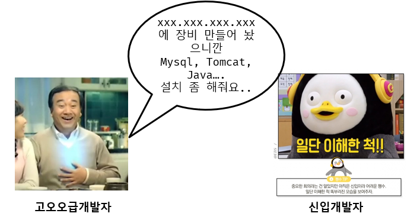
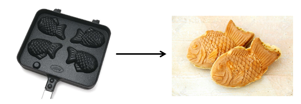
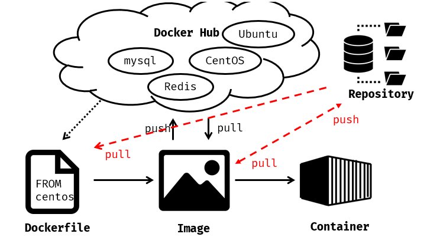

#### 도커에 컨테이너는 어떻게 만들어지는가?

지난 시간에 도커의 개념과 도커가 어떻게 이루어지는지에 대해 간략하게나마 말씀드렸었습니다. 우리는 환경들을 기록하기 위해 **도커파일**을 만들고 그 환경들을 **이미지**라 부르게 됩니다. 또한 그 이미지들을 가지고 **컨테이너**를 만들게 됩니다. 이런 일련의 과정들을 이해하기 위해 아래의 그림을 한번 살펴보겠습니다.



회사에서나 학교에서 개발장비를 구축하게 되면 위와 같은 상황이 많이 발생합니다. 여기서 위에 고급개발자가 말하고 있는 명령어들을 ``도커파일``이라고 보시면 됩니다. 



다음 그림을 보시면 자바책에서 많이 보시던 그림이실텐데요. 마찬가지로 도커에서는 저 붕어빵 틀이 ``이미지`` 그리고 만들어진 붕어빵은 ``컨테이너``라고 보시면 됩니다. 이제 우리는 어떤 구성을 통해 컨테이너를 구성 할 수 있는지 알 수 있었는데요. 실제로 도커파일을 어떻게 작성해야되나에 대해 말씀드릴려고 합니다.

### Dockerfile

도커파일은 아래와 같이 생겼습니다. 제가 실제 구성하여 사용하고 있는 도커파일이며 간략히 설명드릴려고 합니다.

```dockerfile
ARG ALPINE_VERSION
ARG GO_VERSION
FROM alpine:${ALPINE_VERSION} as protoc_base
RUN apk add --no-cache build-base curl cmake autoconf libtool git zlib-dev linux-headers
RUN mkdir -p /out

FROM protoc_base as protoc_builder
ARG GRPC_VERSION
RUN apk add --no-cache automake ninja && \
    git clone --recursive --depth=1 -b v${GRPC_VERSION} https://github.com/grpc/grpc.git /grpc && \
    ln -s /grpc/third_party/protobuf /protobuf && \
    mkdir -p /grpc/cmake/build && \
    cd /grpc/cmake/build && \
    cmake \
    -GNinja \
    -DBUILD_SHARED_LIBS=ON \
    -DCMAKE_INSTALL_PREFIX=/usr \
    -DCMAKE_BUILD_TYPE=Release \
    -DgRPC_INSTALL=ON \
    -DgRPC_BUILD_TESTS=OFF \
    ../.. && \
    cmake --build . --target plugins && \
    cmake --build . --target install && \
    DESTDIR=/out cmake --build . --target install

ARG GO_VERSION
FROM golang:${GO_VERSION}-alpine${ALPINE_VERSION} as go_builder
RUN apk add --no-cache build-base curl git
```

#### FROM

먼저 Dockerfile을 만들기에 앞서 ``FROM`` 명령어를 통해 Base이미지를 선택해주셔야 됩니다. Base이미지란 centos같이 OS이미지가 될 수도 있고 어떤 특정 언어를 빌드 할 수 있는 이미지 일 수도 있습니다. git과 같이 도커도 dockerhub가 따로 있으며 공개적으로 올라온 이미지들을 로컬에 pull하여 이미지를 사용 할 수 있으며, 공개하지 않을 이미지들은 마찬가지로 dockerhub나 개인적인 리포지토리를 구성하여 도커 이미지들을 보관 할 수 있습니다.



#### ARG

빌드를 위한 명령어로써 도커파일 내부에서만 사용가능합니다. BASE이미지에 대한 버전을 빌드 시 입력하기 위해 사용합니다.

#### LABEL

이미지 버전 정보, 작성자등 정보를 기술하는 명령어 입니다.

#### WORKDIR

컨테이너 내부에서 작업 할 디렉토리를 의미합니다.

#### USER

유저를 생성하였을 경우 지정한 유저로 전환합니다.

```dockerfile
RUN useradd kyh0703
USER kyh0703
```

#### COPY

호스트OS에 있는 파일을 복사하기 위해 사용됩니다.

#### ADD

ADD는 COPY와 동일하게 컨테이너 안 경로로 파일을 복사하지만 로컬 파일/디렉토리 대신 URL을 사용가능하며 소스에서 대상으로 직접 tar파일을 추출할 수도 있습니다. 

> 도커 공식문서에서는 이미지크기로 인하여 ADD를 권장하지 않습니다. 해당 기능은 COPY 명령어 후에 wget 및 curl로 대체가 가능하기에 저의 경우에는 특별히 ADD 명령어를 따로 구성하지 않습니다.

#### RUN

이미지 구성을 위한 명령어를 입력합니다. ``&&`` 해당 문자가 뒤에 붙은 경우 그 전 단계가 성공하여야만 다음 단계로 진행됩니다.

#### ENV

환경변수로써 컨테이너 특성상 설정파일(conf) 들을 읽어서(fopen) 처리하지 않습니다. 모든 설정파일에 내용들은 환경변수로 구성하게 됩니다.

#### EXPOSE

외부로 노출 시킬 포트를 입력합니다.

#### CMD

컨테이너가 실행될 때 명령어입니다.

#### ENTRYPOINT

entrypoint.sh을 직접 지정하며, 컨테이너가 실행될 때 변경되지 않을 명령이 수행되도록 지정합니다.

### 마치며

오늘은 도커파일을 구성하는 명령어들을 알아봤습니다. 컨테이너는 프로세스와 마찬가지로 종료되면 컨테이너 안에 있던 내용들은 사라지게 됩니다. 하지만 빌드 시 명령어에 대한 레이어는 남아있으며 존재하면 그 과정을 생략하게 됩니다. 예를 들자면 Image build시 ``RUN``명령어를 통과하게 되면 다음 빌드에 변경사항이 없을 시 생략합니다.  도커 파일을 이해하기 위해서는 기존에 있던 환경을 도커파일로 구성해보는 방식이 제일 빠릅니다. 다만 도커파일 구성 시 한번에 명령어를 구성하시지 말고 명령어를 분리하여 단계별로 진행하시면 훨씬 더 수월 할 것입니다.
