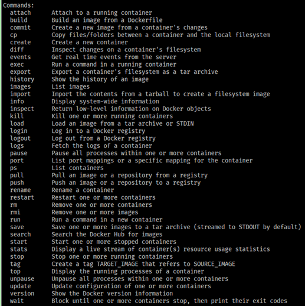

#### 간단하게 배우는 도커 사용법

새로운 도구를 익히기 위해서는 각 도구들의 명령어들을 익힐 필요가 있습니다. 물론 통합 툴에서 지원하는 UI모드를 가지고 쉽게 사용할 수 있지만 저는 대부분 직접 명령어를 입력하여 사용하는 편입니다. 오늘은 제가 도커 명령어를 좀 더 친근하게 기억 할 수 있었던 방법을 기술하려 합니다.

먼저 도커 명령어들은 **리눅스에서 사용하는 명령어들과 많이 닮아있습니다.** 그래서 리눅스를 쉽게 다루시는 분들은 편하게 사용 하실 수 있습니다. 예를 들어서 도커에서 실행중인 컨테이너를 보는 명령어는 ``docker ps``라는 명령어를 통해 확인하실 수 있는데요. 리눅스에 실행중인 프로세스를 확인하는 명령어를 본을 따서 만들어진 것을 확인 할 수 있습니다. 그렇면 어떻게 하면 우리는 명령어를 좀 더 쉽게 기억할 수 있을까요?

#### 도커 명령어 구성 방식

```bash
$ docker [대상] [명령어] [-옵션]
```

도커 명령어는 위와 같이 ``대상`` , ``명령어``, ``옵션`` 으로 구성되어 있습니다. 그래서 우리는 확인해야 될 대상과 기본적인 리눅스 명령어들만 알면 쉽게 연상하여 확인할 수 있습니다. 아래 예시를 통해 간단하게 알아보겠습니다. 

#### IMAGE

```bash
# docker 이미지 조회
$ docker image ls

# docker 이미지 빌드
$ docker image build -t helloworld:latest .

# docker 이미지 push
$ docker image push helloworld:latest

# docker 이미지 Pull
$ docker image pull centos:7
```

#### CONTAINER

```bash
# docker 컨테이너 조회 (docker ps와 동일함)
$ docker container ls

# docker 컨테이너 상세조회
$ docker container ls -al

# docker 컨테이너 실행
$ docker container run -it helloworld:latest /bin/bash
```

#### HELP

도커 명령어에 ``--help``키워드를 붙이면 해당 명령어에 대한 상세 설명 및 옵션을 확인 할 수 있습니다.

```bash
$ docker help
$ docker image --help
$ docker continaer --help
```



#### 마치며

제가 언급드린 내용 이외에 도커에는 많은 명령어들이 있습니다. 여러 명령어들을 확인해보시면 제가 설명드린 명령어 구성방식과 꼭 동일하게 구성되어 있지 않고 약어로 조금 더 편하게 쓸 수 있게 따로 구성되어 있습니다. 사람마다 다르겠지만 제 경험상 쉽게 기억하기 위해선 약어보다는 **명령어에 대한 대상**을 기억했던 것이 사용할 때 큰 도움이 되었습니다:)