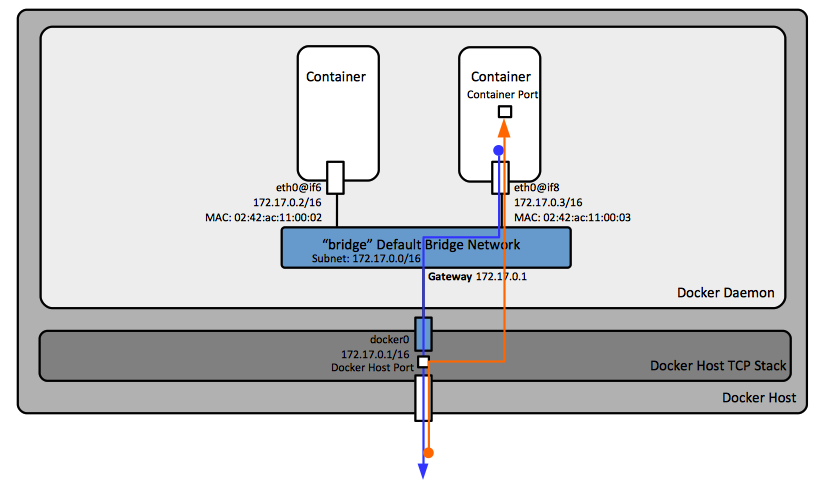
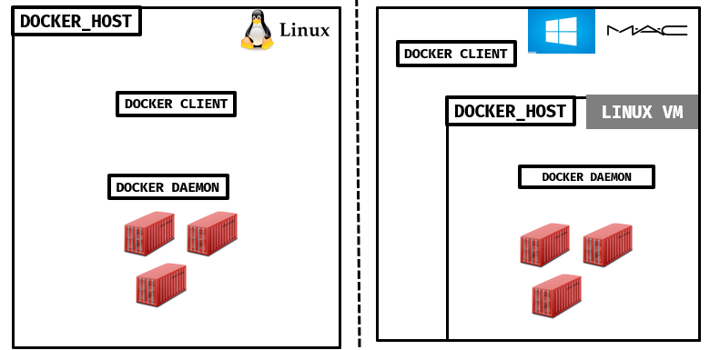

#### 도커와 호스트

우리는 컨테이너가 독립적인 공간으로써 네트워크가 분리되어 있는 영역임을 알 수 있었습니다.  그렇다면 호스트 영역과 컨테이너 내부를 어떻게 연결 할 수 있을까요? 도커는 호스트와 다음 영역을 공유 할 수 있습니다!

* 포트
* 볼륨

좀 더 자세하게 알아보기 위해 각각 구조들을 확인해보겠습니다.

#### 포트

호스트와 포트 연결에 앞서 도커 네트워크를 간단하게 이해 할 필요가 있습니다.

도커는 다음과 같이 4가지의 네트워크 모드를 지원합니다.

```bash
$ docker run --net=NETWORK_TYPE
```

* bridge

  

  bridge는 기본모드입니다. 따라서 컨테이너 생성 시 네트워크 타입에 대한 옵션을 주지 않는다면 기본으로 bridge모드로 선택되게 됩니다. 도커를 실행하게 되면 ``docker0 bridge``가 생기게 되고 우리가 컨테이너를 생성하게 되면 각각의 독립적인 공간(Namespace)가 만들어지고 ``docker0 bridge`` 에 연결됩니다. 그래서 우리는 ``docker0 bridge`` 통해 호스트 네트워크와 연결이 가능합니다. 아래와 같은 명령어를 통해 컨테이너 생성 시 호스트와 포트를 공유 할 수 있습니다.

  ```bash
  # docker container run --it -p [호스트포트]:[컨테이너포트]
  $ docker container run --it -p 4000:4000 test:latest /bin/bash
  ```

* host

  host모드는 문자그대로 호스트와 네트워크를 공유합니다. 따라서 컨테이너 실행시 포트를 따로 매핑 시킬 필요가 없습니다. **하지만 호스트네트워크 모드는 리눅스만 사용가능하다는 점 꼭 기억하세요.** 

  

  위에 그려진 예시를 보게 되면 리눅스에 경우 호스트와 도커엔진이 바로 연결되어 있음을 확인할 수 있습니다. 반면 Window의 경우 리눅스 가상머신(VM)위에 도커 호스트가 올라가게 됨으로 호스트 네트워크를 같이 공유할 수 없습니다.

* container

  이미 생성되어 있는 컨테이너와 네트워크를 공유합니다.

  ```bash
  $ docker container run [생성된 컨테이너]
  ```

* none

  네트워크를 지정하지 않습니다.

#### 볼륨

네트워크와 마찬가지로 컨테이너는 격리된 공간입니다. 앞서 언급된듯이 우리가 만든 컨테이너는 종료시에 가지고 있던 데이터들도 사라집니다. 어떻게 하면 컨테이너가 생성한 데이터를 받아올 수 있을까요?

* 볼륨지정

  도커를 생성할 때 우리는 호스트 영역을 공유할 수 있도록 옵션을 줄 수 있습니다. 지정한 디렉토리는 마운트되어 컨테이너가 호스트의 데이터를 사용하거나 저장할 수 있습니다.

```bash
# docker container run --it -v [호스트볼륨]:[컨테이너볼륨] /bin/bash
$ docker container run --it -v /etc/gitlab-runner/toml.config:/var/etc/gitlab-runnet /bin/bash
```

* SSH 복사

  도커로 작업된 파일들을 호스트 영역으로 ssh를 통해 전달 할 수도 있습니다.

#### 마치며

제가 언급드린 내용은 최소한의 컨테이너를 이해하고  사용하기 위함입니다. 좀 더 자세히 확인하시기 위해서는 공식문서 및 다른 블로그를 참고해주세요:)

