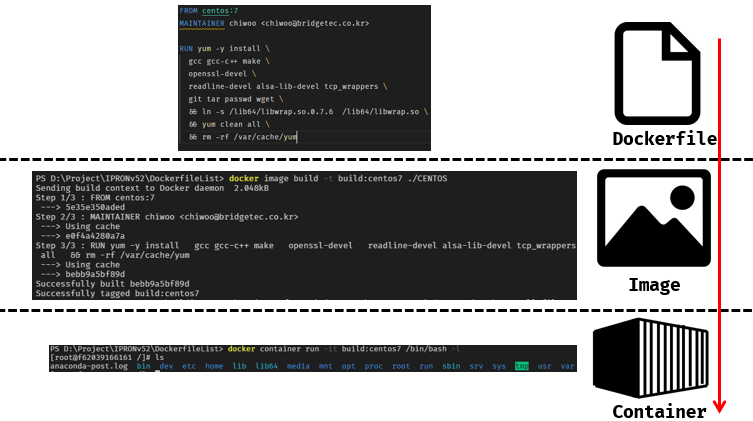

### 개발 환경 구성을 할 수 있다!



이제 우리는 위와 같이 일련의 과정을 통해서 컨테이너들을 생성할 수 있게 되었습니다!  그래서 열심히 이미지를 작성하여 개발환경을 ``코드화``하였고 언제든지 컨테이너를 실행할 수 있게 준비했습니다. 여기서 개발환경에는 ``mysql``, ``postgresql``, ``rabbitmq``가 필요하다고 가정해봅시다. 이 때 실행한 컨테이너를 다시 재기동해야되는 상황이 일어났습니다. 어떻게 해야될까요?

1. docker container 정지

```bash
$ docker container stop mysql
$ docker container stop postgresql
$ docker container stop rabbitmq
```

2. docker  container 정지 확인

```bash
$ docker container ls -al
```

3. docker container 실행

```bash
# mysql
$ docker container run –d \
	--name mysql \
	–p 3306:3306 \
	-e MYSQL_ALLOW_EMPTY_PASWORD=true \
	 mysql:5.7
	 
# postgresql
$ docker container run -d \
	--name postgresql \
	-v my_dbdata:/var/lib/postgresql/data \
	-p 54320:5432 postgres:11 
	
# rabbitmq
$ docker container run -d \
	--name rabbitmq \
	-v {PWD}/shared/rabbitmq/1/data:/var/lib/rabbitmq/mnesia \
	-p 5672:5672 \
	-p 15672:15672 \
	-e RABBITMQ_DEFAULT_USER=guest \
	-e RABBITMQ_DEFAULT_PASS=guest \
	-e RABBITMQ_DEFAULT_VHOST=/ \
	-e RABBITMQ_ERLANG_COOKIE=1234
```

컨테이너를 정지시키고 컨네이너가 정지된지를 정확히 인지한 후에 다시 컨테이너를 실행했던 명령어를 통해 다시 실행 할 수 있습니다. **정말 비효율적이지 않나요?** 도커에서는 일련의 반복과정을 ``docker-compose`` 를 사용하면 쉽게 구성 할 수 있습니다! 그러면 어떻게 쉽게 적용할 수 있는지 알아보겠습니다.

### docker-compose

 ``docker-compose``를 사용하면 크게 다음과 같은 기능을 사용할 수 있습니다.

* 도커 빌드

* 도커 컨테이너 실행
* 도커 컨테이너들을 묶어서 실행
* 도커 컨테이너 종료
* 도커 단일 및 개별 네트워크 사용 설정

예시에 개발환경 도커 컨테이너 명령어를 yml파일로 변경하면 아래와 같습니다. ``docker-compose.yml``을 통해 우리는 컨테이너를 쉽게 재기동하면서 사용 할 수 있게 됩니다.

```yaml
version: '3.2'

services:
  mysql:
    image: mysql:5.7
    container_name: mysql
    ports:
      - "3306:3306"
     environment:
      - MYSQL_ALLOW_EMPTY_PASWORD=true
      
  postgresql:
    image: postgres:11
    contianer_name: postgresql
    volumes:
      - my_dbdata:/var/lib/postgresql/data
     ports:
       - "54320:5432"

  rabbit:
    image: rabbitmq:3-management-alpine
    container_name: rabbit
    hostname: rabbit
    volumes:
      - ./shared/rabbitmq/1/data:/var/lib/rabbitmq/mnesia
    ports:
      - "5672:5672"
      - "15672:15672"
    environment:
      - RABBITMQ_DEFAULT_USER=guest
      - RABBITMQ_DEFAULT_PASS=guest
      - RABBITMQ_DEFAULT_VHOST=/
      - RABBITMQ_ERLANG_COOKIE=1234
```

>docker-compose는 컨테이너 실행 명령어들을 yml파일 형식으로 지정합니다.
>
>공식 홈페이지를 통해 버전 별 사용법을 확인 하실 수 있습니다.
>
>https://docs.docker.com/compose/

#### 설치

1. 다운로드

```bash
sudo curl -L "https://github.com/docker/compose/releases/download/1.29.2/docker-compose-$(uname -s)-$(uname -m)" -o /usr/local/bin/docker-compose
```

2. 권한 부여

```bash
 sudo chmod +x /usr/local/bin/docker-compose
```

3.  docker-compose 확인

```ba
docker-compose --version
```

4. 실패 시 경로 부여

```bash
sudo ln -s /usr/local/bin/docker-compose /usr/bin/docker-compose
```

#### 컨테이너 실행

```bash
# -d: 백그라운드로 실행
# -f: compose 파일지정
# --build: build 태그가 있을경우 이미지를 빌드함
$ docker-compose up 
```

#### 컨테이너 종료

```bash
$ docker-compose down
```

#### 컨테이너 로그

```bash
$ docker-compose logs -f 
```

### 마치며

컨테이너를 생성 시마다 여러 옵션을 지정해주는건 참으로 번거로운 일입니다. 저의 경우에는 ``docker-compose`` 통해 개발 시 이미지 빌드 및 컨테이너를 실행할 때 사용하며, 또한 네트워크 구성이 필요한 개발 환경을 빠르게 만들 수 있어 유용하게 사용하고 있습니다. 

도커에 관련된 내용은 여기까지로 구성하였습니다. 다음에는 오케스트레이션 도구인 쿠버네티스에 대해 기술할려고 합니다. 

궁금하시거나 잘못된 점 있으면 댓글로 남겨주세요! 감사합니다(__)

