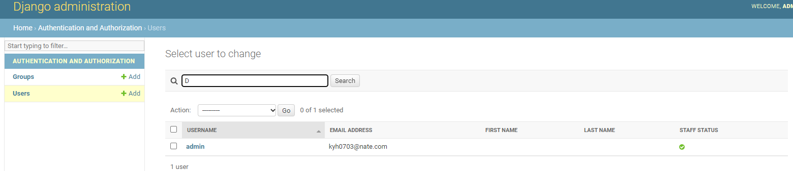
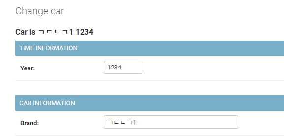

### Model

#### Command

- makemigration
  - 데이터베이스에 변경 사항을 적용할 명령 집합을 생성하지만, 실제로 반영하지는 않음
  - 데이터베이스에 대한 변경을 수행하지 않음

```bash
app
  * migrations
      * 0001_inital.py
```

- migrate
  - 반영
- sqlmigrate
  - 애플리케이션 이름과 특정 마이그레이션 Python 파일과 연결된 번호를 실행하면 실제로 SQL코드를 만들어준다.
  - 실제로 마이그레이션을 진행하지는 않음

#### Step

1. 프로젝트 초기화 `migrate command`
2. 앱 생성 및 모델 생성
3. Register app in `INSTALLED_APPS` in setting.py
4. `makemigration`
5. `migrate`

#### Data Entry Create

> IPython 설치하면 좋다.. 굳

- Create Object and `.save()` : 정의 후 생성

- `objects.create()`: 정의와 동시 생성

  `

- `objects.bulk_create()`: 한번에 여러개


#### Shell


**.all()**

```bash
$ Partient.objects.all()
```

**Get & Filter**

```bash
$ Partient.objects.get(pk=1)#  단일객체
$ Partient.objects.filter(last_name='smith')
```

**Query Set**

```python
from django.db.models import Q
# | or, & and
Patient.objets.filter(Q(last_name='smith') & Q(age=40))
```

#### Field lookups

[링크](https://docs.djangoproject.com/en/4.0/ref/models/querysets/#field-lookups)

```bash
Model.objects.filter(name__startswith="S")
```

```bash
Patient.objects.filter(age__in=[20,30,40]).all()
Patient.objects.filter(last_name__startswith='s')
```

#### Validator

```python
from django.db import models
from django.core.validators import MaxValueValidator, MinLengthValidator

# Create your models here.
class Patient(models.Model):
    first_name = models.CharField(max_length=30)
    last_name = models.CharField(max_length=30)
    age = models.IntegerField(
        validators=[MinLengthValidator(0), MaxValueValidator(120)]
    )
    heartrate = models.IntegerField(
        default=60, validators=[MinLengthValidator(1), MaxValueValidator(300)]
    )

    def __str__(self):
        return f"{self.last_name}, {self.first_name} is {self.age} years old."
```

#### CSRF(Cross Site Request Forgery)

사이트간 요청 위조

해킹 시도가 없는지 `Dango`로 구현되는 매커니즘

```html
  <form action="" method="POST">
    <!---->
    <div class="form-group">
      <label for="pk">PK Number:</label>
      <input class="form-control" type="text" id="pk" name="pk" />
    </div>
    <input class="btn btn-primary" type="submit" />
  </form>
```

#### Admin

```bash
python manage.py createsuperuser
```



**admin page에 테이블 넣기**

* admin.py

```python
from django.contrib import admin
from cars.models import Car
# Register your models here.
admin.site.register(Car)
```

* custom

```python
from django.contrib import admin
from cars.models import Car

# Register your models here.
class CarAdmin(admin.ModelAdmin):
    fields = ["year", "brand"] # 순서 변경
#    fieldsets = [
#        ("TIME INFORMATION", {"fields": ["year"]}),
#        ("CAR INFORMATION", {"fields": ["brand"]}),
#    ]

admin.site.register(Car, CarAdmin)

```


