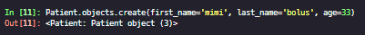
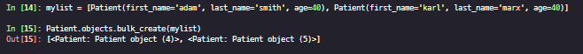
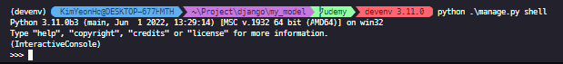

### Model

#### Command

* makemigration
  * 데이터베이스에 변경 사항을 적용할 명령 집합을 생성하지만, 실제로 반영하지는 않음
  * 데이터베이스에 대한 변경을 수행하지 않음

```bash
app
  * migrations
      * 0001_inital.py
```

* migrate
  * 반영
* sqlmigrate
  * 애플리케이션 이름과 특정 마이그레이션 Python 파일과 연결된 번호를 실행하면 실제로 SQL코드를 만들어준다.
  * 실제로 마이그레이션을 진행하지는 않음

#### Step

1. 프로젝트 초기화 `migrate command`
2. 앱 생성 및 모델 생성
3. Register app in `INSTALLED_APPS`  in setting.py
4. `makemigration`
5. `migrate`

#### Data Entry Create

> IPython 설치하면 좋다.. 굳

* Create Object and `.save()` : 정의 후 생성

* `objects.create()`: 정의와 동시 생성

  `

* `objects.bulk_create()`: 한번에 여러개



#### Shell 



**.all()**

```bash
$ Partient.objects.all()
```

