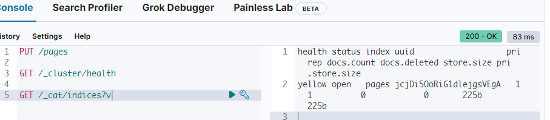
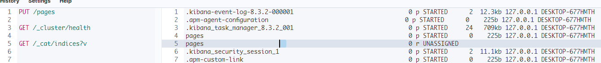
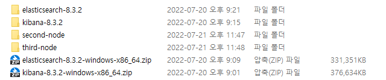

### Sharding

* 인덱스를 별도의 조각으로 나누는 방법

* 클러스터나 노드가 아닌 인덱스에서 `Sharding`이 수행 됨

* 수평으로 데이터 볼륨을 확장함

  > 예를 들면 500GB 두개의 노드가 있을 때 하나의 인덱스가 600GB이다. 그러면 노드기준이면 적합하지 않기에 인덱스로 샤딩함

**장점**

* 인덱스의 크기를 늘린다
* 인덱스의 처리량을 늘린다.

#### Elasticsearch Shard

* 각 샤드는 `Apache Lucene` 인덱스이다.
  * 이는 5개의 `shard`가 있는 Elasticsearch 인덱스는 5개의 `Lucene`로 구성됨
* 한개의 샤드가 저장할 수 있는 문서 수의 제한은 20억 개이다.
* 여러개의 샤드로 확장 함 (수십억개의 문서를 저장 가능)

* 쿼리를 분산 할 수 있음
  * 이는 검색 쿼리가 동시에 여러 사드에서 실행 될 수 있다. (성능업)
* 버전 7.0 이전에는 인덱스 한개의 5개의 샤드가 생성되었으나 불필요하여 7.0이후부터는 기본 적으로 단일 샤드로 생성된다.

* 샤드 수를 늘려야 하는 경우 `Split API`를 사용한다.
* 샤드 수를 줄이기 위해서는 `'Shrink API`를 사용한다.

> 7.0 이전 버전은 샤드 수를 줄일 수가 없다.

**그렇다면 몇 개의 샤드를 사용하는게 좋을까?**

그때 그때 마다 다르다. 내부 노드의 수, 노드의 용량, 클러스터 등등 많은 변수가 있기에 상황이 다르지만 적절하게 `5개의샤드`를 선택하는 것이 좋으며, 그렇지 않으면 기본 값으로 사용한다.

### Replication

**샤드가 저장된 노드가 고장 난 경우 디스크 오류가 발생했다면?**

답: 데이터가 손실 된다.

#### Replication

* `Elasticsearch`는 기본적으로 샤드 복제를 지원한다.

* 기본적으로 0이다.

* 복제도 인덱스 수준에서 구성된다. `복제본 샤드`라고 한다.
* 인덱스를 생성할 때 각 샤드의 복제본 수를 선택 할 수 있다(기본값 1)

복사본: `Replica shards`

한번 이상 복제된 샤드: `primary shard`

복제그룹: `Replica shards` + `primary shard`

**프로덕션환경**

데이터의 역할에 따라 위험을 감수 할지 결정

중요한 시스템 일 경우 두번 이상 복제 필요

* 이는 보호를 위해 최소 2개의 노드가 필요함을 의미

#### Snapshots

`ElasticSearch`는 특정 인덱스 또는 전체클러스터를 스냅샷을 찍을 수 있다.

스냅샷은 특정 시점으로 돌리는 것이다.

#### 레플리카샤드

레플리카 샤드는 그 자체로 완전한 기능을 하는 인덱스이기에 동시에 쿼리할 수 있음.

* Elasticsearch가 자동으로 쿼리가 실행될 위치 및 병렬화를 자동으로 조정
* 각 샤드에 대해 병렬로 쿼리하여 인덱스 처리량을 높임

> 레플리카가 할당되지 않았기에 `Yellow`로 뜸

#### 키바나

kibana index는 `auto_expand_relicas`라는 설정으로 구성되어 있기에, 값이 `0-1`이다. 동적으로 변경됨.

### 로컬 클러스터 노드 추가

1. 압축을 풀어 두 개를 더 만든다. 이 때 기존의 생성된 폴더를 복사하지 않도록 주의한다.

2. `config/elasticsearch.yml` 수정
