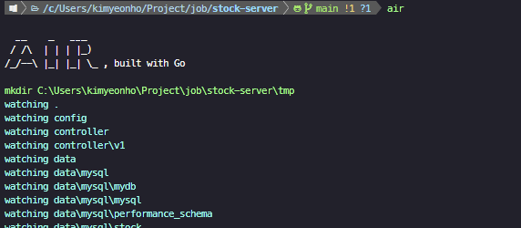
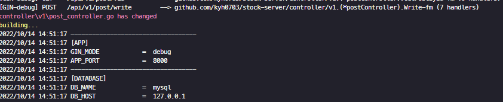

golang으로 `백엔드서버`를 개발하다보면 빌드 때문에 답답한 경우가 많습니다. `nodemon`을 직접 설정하여 `hot-reload`나 `live-reload`를 가능하게 할 수 있으나, golang에서 지원하는 패키지를 사용하고 싶었습니다. 🤣

최근에 검색하다 발견한 패키지를 공유드립니다.

### Air

[GITHUB]([github.com/cosmtrek/air](https://github.com/cosmtrek/air))

Air라는 패키지로서, `live-reload`도구로써 파일 변경 시 재 빌드 후 프로세스를 재기동시켜줍니다.



1. 명령어 실행

```bash
$ air
```

2. 변경 확인 후 재 빌드 확인


