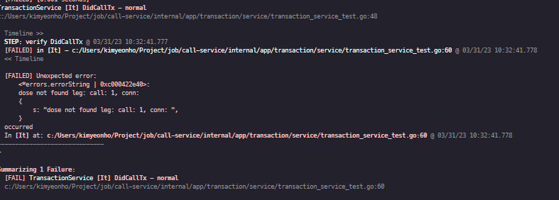

`golang`에서 오픈소스들을 보다 보면 go언어에 자유로움으로 인해 각기 다른 테스트 프레임워크를 사용합니다. 

`golang`에서는 대체로 다음과 같이 프레임워크들을 사용합니다.

* Go Standard testing package
* Testify
* GoConvey
* ginkgo
* goblin

저는  `ginkgo`에 관해 다뤄보도록 하겠습니다.

[ginkgo문서](https://onsi.github.io/ginkgo/)

필요한 패키지들을 다운 받고 먼저 테스트 할 디렉토리에서 아래 명령어를 입력하여 줍니다!

```bash
$ ginkgo bootstrap
```

그러면 아래 와 같이 파일이 하나 생기게 되는데요.


파일을 열어보면 다음과 같이 구성되어 있습니다.

```go
package service_test

import (
	"testing"

	. "github.com/onsi/ginkgo/v2"
	. "github.com/onsi/gomega"
)

func TestService(t *testing.T) {
	RegisterFailHandler(Fail)
	RunSpecs(t, "Service Suite")
}
```

해당 파일에 테스트 코드를 기술하는 방식이 있고, 아니면 `generate`명령을 통해 테스트 파일을 하나 더 생성 할 수 있습니다.

이 문서에서는 해당 testfile을 생성합니다.

```bash
$ ginkgo generate transaction_service
```

```bash
package service_test

import (
	"context"

	. "github.com/onsi/ginkgo/v2"
	. "github.com/onsi/gomega"
	
	...
)

var _ = Describe("TransactionService", func() {
	It("DidCallTx - normal", func() {
		mock := new(CallsServiceMock)
		req := &callpb.DidCallRequest{}
		txService := service.ProvideTransactionService(
			nil,  // rpc.Rpc
			mock, // calls.Service
			nil,  // number.Service
			nil,  // endpoint.Repository
		)

		By("verify DidCallTx")
		data, err := txService.DidCallTx(context.Background(), req)
		Expect(err).NotTo(HaveOccurred())
		Expect(data.FirstCall.ID).To(Equal("1"))
		Expect(data.FirstCall.CallType).To(Equal(string(ievent.CallTypeNormal)))
	})
}
```

`Describe, It, BeforeEach` 등 많은 키워드를 제공합니다.  `gingo watch` 명령어를 통해서 `jest`와 같이 모니터링 하며 코드를 작성 할 수도 있습니다.



테스트 코드를 작성하는데 도움이 되면 좋겠습니다.
