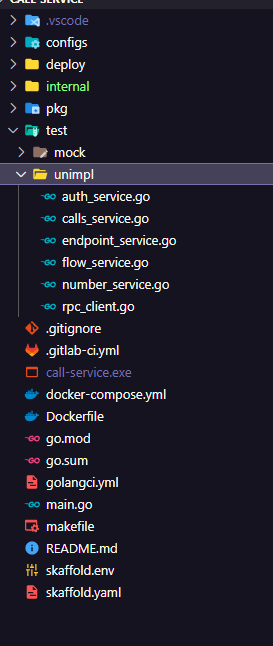

`golang`에서 mock을 만들 때 만들어진 패키지를 통해 `go generate`명령어를 통해 만들 수도 있으나, `interface`를 다 구현해야된다는 단점이 있습니다. 그래서 테스트 코드 작성 시 직관적으로 필요한 부분만 구성하고 싶을 때 사용하는 방법을 공유드립니다.

#### 프로젝트 레이아웃



#### unimpl 구성

```go
package unimpl

import "gitlab.com/ipron-cloud/call-service/internal/app/auth"

type AuthServiceUnImpl struct{}

// CheckSpam implements auth.Service
func (*AuthServiceUnImpl) CheckSpam(tenant string, ani string) (bool, error) {
	panic("unimplemented")
}

// CheckTodayHoliday implements auth.Service
func (*AuthServiceUnImpl) CheckTodayHoliday(tenant string, ani string) (bool, error) {
	panic("unimplemented")
}

var _ auth.Service = (*AuthServiceUnImpl)(nil)
```

#### 사용 시

```go
type CallsServiceMock struct {
	callssvc.CallsServiceUnImpl
}

func (m *CallsServiceMock) AllocCall(ctx context.Context, id string) (*entity.Call, error) {
    .. 필요한 method만 작성 가능
}
```

#### 설명

`umimplement`를 구성하여 해당 서비스에 대한 내용을 자동완성으로 만듭니다. 그 다음 사용할 `mock`구조체에서 임베드하여 필요한 부분만 기술하여 테스트를 진행합니다.
