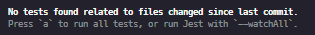

#### Jest

- Facebook에서 만든 `js`테스팅 프레임워크

- jest는 기본적으로 `test.js`로 끝나거나, `__test__` 디렉터리 안에 있는 파일들은 모두 테스트 파일로 인식

- 시작은 언제나 `expect`로 시작한다.

```js
// Matcher string
expect(element.textContext).toBe("hello");

// Match Length
expect(elementsArray).toHaveLength(7);
```

#### Jest-dom

- jest-dom은 create-react-app과 제공되며 함께 설치됨
- `src/setupTest.js`를 사용해 각 테스트 전에 `jest-dom`을 가져온다.
- `DOM` 베이스 기반

#### RTL(React Testing Library)

- rendering components into virtual DOM
- searching virtual DOM
- interfacting with virtual DOM

#### Jest Watch Mode

- 마지막 `git commit` 이후 변경된 파일만 실행



#### TDD(Test-Driven Developer)

- 테스트 코드를 작성하고 코드를 작성하여 테스트를 통과함

**red-green**

- 테스트에 실패하는 레드 테스트를 먼저 실행하고
- 통과하는 테스트로 그린 테스트를 작성
