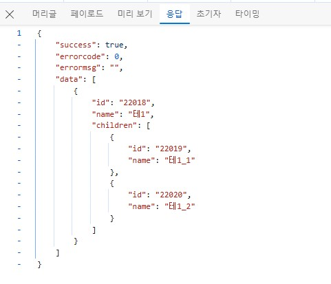
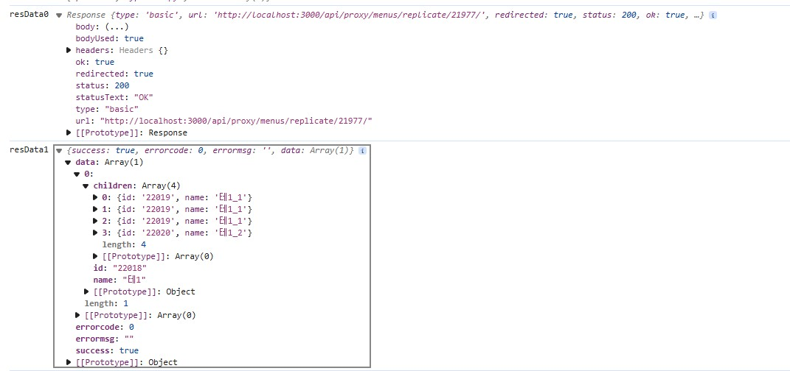
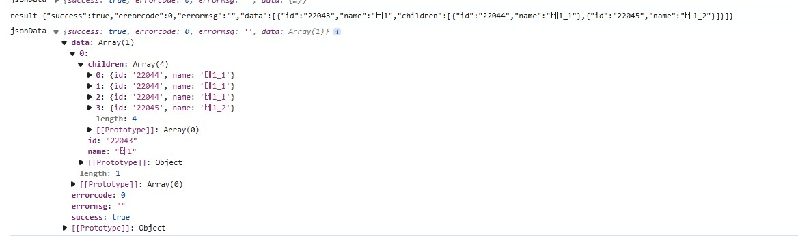

## Javascript JSON 파싱 시 children 필드 이상현상

이번에 개발을 진행하면서 JSON.parse와 관련하여 이상한 현상이 있어 공유 드릴려고 글을 적습니다.

이번에 트리구조를 개발하면서 `react-arborist`라이브러리를 사용하여 개발중에 있었습니다.

트리구조는 다음과 같습니다.

```typescript
export interface SimpleTreeData {
  name: string
  children?: MenuTree[]
}
```

backend로부터 `react-arborist`에 트리 데이터를 만들어서 받는 도중에 발생한 문제로 backend는 chiildren에 Array(2)를 넣어서 보냈습니다.

하지만 fetch이후 받았을 때 children이 Array(4)로 찍히면서 문제가 발생했습니다

### 문제현상





브라우저의 네트워크 탭에서 보면 정확히 두개로 보이나 실제 Fetch하고 나서 이후의 데이터를 보면 4개로 보이게 됩니다.

정확히 확인하기 위해서 `getReader()`를 통해 바이트를 가져와 확인하였습니다.

```typescript
try {
    const reader = res.body?.getReader()
    const decoder = new TextDecorder('utf-8')
    let result = ""
    while (true) {
        const { done, value } = await reader!.read()
        if (done) {
            break
        }
        result += decoder.decode(value, { stream: true })
	}
    console.log("result", result)
    const jsonData = JSON.parse(result)
    console.log("jsonData", jsonData)
    return jsonData.data
} catch (error) {
    console.error(error)
}
```

적어서 확인해보니 JSON.parse()를 하는 순간 4개로 늘어난 걸 확인하였습니다.



결국 `children`을 다른 이름으로 변경 후 해당 현상이 해결 됐습니다.

이름이 변경되서 treeData로 변경할 때 다시 변환해서 넣어야 되었습니다.

## 마치며

혼자서 찾아보다가 내용이 없어서 올려봅니다. 위의 내용 혹시 자세히 알고 계신 분들은 알려주시면 감사합니다(__)
