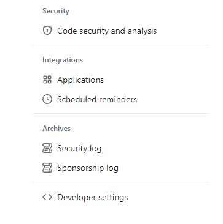
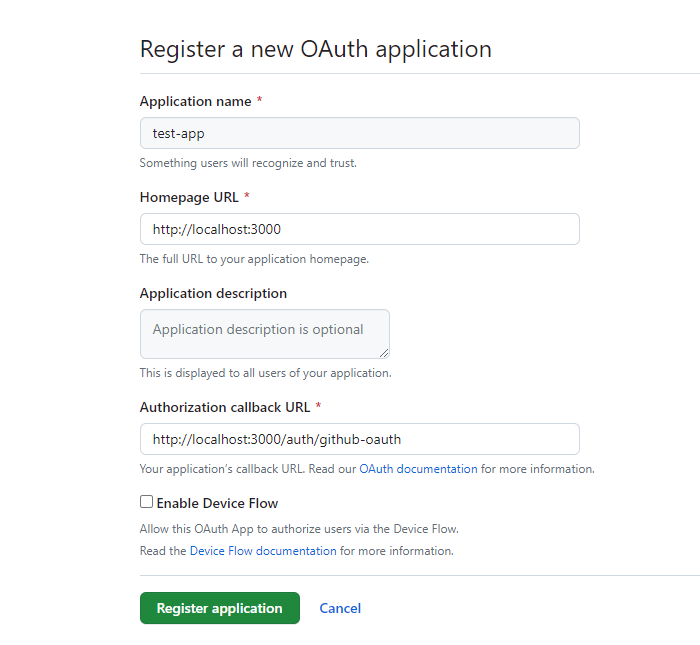
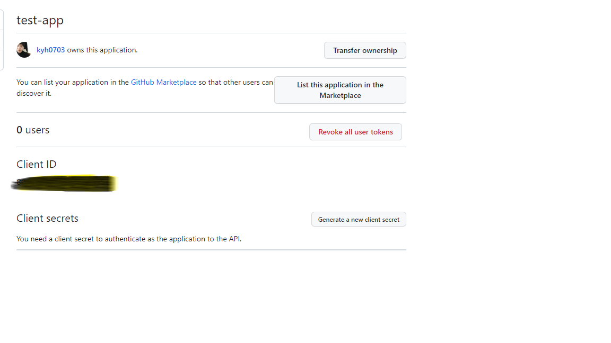

## OAuth란

기존에 플랫폼 환경에 인증된 정보를 가지고 인증과 권한을 획득하는 것입니다

> 기존 사용자들은 새로운 아이디를 등록하여 가입하는 것에 번거로움을 느끼고 있기에 기존에 플랫폼에 등록된 정보들을 사용하여 로그인을 시도합니다.


1. 먼저 `frontend`에서 플랫폼 인증 서버로 인증요청을 시도합니다.
2. 플랫폼 인증서버는 로그인 페이지를 제공합니다.
3. `user`는 해당 페이지에 권한 설정을 확인 한 후 로그인을 합니다.
4. 인증 요청 전 미리 저장한 `redirect_uri`를 통해  페이지에 `code`를 전달하여 줍니다.
5. `frontend`는 `backend`로 해당 `code`를 전달합니다.
6. `backend`는 `code`를 통해 지정된 `uri`를 통해 `access_token`을 받아옵니다.
7. `backend`는 발급 받은 `access_token`을 가지고 `user`정보를 받아올 수 있는 `uri`에 요청합니다.
8. `backend`는 `user`정보를 취득합니다

> `frontend`에서 `code`를 먼저 취득하였으나,  `backend`에게 `Get`요청만 보낸 후 `backend`에서 위의 일련의 과정일 진행 할 수도 있습니다. 
>
> 과정은 동일합니다.

## 예시

저는 아래 예시에서 다음과 같이 구현하였습니다.

* front: nextjs
* back: nestjs

### Github

1. 먼저 다음과 같이 `github`에 로그인하여 접속한 후 `Developer settings`에 접근합니다.



2. 접근 후 `OAuth Apps`에 접근하여 내가 등록할 앱을 지정하여 줍니다.

> 여기서 홈페이지는 로컬 개발환경이기에 localhost를 지정하였습니다. 또한 callbackURL에 경우 사용자가 인증한 후 code가 넘어오는 페이지를 말합니다.



3. `clientID`와 `client Secret`을 받아옵니다.

> 해당 값들은 환경변수로 저장하여 줍니다.



### Front

1. 인증 페이지로 `code`를 받기 위해 요청합니다.

```tsx
export default function SigninPage() {
  const router = useRouter()
  
  // 구글 로그인 버튼 클릭 시 실행
  const handleSigninWithGithub = () => {
    const url = 'https://github.com/login/oauth/authorize'
    const query = qs.stringify({
      client_id: process.env.NEXT_PUBLIC_GITHUB_CLIENT_ID,
      redirect_uri: process.env.NEXT_PUBLIC_GITHUB_REDIRECT_URL,
    })
    router.push(url + '?' + query)
  }
}
```

2. `Redirect URL`페이지를 구현하여 받은 `code`값을 `backend`에 요청합니다

```tsx
'use client'

import { useSearchParams, useRouter } from 'next/navigation'
import { useEffect } from 'react'
import { styled } from 'styled-components'
import Spinner from '@/components/atoms/Spinner'

const SpinnerWrapper = styled.div`
  text-align: center;
`

export default function GithubOAuthPage() {
  const router = useRouter()
  const searchParams = useSearchParams()

  useEffect(() => {
    const getToken = async () => {
      const code = { code: searchParams.get('code') }
      const url = '/api/proxy/auth/github-oauth'
      const response = await fetch(url, {
        method: 'POST',
        headers: { 'Content-Type': 'application/json' },
        body: JSON.stringify(code),
      })
      console.log(response)
      router.push('/')
    }

    getToken()
  }, [])

  return (
    <SpinnerWrapper>
      <Spinner isAutoCentering />
    </SpinnerWrapper>
  )
}
```

### Back

`nodejs`의 경우 `passport`를 통해 쉽게 구현할 수 있습니다만, 해당 라이브러리를 사용하지 않고 아래는 직접 구현하였습니다.

컨트롤러

```js
@Controller('auth')
export class AuthController {
  private readonly logger: Logger = new Logger(AuthController.name)
  constructor(private authService: AuthService) {}

  @HttpCode(HttpStatus.CREATED)
  @Post('/github-oauth')
  githubOAuth(@Body() githubOAuthDto: GithubOAuthDto) {
    this.logger.debug('github: ')
    return this.authService.signinWithGithub(githubOAuthDto)
  }
}
```

서비스

```js
@Injectable()
export class AuthService {
  private readonly logger: Logger = new Logger(AuthService.name)

  async signinWithGithub(
    githubOAuthDto: GithubOAuthDto,
  ): Promise<GithubUserData> {
    const { code } = githubOAuthDto
    const getTokenUrl: string = `https://github.com/login/oauth/access_token`
    const request = {
      code,
      client_id: this.configService.get<string>('oauth.githubId'),
      client_secret: this.configService.get<string>('oauth.githubSecret'),
    }

    const response: AxiosResponse = await axios.post(getTokenUrl, request, {
      headers: {
        accept: 'application/json',
      },
    })
    if (response.data.error) {
      throw new UnauthorizedException('깃허브 인증을 실패하였습니다')
    }

    const { access_token } = response.data
    const getUserUrl: string = 'https://api.github.com/user'
    const { data } = await axios.get(getUserUrl, {
      headers: {
        Authorization: `token ${access_token}`,
      },
    })

    const { login, avatar_url, name, bio, company } = data

    const githubInfo: GithubUserData = {
      githubId: login,
      avatar: avatar_url,
      name,
      description: bio,
      localtion: company,
    }

    return githubInfo
  }
}
```

## 마치며

직접 구현하시는 것보다 `passport`라이브러리를 사용하시는게 더 좋습니다만, `golang`이나 다른 언어에 경우 직접 구현이 필요하기에 구현 내용을 정리하였습니다.

매커니즘은 거의 다 비슷하기에 플랫폼에서 제공하는 문서를 읽어보시면 구현에 어려움이 없으실 겁니다👍
