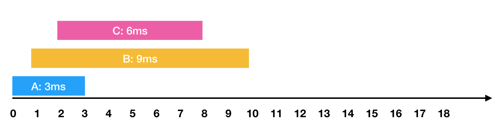
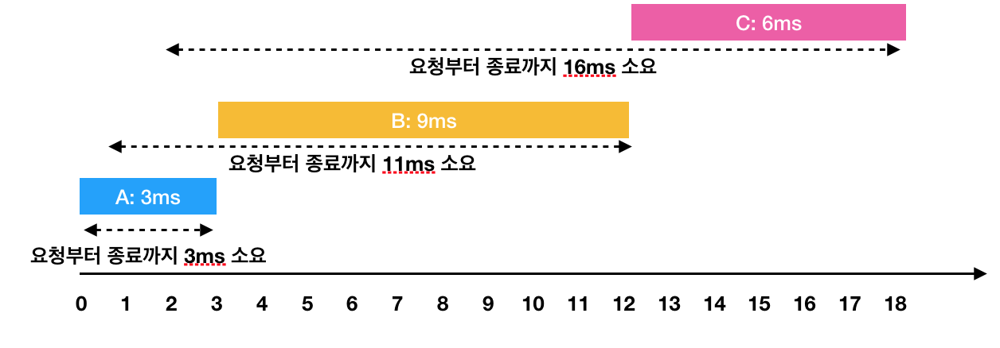

#### 문제

하드디스크는 한 번에 하나의 작업만 수행할 수 있습니다. 디스크 컨트롤러를 구현하는 방법은 여러 가지가 있습니다. 가장 일반적인 방법은 요청이 들어온 순서대로 처리하는 것입니다.

예를들어

```
- 0ms 시점에 3ms가 소요되는 A작업 요청
- 1ms 시점에 9ms가 소요되는 B작업 요청
- 2ms 시점에 6ms가 소요되는 C작업 요청
```

와 같은 요청이 들어왔습니다. 이를 그림으로 표현하면 아래와 같습니다.


한 번에 하나의 요청만을 수행할 수 있기 때문에 각각의 작업을 요청받은 순서대로 처리하면 다음과 같이 처리 됩니다.


```
- A: 3ms 시점에 작업 완료 (요청에서 종료까지 : 3ms)
- B: 1ms부터 대기하다가, 3ms 시점에 작업을 시작해서 12ms 시점에 작업 완료(요청에서 종료까지 : 11ms)
- C: 2ms부터 대기하다가, 12ms 시점에 작업을 시작해서 18ms 시점에 작업 완료(요청에서 종료까지 : 16ms)
```

이 때 각 작업의 요청부터 종료까지 걸린 시간의 평균은 10ms(= (3 + 11 + 16) / 3)가 됩니다.

하지만 A → C → B 순서대로 처리하면


```
- A: 3ms 시점에 작업 완료(요청에서 종료까지 : 3ms)
- C: 2ms부터 대기하다가, 3ms 시점에 작업을 시작해서 9ms 시점에 작업 완료(요청에서 종료까지 : 7ms)
- B: 1ms부터 대기하다가, 9ms 시점에 작업을 시작해서 18ms 시점에 작업 완료(요청에서 종료까지 : 17ms)
```

이렇게 A → C → B의 순서로 처리하면 각 작업의 요청부터 종료까지 걸린 시간의 평균은 9ms(= (3 + 7 + 17) / 3)가 됩니다.

각 작업에 대해 [작업이 요청되는 시점, 작업의 소요시간]을 담은 2차원 배열 jobs가 매개변수로 주어질 때, 작업의 요청부터 종료까지 걸린 시간의 평균을 가장 줄이는 방법으로 처리하면 평균이 얼마가 되는지 return 하도록 solution 함수를 작성해주세요. (단, 소수점 이하의 수는 버립니다)

##### 제한 사항

- jobs의 길이는 1 이상 500 이하입니다.
- jobs의 각 행은 하나의 작업에 대한 [작업이 요청되는 시점, 작업의 소요시간] 입니다.
- 각 작업에 대해 작업이 요청되는 시간은 0 이상 1,000 이하입니다.
- 각 작업에 대해 작업의 소요시간은 1 이상 1,000 이하입니다.
- 하드디스크가 작업을 수행하고 있지 않을 때에는 먼저 요청이 들어온 작업부터 처리합니다.

##### 입출력 예

| jobs                     | return |
| ------------------------ | ------ |
| [[0, 3], [1, 9], [2, 6]] | 9      |

##### 입출력 예 설명

문제에 주어진 예와 같습니다.

- 0ms 시점에 3ms 걸리는 작업 요청이 들어옵니다.
- 1ms 시점에 9ms 걸리는 작업 요청이 들어옵니다.
- 2ms 시점에 6ms 걸리는 작업 요청이 들어옵니다.

#### c++

```c++
#include <string>
#include <vector>
#include <queue>

using namespace std;

struct cmp {
    bool operator()(pair<int, int> lhs, pair<int, int> rhs)
    {
        if (lhs.first == rhs.first)
            return lhs.second > rhs.second;
        return lhs.first > rhs.first;
    }
};

int solution(vector<vector<int>> jobs) {
    int answer = 0;
    priority_queue<pair<int, int>, vector<pair<int, int>>, cmp> pq;
    for (auto job : jobs)
        pq.push(make_pair(job[0], job[1]));

    int ms = 0;
    priority_queue<pair<int, int>, vector<pair<int, int>>, greater<pair<int, int>>> wait_queue;
    int completed = 0;
    while (completed != jobs.size())
    {
        while (!pq.empty())
        {
            pair<int, int> work = pq.top();
            if (ms < work.first)
                break;
            pq.pop();
            wait_queue.push(make_pair(work.second, work.first));
        }

        if (wait_queue.empty())
        {
            ms++;
            continue;
        }

        pair<int, int> work = wait_queue.top();
        wait_queue.pop();
        int work_ms = work.first;
        int req_ms = work.second;
        answer += ms - req_ms + work_ms;
        ms += work_ms;
        completed++;
    }

    return answer / jobs.size();
}
```

#### 마치며

소스코드가 또 깁니다.. 흠.. 일단 자꾸 한글과 싸우고 있는 제 자신을 발견하는데 눈물이 나네요😭😭😭