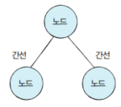

## DFS / BFS

#### 그래프

DFS, BFS 문제를 풀기 위해서는 그래프에 대해 이해하여야 합니다.

그래프는 ``노드``와 ``간선``으로 표현되며, ``노드 == 정점``과 같은 말입니다.

노드와 간선을 이해하기 위해서는 다음과 같은 그림을 보시면 도움이 됩니다.



노드와 간선이 연결되어 있어야 인접할수 있습니다.

그래프를 표현하는 방식은 아래와 같이 두가지 방식으로 표현됩니다.

* 인접 행렬: 2차원 배열로 그래프의 연결 관계를 표현하는 방식
* 인접 리스트: 리스트로 그래프의 연결관계를 표현하는 방식

문제를 통해 해당 그래프를 그려볼 수 있습니다.

```bash
# 백준 1260 문제 예시
입력
첫째 줄에 정점의 개수 N(1 ≤ N ≤ 1,000), 간선의 개수 M(1 ≤ M ≤ 10,000), 탐색을 시작할 정점의 번호 V가 주어진다. 다음 M개의 줄에는 간선이 연결하는 두 정점의 번호가 주어진다. 어떤 두 정점 사이에 여러 개의 간선이 있을 수 있다. 입력으로 주어지는 간선은 양방향이다.

4(정점의 개수) 5(간선의 개수) 1(시작점)
1 2
1 3
1 4
2 4
3 4

1 - 2
| \ |
3 - 4

인접 행렬
    1  2  3  4
   -----------
1 | 0  1  1  1
2 | 1  0  0  1
3 | 1  0  0  1
4 | 1  1  1  0

인접 리스트
1 | 2 -> 3 -> 4
2 | 4
3 | 4
```

|            | 인접행렬                | 인접리스트           |
| ---------- | ----------------------- | -------------------- |
| 메모리     | 메모리 사용량 높음      | 메모리 사용량이 적음 |
| 속도       | 정보를 얻는 속도가 빠름 | 순회하면서 조회      |
| 예시       | graph[1] [4]  == true   | 1\| 2 -> 3 -> 4      |
| 시간복잡도 | O(N²)                   | O(N+E)               |

### DFS(Depth-First Search)

DFS는 ``깊이우선탐색``으로 그래프에서 깊은 부분을 우선적으로 탐색하는 알고리즘입니다.

최대한 깊이 내려간 뒤, 더이상 깊이 갈곳이 없을 경우 옆으로 이동합니다.


> 출처 https://developer-mac.tistory.com/64

* 모든 노드를 방문하고자 하는 경우에 이 방법을 선택함

* 깊이 우선 탐색(DFS)이 너비 우선 탐색(BFS)보다 좀 더 간단함

* 검색 속도는 너비 우선 탐색(BFS)에 비해서 느림

**동작과정**

1. 탐색 시작 노드를 스택에 삽입하고 방문 처리를 한다.
2. 스택의 최상단 노드에 방문하지 않은 인접 노드가 있으면 그 인접 노드를 스택에 넣고 방문 처리를 한다. 방문하지 않은 인접 노드가 없으면 스택에서 최상단 노드를 꺼낸다.
3. ``2번``의 과정을 더 이상 수행할 수 없을 떄까지 반복한다.

### BFS(Breadth-First Search)

BFS는 ``넓이우선탐색``으로 가까운 노드부터 탐색하는 알고리즘입니다.

최대한 넓게 이동한 다음, 더 이상 갈 수 없을 때 아래로 이동합니다.


>출처 https://developer-mac.tistory.com/64
>
>

* 두 노드 사이의 최단 경로를 찾고 싶을 때 선택함

**동작방식**

1. 탐색 시작 노드를 큐에 삽입하고 방문 처리를 한다.

2. 큐에서 노드를 꺼내 해당 노드의 인접 노드 중에서 방문하지 않은 노드를 모드 큐에 삽입하고 방문 처리를 한다.
3. ``2번``의 과정을 더 이상 수행할 수 없을때까지 반복한다.

#### 비교

| DFS(깊이우선탐색)                                 | BFS(너비우선탐색)                       |
| ------------------------------------------------- | --------------------------------------- |
| 현재 정점에서 갈 수 있는 점들까지 들어가면서 탐색 | 현재 정점에 연결된 가까운 점들부터 탐색 |
| 스택                                              | 큐                                      |
