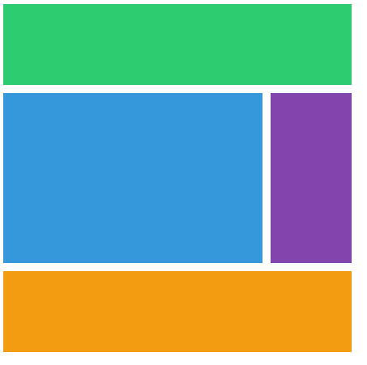
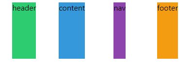
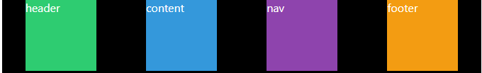
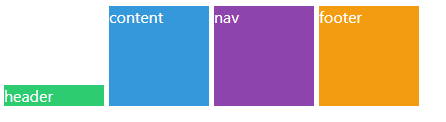
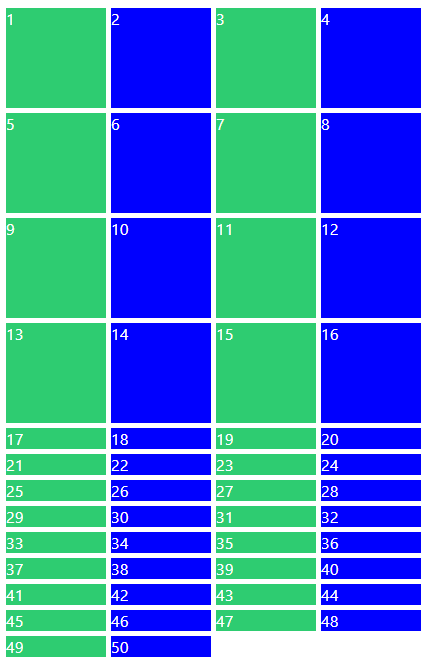
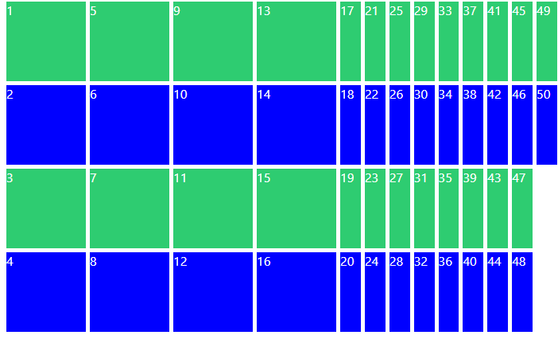
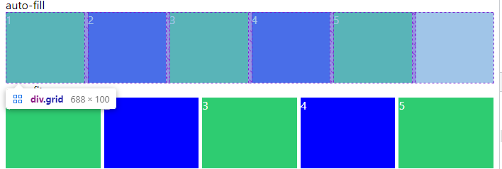
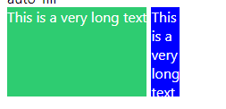

### GRID

#### Grid

`flex-box`로 `grid`를 구성하기에는 어렵다.

부모에 적용하여 grid를 조정

* grid-template-column
* grid-template-row
* column-gap
* row-gap
* gap

#### grid-template-areas

`grid-area`로 영역을 지정한 후 부모영역 `grid`에서 다음과 같이 구도를 배치할 수 있다.`grid-area`를  비우기위해선 `.`지정

```css
.grid {
    display: grid;
    grid-template-columns: auto 200px;
	grid-template-rows: 100px repeat(2, 200px) 100px;
    grid-template-areas:
    "header header header header"
    "content content . nav"
    "content content . nav"
    "footer footer footer footer";
}

.header {
    grid-area: header
}
```

#### grid-column-start & grid-column-end

쉬운방법: `grid-column {start} / {end} `

더 쉬운방법: `grid-column: 1 / -1;` 

> -1은 끝을 의미

더 더 쉬운 방법: `grid-column: span 4;`

> span은 하나의 cell을 의미

```css
.grid {
  display: grid;
  gap: 10px;
  grid-template-columns: repeat(4, 100px);
  grid-template-rows: repeat(4, 100px);
}

.header {
  background: #2ecc71;
  grid-column: 1 / 5; /* 아래와 동일하다. */
  grid-column-start: 1;
  grid-column-end: 5;
}

.content {
  background: #3498db;
  grid-column: 1 / -2;
  grid-row: span 2;
}

.nav {
  background: #8344ad;
  grid-row: span 2;
}

.footer {
  background: #f39c12;
  grid-column-start: 1;
  grid-column-end: 5;
}
```



#### Line Naming

라인에 이름을 붙일 수 있다.

> 니꼬는 잘 안씀

```css
.grid {
  display: grid;
  gap: 10px;
  grid-template-columns: [first-line] 100px [second-line] 100px [third-line] 100px [fifth-line] 100px;
  grid-template-rows: repeat(4, 100px);
}

.content {
  grid-column: first-line / -2;
}
```

* repeat안에 이름을 넣고 싶으면?

```css
.grid {
    /* row의 라인 이름을 "sexy-line" 으로 지정 */
    /* 아래 라인은 로우 라인 전체를 sexy-line */
    grid-template-rows: repeat(4, 100px [sexy-line]);
}
```

#### Grid Template

`fr`: fraction은 사용가능한 공간을 의미

모바일에선 `px`단위가 아닌 `%`나 `fr`로 잡아야된다.

> repeat(4, 1fr) grid에서 사용한공간을 1fr로 잡는다.

```css
.grid {
    /* 할수 있는 만큼 공간을 차지하고 4번 똑같이 나눈다 */
    grid-template-columns: repeat(4, 1fr);
}
```

**이걸쓰자**

```css
.grid {
  display: grid;
  gap: 5px;
  height: 50vh;
  grid-template:
    "header header header header" 1fr
    "content content content nav" 2fr
    "footer footer footer footer" 1fr / 1fr 1fr 1fr 1fr;
}

.header {
  background-color: #2ecc71;
  grid-area: header;
}
.content {
  background-color: #3498db;
  grid-area: content;
}
.nav {
  background-color: #8e44ad;
  grid-area: nav;
}
.footer {
  background-color: #f39c12;
  grid-area: footer;
}
```

> grid-template에서 repeat는 적용되지 않는다!

#### Place Items

**justify-items(수평) & align-items(수직)**

shortcuts: `place-items: y x`

* 기본값 `stretch`
  * grid 부모는 자식들을 늘려서 영역을 채운다.
* item은 cell중에 하나

* 예시

  * center

  

  * start


> 잘 안 쓸꺼 같다.

#### Place content

**justify-content(수평) & align-contents(수직)**

shortcuts: `place-content: y x`



* content는 전체 grid를 컨트롤(flex-box를 생각하면 간단하다.)
* 기본값 `strech`

#### Auto Columns and Rows

**align-items & justify-items**

shortcuts: `place-self: y x`

* 자식들에게 개별 적용

```css
.grid {
  color: white;
  height: 50vh;
  display: grid;
  gap: 5px;
  grid-template-columns: repeat(4, 100px);
  grid-template-rows: repeat(4, 100px);
}

.header {
  background-color: #2ecc71;
  align-self: end;
}
```



**vscode tip**

as-is

```html
<div class="grid">
    .item*20>{$}
</div>
```

to-be

```html
<div class="grid">
    <div class="item">1</div>
    <div class="item">2</div>
    <div class="item">3</div>
    <div class="item">4</div>
    <div class="item">5</div>
    <div class="item">6</div>
    <div class="item">7</div>
    <div class="item">8</div>
    <div class="item">9</div>
    <div class="item">10</div>
    <div class="item">11</div>
    <div class="item">12</div>
    <div class="item">13</div>
    <div class="item">14</div>
    <div class="item">15</div>
    <div class="item">16</div>
    <div class="item">17</div>
    <div class="item">18</div>
    <div class="item">19</div>
    <div class="item">20</div>
</div>
```

**grid-auto-row**

가져올려고 했던 데이터보다 더 많은 데이터를 가져왔을때 아래와 같은 현상 발생



* `grid-auto-row`은 내가 지정한 열과 행보다 더 많은 `grid`가 있을때 기본값을 지정해준다.

```css
.grid {
  color: white;
  display: grid;
  gap: 5px;
  grid-template-columns: repeat(4, 100px);
  grid-template-rows: repeat(4, 100px);
  grid-auto-rows: 100px;
}
```

**grid-auto-flow & grid-auto-column**

* `grid-auto-flow`는 추가된 `grid`를 늘린 방향을 지정한다.

```css
.grid {
  color: white;
  display: grid;
  gap: 5px;
  grid-template-columns: repeat(4, 100px);
  grid-template-rows: repeat(4, 100px);
  grid-auto-flow: column;
}
```



이때 `column`의 기본값을 넣어주기 위해 `grid-auto-column`을 사용한다.

#### minmax

`element`가 가능한 엄청 크길 원하는데, 동시에 엄청 작게 되진 않길 원할떄 쓸 수 있음

```css
.grid {
  color: white;
  display: grid;
  gap: 5px;
  grid-template-columns: repeat(4, minmax(100px, 1fr));
  grid-template-rows: repeat(4, 100px);
}
```

#### auto-fit auto-fill

* `repeat()` 에서만 사용

```css
.grid {
  color: white;
  display: grid;
  gap: 5px;
  grid-template-columns: repeat(4, minmax(100px, 1fr));
  grid-template-rows: repeat(1, 100px);
}

.grid:first-child {
  grid-template-columns: repeat(auto-fill, minmax(100px, 1fr));
}

.grid:last-child {
  grid-template-columns: repeat(auto-fit, minmax(100px, 1fr));
}
```



**auto-fill**

* column을 만들어 주는 역할

* 가능한한 많은 컬럼
* 뒤에 여백에도 만들어줌

**auto-fit**

* 현재 `div`를 가져와서 다 늘려서 채움
* 빈 공간없이 채움

#### min-content max-content

* 크기를 의미함

* min-content는 박스를 만들면 content가 작아질 수 있는 만큼 작아지고

  max-content가 필요한만큼 크게 만드는것

```css
.grid {
  color: white;
  display: grid;
  gap: 5px;
  grid-template-columns: max-content min-content;
  grid-auto-rows: 100px;
  margin-bottom: 30px;
}
```



#### 반응형을 이렇게?

```css
.grid {
  display: grid;
  grid-template-columns: repeat(5, minmax(max-content, 1fr));
  grid-template-columns: repeat(auto-fill, minmax(min-content, max-content));
  grid-template-columns: repeat(auto-fit, minmax(20px, max-content));
}
```
