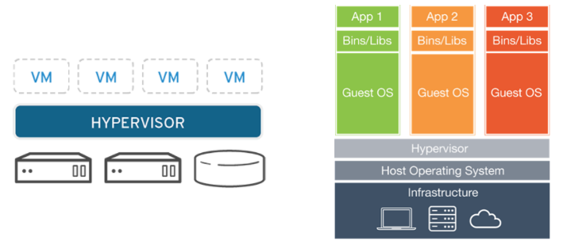
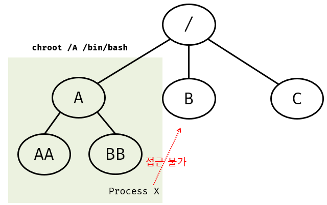
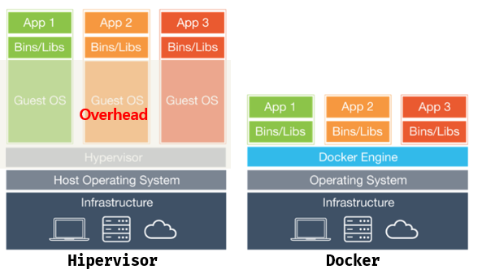
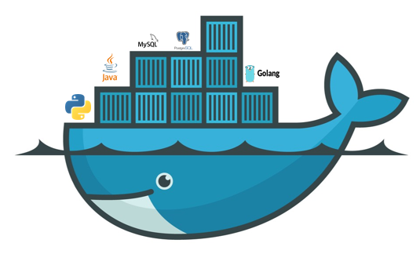

### docker 너는 무엇인가!

제가 처음 도커를 접했던 건 회사에 새로운 차장님이 입사하시면서부터 였습니다. 그분께서는 저에게 "앞으로 도커를 많이 사용하게 될 것이고, 도커에 대해서 공부해두면 나중에 큰 도움이 될것이다."라고 말씀해주셨던게 아직 기억납니다. 그때 당시에 저는 도커의 대한 개념들이 하나도 없는 상태라 막연하게나마 도커를 써서 ``mysql``을 구동했구나! 라고만 이해했었습니다. 몇년이 지난 지금 쿠버네티스 서비스를 개발하고 있는 저는 그때 차장님처럼 내가 가진 걸 알려줄 수 있는 사람이 되자고 마음속으로 또 한번 다짐했습니다. 그래서 저는 이번에 도커에 대해서 말해볼려합니다!

#### container?

도커의 정의를 찾아보면 ``컨테이너기반의 오픈소스 가상화 플랫폼``이라고 정의되어있습니다. 여기서 컨테이너란 무엇일까요?

컨테이너는 ``코드, 런타임 환경, 시스템 도구, 라이브러리 등 소프트웨어``가 구동되기 위해 필요한 것입니다. 우리는 먼저 가상화플랫폼에 대해서 알아볼 필요가 있습니다. 가상화플랫폼을 어디서 경험해볼 수 있을까요? VMWare, VirtualBox, Xencenter등 가상화 프로그램을 통해서 경험을 해볼 수 있습니다. 앞서 얘기드린 프로그램들은 가상머신(VM)을 실행시키는 하이퍼바이저라고 합니다. 구조를 살펴보시면 다음과 같이 사용자OS를 기본으로 하이퍼바이저가 올라고 그 위에 가상머신이 올라가는것을 확인할 수 있습니다.



그러면 컨테이너 구조는 무엇일까요? 컨테이너를 이해하기서는 chroot라는 명령어를 기억하시면 많은 도움이 됩니다. chroot(Change Root Directory)는 문자그대로 루트 디렉토리를 변경하는 명령어입니다. 루트디렉토리를 변경하면 어떻게 될까요? 다음과 같이 chroot를 A디렉토리로 지정하게 되면 B로 접근이 불가능하게 됩니다.

```bash
$ chroot [새로운 루트 경로] [명령어]
```




chroot를 통해 격리된 공간을 구축할 수 있었고 발전을 통해 LXC(**L**inu**X** **C**ontinaer)라는게 탄생했습니다. LXC는 다음과 같이`` Namespace``와 ``Cgroup``이란  두가지 개념을 가지고 만들어집니다.

* **Namespace (격리된 공간을 제공)**
  * File System
  * Process
  * Network
  * IPC
  * Hostname
  * User
* **Cgroup (자원 배분)**
  * Memory
  * CPU
  * I/O
  * Network
  * Device

이쯤에서 아까 처음 설명드린 컨테이너의 정의를 다시 한번 보겠습니다.

>  컨테이너는 코드, 런타임 환경, 시스템 도구, 라이브러리 등 소프트웨어가 구동되기 위해 필요한 것들을 담는 것

과거 도커는 이 LXC를 통해 컨테이너 가상화를 구성하였으나, 현재는 LXC를 자체 라이브러리(libcontainer)로 변경하였습니다. 우리는 도커라는게 없는 기술을 새로 만들어 낸것이 아니고 기존에 사용하고 있던 가상화 기술들을 사용하기 쉽게 보편화하여 선두주자가 되었음을 확인할 수 있습니다.

#### 대체 이걸 왜 써야되는데?

어떤 니즈에 의해 가상서버가 필요하다고 가정해봅시다. 우리는 먼저 데이터베이스 버전, 톰캣버전, 자바버전 OS버전도 확인해야겠죠? 버전확인이 끝난 후 하이퍼바이저를 통해 가상머신(VM)을 올리게 됩니다. VM에 게스트OS를 설치해보신 경험이 있다면 OS설치가 마음먹은것처럼 빠르게 되지 않음을 알고계실겁니다. 우여곡절 끝에 Centos 설치 후에 네트워크를 지정하고 데이터베이스도 올리고 열심히 작업을 하게 됩니다. 근데 여기서 문제가 생깁니다. 저희가 설치한 centos가 다른 버전이였던거죠! 그러면 어떻게 할까요? 다시 처음부터 돌아가서 "삽질"을 시작하게 됩니다.

위에 경험들은 누구나 쉽게 경험해보신적 있으실겁니다. 그러면 컨테이너는 어떨까요?



> * 애플리케이션의 신속한 개발과 일관성
>   * 개발환경 구성시간이 필요없음
>   * 개발 / 테스트 / 운영 동일 구성
> * 응답성 있는 배포 및 확장
>   * 개발자 PC, 로컬서버, 클라우드 서버 관계없이 여러 환경에서 실행가능
> * 동일한 하드웨어에서 더 많은 작업 실행
>   * 기존 하이퍼바이저보다 빠르고 가벼우며 적은 리소스로 많은 작업을 수행가능


하이퍼바이저는 호스트OS 위에 게스트OS가 올라가게 됩니다. 그에 비해 Docker는 호스트OS 바로 위에 DockerEngine이 올라가게 되어 가볍습니다. 또한 구동속도 또한 아주 빠르게 진행됩니다. 이러한 이점으로 인해 놀라울 정도로 빠르게 환경을 구성할 수 있게 됩니다!



도커 생태계는 놀랍고 그안에 많은 컨테이너들이 존재하게 됩니다. 도커를 통해 **서버를 코드화**하여 여러가지 컨테이너들을 만들 수 있습니다.

### 마치며

오늘은 도커에 대한 개념에 대해 알아봤습니다. 다음 계시물에서는 실제 Dockerfile을 어떻게 사용하는지 알아볼려고합니다.

저의 경우 도커를 사용하면서 서버 통합, 개발환경 구성, CI/CD 등 환경구성이 필요할 때에는 docker를 통해서 대부분 해결합니다. 기존에 하이퍼바이저로 사용하고 있는 서버들을 한순간에 컨테이너로 변경한다는건 쉬운일은 아닙니다만 충분히 고려후에 변경하시면 좋은 경험을 얻으실 수 있습니다.