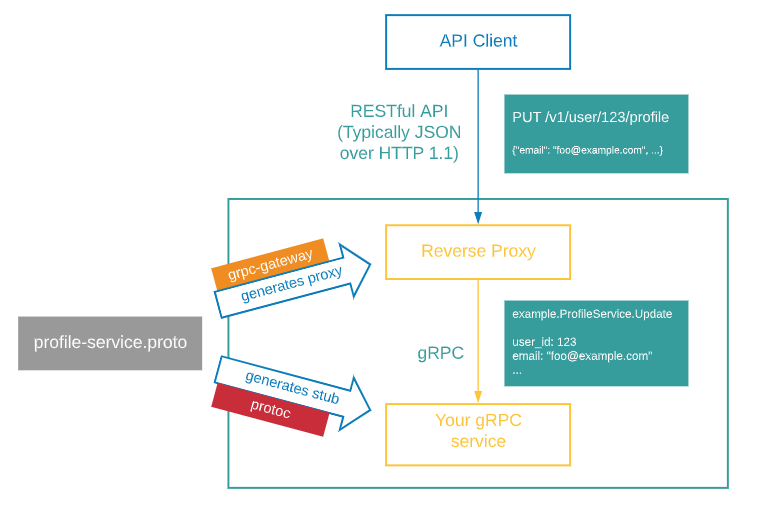

#### grpc-gateway



grpc-gateway는 간략하게 grpc와 http를 같이 사용하기 위한 플러그인입니다. 위의 형상대로 구성되어 있으며, production 환경에서 사용할 경우에 빌드환경을 하나의 도커 이미지로 만들어서 빌드환경을 통일합니다. 현재 문서에서는 공식 가이드대로 설치 과정을 기술하였습니다.:happy:

> **gRPC-gateway Doc**
>
> https://grpc-ecosystem.github.io/grpc-gateway/docs/development/

#### 사전 준비사항

* go get grpc-gateway

```bash
// go 버전에 따라 install로 설치
go get github.com/grpc-ecosystem/grpc-gateway/v2/protoc-gen-grpc-gateway
go get google.golang.org/protobuf/cmd/protoc-gen-go
go get google.golang.org/grpc/cmd/protoc-gen-go-grpc
```

* go mod init

```bash
go mod init github.com/myuser/myrepo
```

* directory

공식 문서에 디렉토리 구조를 보면 `google/api/annotion.proto`, `google/api/annotion.proto` 두개 파일이 존재하는 것을 확인 할 수 있습니다. 저는 아래 구조로 구성하지 않았으며 해당 프로젝트를 현재 디렉토리에 받아 구성하였습니다.

```bash
proto
├── google
│   └── api
│       ├── annotations.proto
│       └── http.proto
└── helloworld
    └── hello_world.proto
```

* git clone

`google/api/annotion.proto`, `google/api/annotion.proto` 프로젝트를 받아 오는 작업입니다.

```bash
git clone https://github.com/googleapis/googleapis.git
```

* proto

```protobuf
syntax = "proto3";

package helloworld;

import "google/api/annotations.proto";

// Here is the overall greeting service definition where we define all our endpoints
service Greeter {
  // Sends a greeting
  rpc SayHello (HelloRequest) returns (HelloReply) {
    option (google.api.http) = {
      post: "/v1/example/echo"
      body: "*"
    };
  }
}

// The request message containing the user's name
message HelloRequest {
  string name = 1;
}

// The response message containing the greetings
message HelloReply {
  string message = 1;
}
```

* build

`-I`옵션으로 git clone으로 받은 프로젝트를 `import`하는 것을 확인 하실 수 있습니다.

```bash
protoc -I ./googleapis-I ./proto --go_out ./proto --go_opt paths=source_relative --go-grpc_out ./proto --go-grpc_opt paths=source_relative --grpc-gateway_out ./proto --grpc-gateway_opt paths=source_relative ./proto/helloworld/hello_world.proto
```

#### 사용법

* grpc-gateway 포트와 다른 포트를 사용 할 경우

```go
package main

import (
	"context"
	"log"
	"net"
	"net/http"

	"github.com/grpc-ecosystem/grpc-gateway/v2/runtime"
	"google.golang.org/grpc"
	"google.golang.org/grpc/credentials/insecure"

	helloworldpb "github.com/myuser/myrepo/proto/helloworld"
)

// implement grpc method
type server struct {
	helloworldpb.UnimplementedGreeterServer
}

func NewServer() *server {
	return &server{}
}

func (s *server) SayHello(ctx context.Context, in *helloworldpb.HelloRequest) (*helloworldpb.HelloReply, error) {
	return &helloworldpb.HelloReply{Message: in.Name + " world"}, nil
}

func main() {
	// Create a listener on TCP port
	lis, err := net.Listen("tcp", ":8080")
	if err != nil {
		log.Fatalln("Failed to listen:", err)
	}

	// Create a gRPC server object
	s := grpc.NewServer()
	// Attach the Greeter service to the server
	helloworldpb.RegisterGreeterServer(s, &server{})
	// Serve gRPC server
	log.Println("Serving gRPC on 0.0.0.0:8080")
	go func() {
		log.Fatalln(s.Serve(lis))
	}()

	// Create a client connection to the gRPC server we just started
	// This is where the gRPC-Gateway proxies the requests
	conn, err := grpc.DialContext(
		context.Background(),
		"0.0.0.0:8080",
		grpc.WithBlock(),
		grpc.WithTransportCredentials(insecure.NewCredentials()),
	)
	if err != nil {
		log.Fatalln("Failed to dial server:", err)
	}

	gwmux := runtime.NewServeMux()
	// Register Greeter
	err = helloworldpb.RegisterGreeterHandler(context.Background(), gwmux, conn)
	if err != nil {
		log.Fatalln("Failed to register gateway:", err)
	}

	gwServer := &http.Server{
		Addr:    ":8090",
		Handler: gwmux,
	}

	log.Println("Serving gRPC-Gateway on http://0.0.0.0:8090")
	log.Fatalln(gwServer.ListenAndServe())
}
```

* grpc-gateway 포트와 같은 포트를 사용 할 경우 

```go
package main

import (
	"context"
	"net/http"
	"strings"

	"github.com/grpc-ecosystem/grpc-gateway/v2/runtime"

	"golang.org/x/net/http2"
	"golang.org/x/net/http2/h2c"
	"google.golang.org/grpc"
	"google.golang.org/protobuf/encoding/protojson"

	helloworldpb "github.com/myuser/myrepo/proto/helloworld"
)

// implement grpc method
type server struct {
	helloworldpb.UnimplementedGreeterServer
}

func NewServer() *server {
	return &server{}
}

func (s *server) SayHello(ctx context.Context, in *helloworldpb.HelloRequest) (*helloworldpb.HelloReply, error) {
	return &helloworldpb.HelloReply{Message: in.Name + " world"}, nil
}

func allHandler(grpcServer *grpc.Server, httpHandler http.Handler) http.Handler {
	return h2c.NewHandler(http.HandlerFunc(func(w http.ResponseWriter, r *http.Request) {
		if r.ProtoMajor == 2 && strings.Contains(r.Header.Get("Content-Type"), "application/grpc") {
			grpcServer.ServeHTTP(w, r)
		} else {
			httpHandler.ServeHTTP(w, r)
		}
	}), &http2.Server{})
}

func main() {
	// create context
	ctx := context.Background()
	ctx, cancel := context.WithCancel(ctx)
	defer cancel()

	// create grpc server
	grpcServer := grpc.NewServer()
	// register pb
	helloworldpb.RegisterGreeterServer(grpcServer, &server{})

	mux := runtime.NewServeMux(
		runtime.WithMarshalerOption(runtime.MIMEWildcard, &runtime.HTTPBodyMarshaler{
			Marshaler: &runtime.JSONPb{
				MarshalOptions: protojson.MarshalOptions{
					UseProtoNames:   true,
					EmitUnpopulated: true,
				},
				UnmarshalOptions: protojson.UnmarshalOptions{
					DiscardUnknown: true,
				},
			},
		}),
	)
	addr := ":8080"
	opts := []grpc.DialOption{grpc.WithInsecure()}
	if err := helloworldpb.RegisterGreeterHandlerFromEndpoint(ctx, mux, addr, opts); err != nil {
		panic(err)
	}
	if err := http.ListenAndServe(addr, allHandler(grpcServer, mux)); err != nil {
		panic(err)
	}
}

```

### 마치며

grpc-gateway를 같은 포트로 사용할 때 자료가 부족하여 찾아본 경험이 있습니다. 따로 구성하여도 되지만 특별한 상황으로 같은 포트를 사용할 수 있는데 위와 같은 방법으로 구성해보시면 좋을 꺼 같습니다 :bear:

추후에 도커를 사용하여 빌드 환경을 통일하는 방법에 대해서 말씀드릴려고 합니다.
