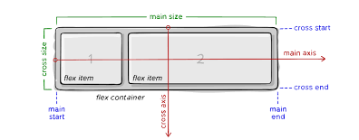

### FLEXBOX

#### 배치를 잘할려면?

* flex-box
* grid

* scss

#### Reference

* [Grid garden](https://cssgridgarden.com/#ko)
* [flx-froggy](https://flexboxfroggy.com/#ko)

#### Requirement

* vscode
* google browser
* node.js

#### block vs inline vs inline-block

**Inline**

* box가 아니다
* Element이며 유동적이라 너비와 높이가 없다.
* 높이와 너비와 같이 사용할 수 없다.
* 예시) 글

**inline-block**

* 너비와 높이가 있다
* 일직선처럼 서로 옆에 있을 수 있다.
* 기본적으로 `margin`이 있다.

#### flex-box

* 자식 Element와 대화하지 않음
* 즉 부모 컨테이너에서 핸들링한다.

```css
.wrapper {
    display: flex;
}
```

* flex-direction: row(defult)
  * 주축 방향

**justify-content: Main axis**

**align-items: cross axis**



#### Align-self and order

Flex에서 `child`에게 줄 수 있는 두가지 속성이 있다.

**align-self**

* 자식 하나의 `element`에 위치를 조정할 수 있음
* align-self == align-items

```css
.child:nth-child(2) {
    align-self: center;
}
```

**order**

* box의 순서를 변경할 수 있음

* html을 변경 할 수 없을 때 box의 order만 변경하면 A와 B의 위치를 바꿀 수 있음
* 기본값은 0이다.

```css
.child:nth-child(2) {
  order: 3;
}
.child:nth-child(1) {
  order: 2;
}

```

#### wrap, nowpra, reverse, align-content

`flexbox`는 `item`들이 너비가 바뀌더라도 모두 같은 줄에 있도록 유지한다.

* 기본값은 `nowrap`이다.
* `reverse`는 순서를 거꾸로
* `wrap`사용시 세로 중간  공백은 `align-content`로 조정할 수 있다.

#### flex-grow, flex-shirnk

`child`에게 줄 수 있는 속성

**flex-shrink**

* element의 행동을 정의함
* `flex box`가 `nowrap`일때
* 기본 값은 1이다.

* 어떤 박스가 찌그러질지 정의할 수 있다.

```css
/* 2번째 박스는 1, 3번째 박스보다 두배로 줄어든다 */
.child:nth-child(2) {
  background-color: black;
  flex-shrink: 2;
}
```

**flex-grow**

* `shink`와 반대로 커진다

* 기본값은 0이다.
* 만약 여분의 공간이 있으면 `flow-grow`는 그 안으로 들어가서 더 크게 만들어진다.

#### flex-basis

* `child`에서 적용되는 `property`이다.
* `flex-basis`는 `width`와 같다고 할수 있지만 그렇지는 않고 `flex-basis`는 `element`에게 모든게 찌그러지거나 늘어나기전에 처음 크기를 정해주는 것이다.
* `flex-basis`는 `main axis`에서 작동한다.
* `flex-direction`에 따라 width, height가 결정된다.

#### flex-flow

`flex-direction` + `flex-wrap`