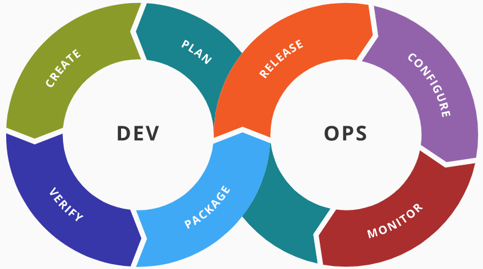
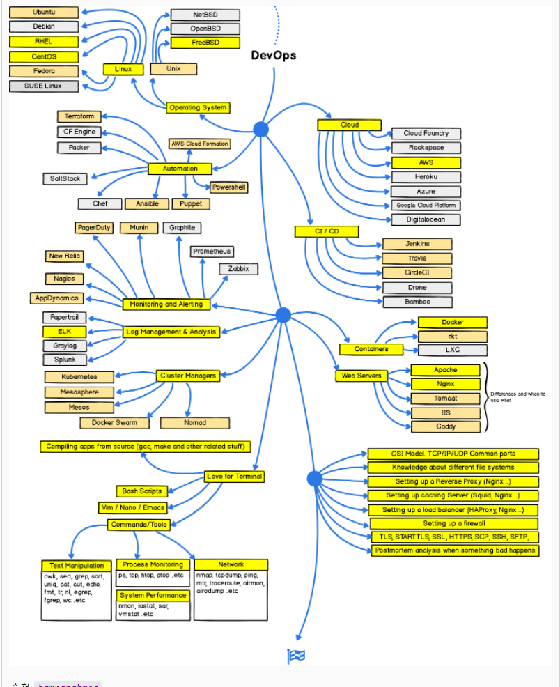

요새는 `DevOps`와 관련하여 내용을 찾아보고 공부하는게 재미있네요. 😁

사실 앤서블은 `실용주의 프로그래머`라는 책을 보다가 발견하였는데, 제품 테스트 환경이나 쿠버네티스 환경을 온프레미스 환경에서 앤서블로 작성하면 재밌을 꺼 같아서 메가존클라우드에서 근무하시는 조훈님의 앤서블 책을 구입하여 읽었습니다!

|          | Puppet      | Chef         | Salt       | Ansible      |
| -------- | ----------- | ------------ | ---------- | ------------ |
| 개발사   | Puppet Labs | Opscode      | SaltStack  | AnsibleWorks |
| 등장     | Ruby        | 2009년 1월   | 2011년 3월 | 2012년 3월   |
| 개발언어 | Ruby        | Ruby, Erlang | Python     | Python       |

`rook&chef` 는 기존에 설치하면서 사용하였었는데 사실 다른 언어들은 처음 듣습니다. 구성관리 툴중에는 `Ansible, Terraform`은 꼭 알아둬야 될 필요가 있을 것 같습니다. `Ansible`은 최근에 발표되었고 에이전트 설치가 필요가 없습니다.

> 윈도우는 앤서블 설치를 사용할 수 없습니다만, 구성은 가능합니다.

#### 장점

* IT팀간 협업의 극대화
* 에이전트가 없는 구조
* 다양한 운영체제를 통합 관리
* 높은 보안과 신뢰성
* 멱등성
* 확장 가능
* 낮은 학습 곡선
* 오픈소스

#### 참조

> 현직 앤서블 강사가 직접 쓴 데브옵스의 모든 것

### 마치며

좋은 책 내용입니다. 앞으로 정리하면서 제가 구축하고 싶었던 서버를 구성하는게 목표입니다!👍
