### AWX 사용법

#### Resource

Resource 아래 탭을 보면 다음과 같이 구분되어있습니다.

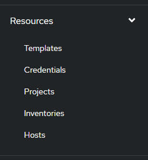

AWX를 사용해서 아래 인벤토리 파일을 구축하는 방법을 기술합니다.

#### 예시

**인벤토리**

```yaml
[rke_masters]
rke_master1 ansible_host=100.100.103.178 ansible_ssh_pass=1234

[rke_workers]
rke_worker1 ansible_host=100.100.103.179 ansible_ssh_pass=1234
```

먼저 `inventory`파일을 보면 `rke_masters`라는 그룹 아래에 `rke_master` 호스트들이 위치해있습니다.

**inventories**

인벤토리는 실제 위에 기술된 `inventory`파일과 같다고 보면 됩니다.

* "Add" > "Add Inventory " 클릭하여 인벤토리를 추가합니다.

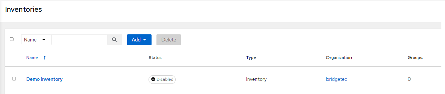

* 인벤토리 추가 후 "Save" 클릭

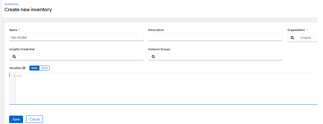

* "Save"를 누르면 다음과 같은 화면이 생기며, "Groups"를 선택하여 "Add"를 눌러 그룹을 추가합니다.


* 그룹을 생성하여줍니다.

```yaml
[rke_masters] # group은 이부분을 의미합니다.
rke_master1 ansible_host=100.100.103.178 ansible_ssh_pass=1234
```


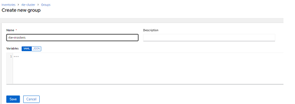

* 그룹에 호스트를 매핑 시켜줍니다.

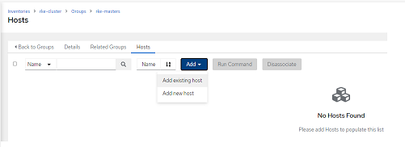

**Hosts**

Host는 우리가 `ansible`을 통해 프로비저닝 할 정보들을 입력합니다.

```yaml
[rke_masters]
rke_master1 ansible_host=100.100.103.178 ansible_ssh_pass=1234 # host 정보
```

* `Add`를 눌러 `Host`를 추가합니다.

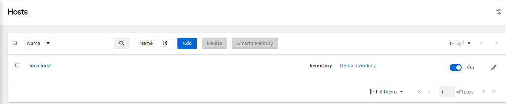

* 다음과 같이 호스트 정보를 입력합니다.

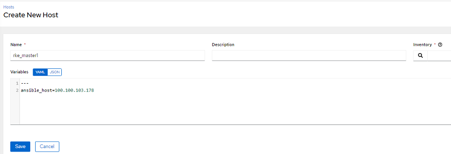

**project**

프로젝트는 작성한 Playbook을 가져오기 위한 곳입니다.

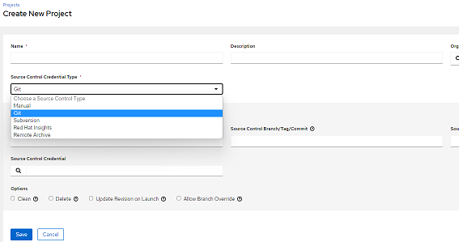

> 저는 개인계정에 Public Repository를 연결하였으나, Private Repository에 경우 Credential에서 자격증명을 생성 후 매핑이 필요합니다.

**Crendential**

자격증명에 관한 곳을 기술합니다. 호스트들의 자격증명의 경우 `Machine`을 선택하여 `username` 및 `password` 그리고 `Privilege Escalation Method`를 각자 OS환경에 맞추어 저장해줍니다.

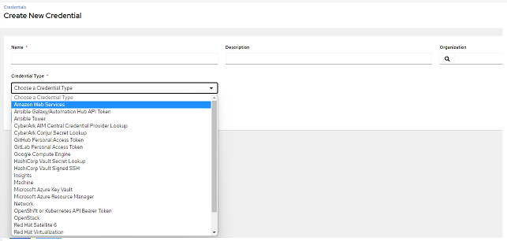

**Template**

위에 만든것들을 조합하여 최종 완성본을 만들어 `ansible-playbook`을 실행시킵니다.

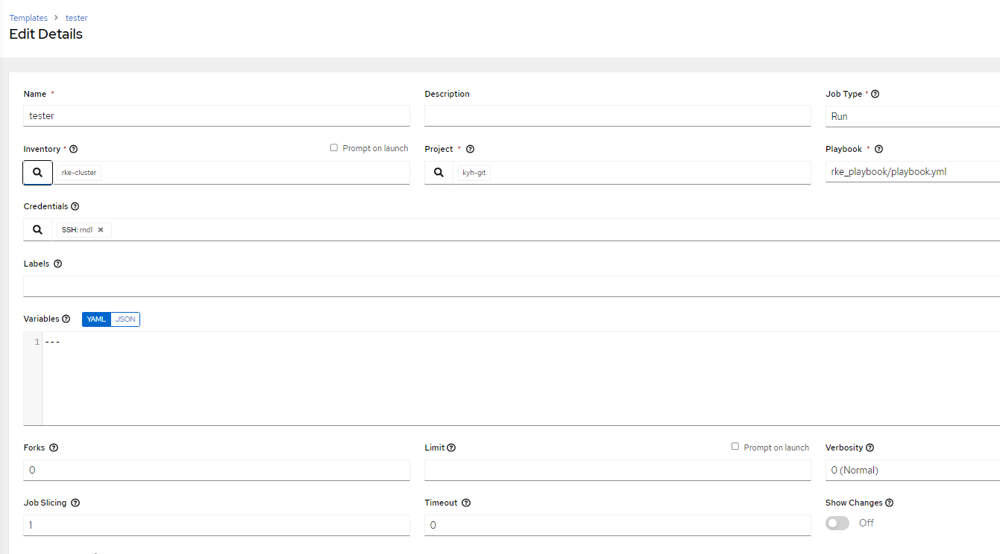

**실행**

실행을 누르면 `ansible-playbook`으로 명령어를 친것과 같이 `ansible-tower`에서 프로비저닝 과정을 확인하실 수 있습니다.

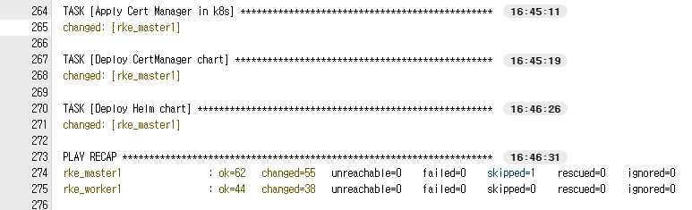

#### 마치며

정확히 제가 구성한 인벤토리를 어떻게 구성하는지 찾아보는데, 정보가 많이 없었습니다. 구성한 내용을 기억하기 위해 블로그에 작성합니다😊
