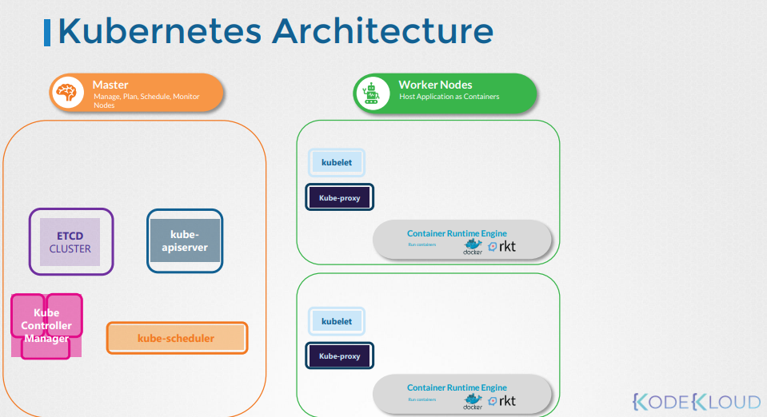
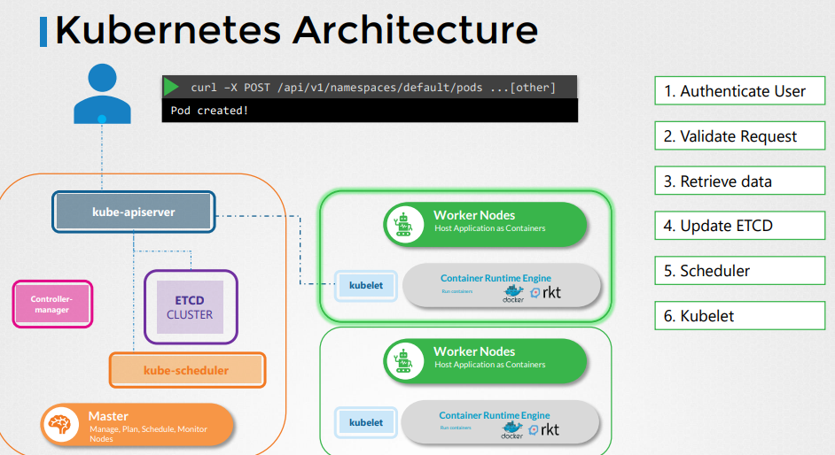
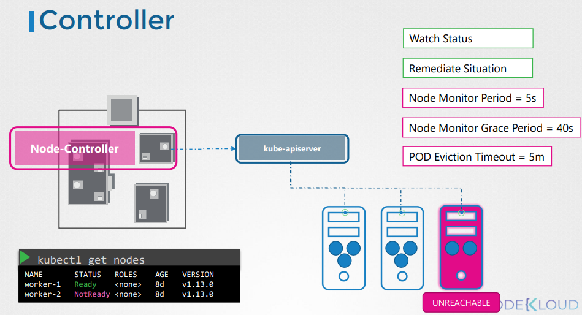
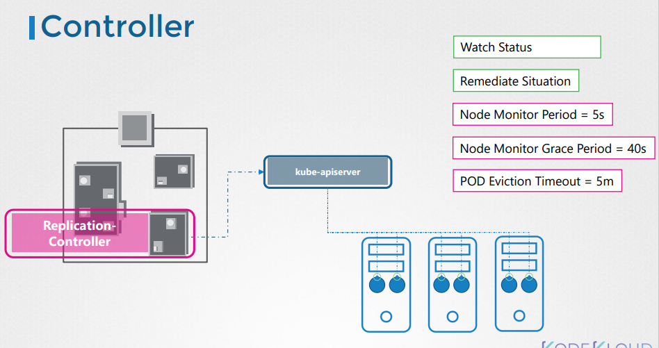
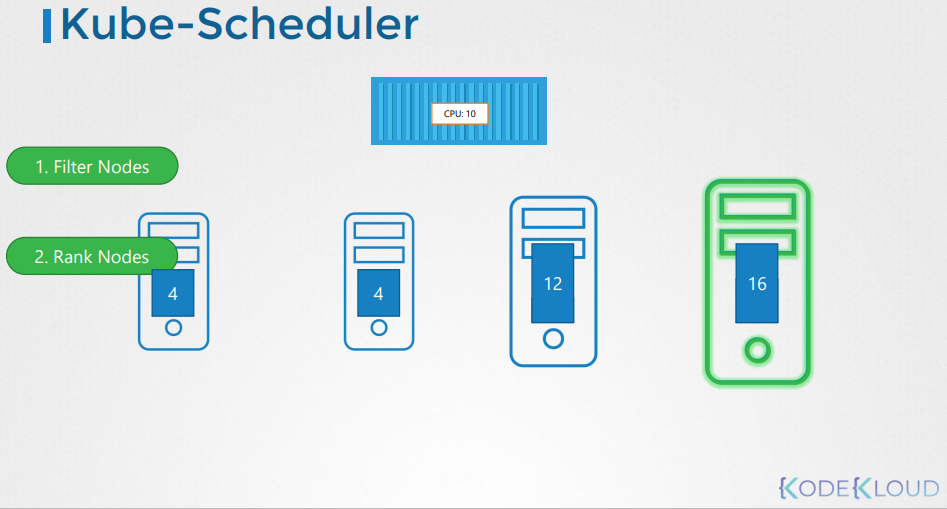
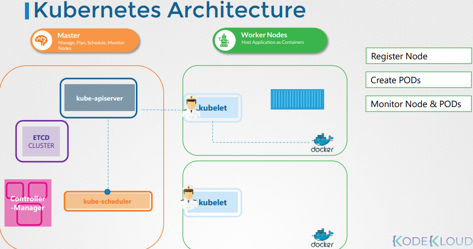
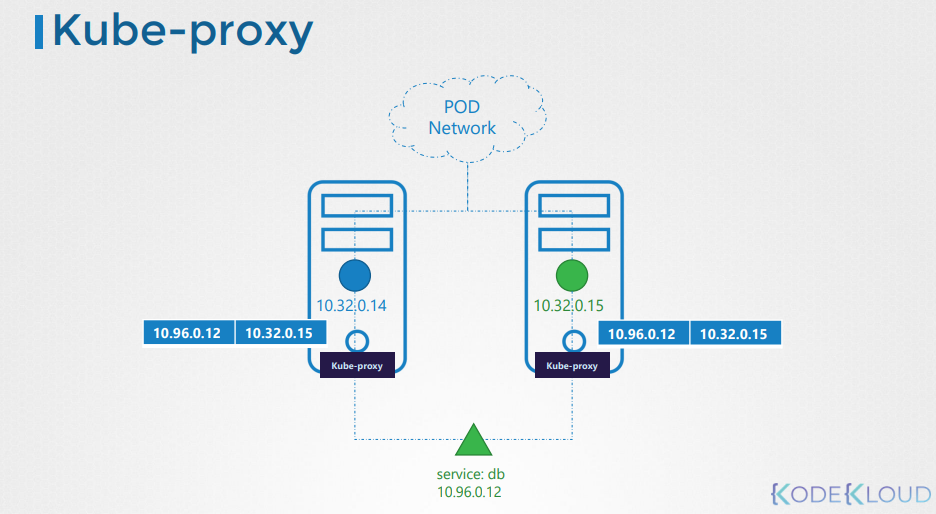

#### 구성요소

**worker node**

컨테이너를 로드 할 수 있는 선박

**master node**

kubernetes를 관리(관리, 계획, 스케쥴, 모니터링)

**etcd**

key-value 형식으로 정보를 저장하는 데이터베이스

**kube-schedule**

worker node의 상태에 따라 파드를 어떤 노드에 배치할지 스케쥴링하는 서비스

- 리소스 요구사항
- 작업자 노드 용량
- 기타 정책
- 제약조건

**Controller Manager**

마스터 선박내의 사무실 또는 부서와 같음

선박에 대한 모니터링 및 필요한 조치

- 노드컨트롤러

  - 노드 감시

  - 파괴되는 클러스터 처리 상황 및 복제

  - 원하는 수의 컨테이너가 항상 실행되는지 확인

- 래플리카 컨트롤러

**kube-apiserver**

쿠버네티스 기본 관리 구성요소

- 클러스터내 모든 작업을 오케스트레이션함
- 외부 API노출

> DNS 서비스 네트워킹 솔루션은 모두 컨테이너 형태로 배포 될 수 있다.

**쿠버네티스 소프트웨어**

- Docker
- ContainerD
- Rocket

**Kubelet**

- kube-api서버의 지시를 듣고 노드에 컨테이너를 배포하거나 파괴
- kube-api는 주기적으로 kubelet에서 상태를 가져와 노드 상태를 모니터링함
- 배의 선장

**kube-proxy**

작업자 노드간 통신을 담당

클러스터 내 서비스 간 통신을 활성화 함



#### ETCD

간단하고 안전하며 빠른 분산된 안정적인 키 값 저장소

클러스터에 하는 작업들을 저장함

- Nodes
- Pods
- Configs
- Secrets
- Accounts
- Roles
- Bindings
- Other

> `kubectl get` 명령을 실행할 때 표시되는 모든 정보는 ETCD에서 가져오는 것

**포트**

2379

**사용법**

`kube-system` 네임스페이스 내에서 `etcdctl`을 사용하여 `etcd` 탐색 가능

**HA**

ETCD인스턴스가 마스터 노드에 분산됨

`--initial-cluster` : ETCD서비스 인스턴스를 지정

**ETCDCTL**

버전: 2, 3

version2(default)

```bash
etcdctl backup
etcdctl cluster-health
etcdctl mk
etcdctl mkdir
etcdctl set
```

vertion3

```bash
etcdctl snapshot save
etcdctl endpoint health
etcdctl get
etcdctl put
```

버전 3을 사용할려면`export ETCDCTL_API=3` 설정 필요.

etcdctl은 etcd api에 인증이 필요하며 다음과 같이 인증할수있음

```bash
--cacert /etc/kubernetes/pki/etcd/ca.crt
--cert /etc/kubernetes/pki/etcd/server.crt
--key /etc/kubernetes/pki/etcd/server.key
```

```bash
kubectl exec etcd-master -n kube-system -- sh -c "ETCDCTL_API=3 etcdctl get / --prefix --keys-only --limit=10 --cacert /etc/kubernetes/pki/etcd/ca.crt --cert /etc/kubernetes/pki/etcd/server.crt  --key /etc/kubernetes/pki/etcd/server.key"
```

#### Kube Api Server

> kube-api서버는 etcd와 직접 상호작용하는 유일한 구성요소

1. Authenticate User (인가된 사용자 확인)
2. Validate Request (인증된 요청 확인)
3. Retrive Data (스케줄러가 kube-api-server를 지속적으로 모니터링 하다가 새로운 파드가 있는 것을 확인 후 kube-api-server에게 배포 요청)
4. Update ETCD (etcd클러스터에 정보를 업데이트 하고 지정한 노드 kubelet에 배포 요청)
5. Scheduler (kubelet은 kube-api-server에게 업데이트 상태 전송 후 kube-api-server는 업데이트)



**확인방법**

```bash
cat /etc/kubenetes/manifests/kube-apiserver.yml
```

```bash
cat /etc/systemd/system/kube-apiserver.service
```

```bash
ps -aux | grep kube-apiserver
```

#### Kube Controller Manager

시스템 내의 다양한 구성 요소의 상태를 지속적으로 모니터링 하는 프로세스

전체 시스템을 원하는 기능 상태로 만들기 위해 노력

단일 프로세스로 마스터 노드에 위치함

1. 지속적으로 선박의 상태를 감시
2. 상황을 시정하기 위해 필요한 조치

**Node-Controller**

5초마다 `kube-apiserver`를 통해 노드의 상태를 확인

HB으로 모니터링 40초 동안 기다린 후에 연결할 수 없는 것으로 표기

다시 복구 시 5분 필요



**Replication-Controller**

복제본 세트의 상태를 모니터링 하고 원하는 수의 복제 세트를 확인하는 역할



- 배포 서비스, 네임스페이스, 영구볼륨 등 다양한 컨트롤러가 있음

**확인방법**

```bash
cat /etc/kubernetes/manifests/kube-controller-manager.yml
```

```bash
cat /etc/systemd/system/kube-controller-manager.service
```

```bash
ps -aux | grep kube-controller-manager
```

#### Kube Sceduler

스케줄러는 어떤 pod가 어떤 노드에 가는지 결정하는 역할만 함. 직접 옮기지는 않는다.

- pod에 cpu 및 메모리 요구사항에 맞지 않는 노드를 필터링함
- 노드 순위를 매긴 후 점수 할당(0 - 10점)



**확인방법**

```bash
cat /etc/kubernetes/manifests/kube-scheduler.yaml
```

```bash
ps -aux | grep kube-scheduler
```

#### Kubelet

- 배의 선장(노드마다 구성되어 있음)

- 모든 서류 작업을 담당하는 사람들
- kube-apiserver가 kubelet을 통해 pod를 로드하라고 하면 pod를 생성하고 주기적으로 감시 후 kube-apiserver에게 보고함
- 작업자 노드에 항상 kubelet을 수동으로 설치함



**확인방법**

```bash
ps -aux | grep kubelet
```

#### Kube Proxy

- 쿠버네티스 내 클러스터 모든 pod는 다른 모든 pod에 연결 할 수 있다.

- 다른 노드에 존재하는 파드간의 통신은 Pod Network를 통해 연결된다.
- 파드에 IP로 바로 붙을 수 있으나 동적으로 변하기에 `service`를 사용하여 접근한다.

- kubeproxy는 각 노드에서 실행되는 프로세스(demon set)
- 새로운 서비스를 찾으며, 새로운 서비스가 생성될때마다 적절한 서비스를 생성함. 트래픽을 백엔드 `pod`로 전송함
  - IPTables Mode
  - IPVS Mode



**확인방법**

```bash
k get po -n kube-system
```

```bash
k get demonset -n kube-system
```
