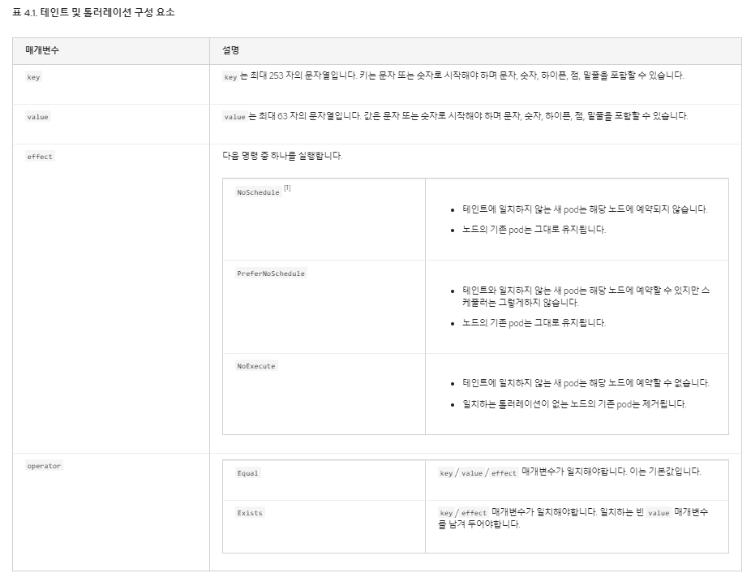

#### Service

* 애플리케이션 내부와 외부의 다양한 구성 요소 간의 통신을 가능하게 함

* 애플리케이션에서 마이크로 서비스 간의 느슨한 결합을 가능하게 함

* 서비스는 가상의 오브젝트이며, 서비스의 고유 IP를 가짐

* 로드밸런서 역할

**NodePort**

서비스가 노드의 포트에서 내부  Pod에 액세스 할 수 있도록 함

* 30000~32767 포트로 내부 파드에 접속 할 수 있게 해줌
* 포트의 종류
  * targetPort: 웹서버가 실행중인 Pod 포트
  * port: 서비스의 포트
  * NodePort: 노드에서 연결되는 포트

```yaml
apiVersion: v1
kind: Service
metadata:
  name: myapp-service
# 실제 서비스를 정의
spec: 
  type: NodePort
  ports:
   - targetPort: 80
     port: 80
     nodePort: 30008
 selector:
   # pod나 deployment정의한 type명을 지정
   app: myapp
   type: front-end
```

**Cluster IP**

클러스터 내부에 가상 IP를 생성하여 다른 서비스와 통신할 수 있음

* 단일 인터페이스 제공
* 서비스를 통해 아래 Pod중 무작위로 전달

```yaml
apiVersion: v1
kind: Service
metadata:
  name: myapp-service
# 실제 서비스를 정의
spec: 
  type: ClusterIP
  ports:
   - targetPort: 80
     port: 80
 selector:
   # pod나 deployment정의한 type명을 지정
   app: myapp
   type: front-end
```

**Load Balancer**

클라우드 제공자를 위한 로드밸런서를 프로비저닝 한다.

최종 사용자가 애플리케이션에 접근 할수 있는 방법 제공

열려있는 노드 포트들을 묶어 관리함

* 온프레미스: L4, MetalLB
* 클라우드: 노드벨런스

```yaml
apiVersion: v1
kind: Service
metadata:
  name: myapp-service
# 실제 서비스를 정의
spec: 
  type: LoadBalancer
  ports:
   - targetPort: 80
     port: 80
 selector:
   # pod나 deployment정의한 type명을 지정
   app: myapp
   type: front-end
```

**명령어**

`expose` : delpoyment를 노출하는 서비스 오브젝트를 생성한다.

#### Imperative vs Declartive

코드로서의 인프라를 관리하는 다양한 접근방식이 있다.

**Imperative(명령형 접근방식)**

* 경로를 설명 (Step by Step)
* 작업을 수행하는 방법에 대해 설명

```bash
$ Provision a VM by the name 'web-server'
$ Install NGINX Software on it
$ Edit Configuration file to use port '8080'
$ Start NGINX Server
```

**Declartive(선언적 접근방식)**

* 최종목적지를 설정
* 어떻게 갈 것인가를 고민하는 접근 법

```yaml
VM Name: web-server
Package: nginx
Port: 8080
Path: /var/www/nginx
Code: GIT Repo - X
```

**접근방법**

* Ansible
* Puppet
* Chef
* TerraForm

**예시**

Imperative

* 하나하나의 명령어를 구성하여 만들며, 중간에 설정이나 에러 발생시 처리가 어려움
* 명령은 한 번만 실행되고 잊어버림(추적이 어려움)
  * `k edit`으로 변경하여 `kubectl`내에서 변경하면 해당 파일은 `k8s`내부에서만 기록됨
  * 이를 모르고 다른 사람이 내부 로컬 파일을 가지고 조작할 경우 맞지 않는 경우 발생
* 매우 관리가 어려움

```bash
# create Objects
$k run --image=nginx nginx
$k create deployment --image=nginx nginx
$k expose deplyment nginx --port 80

# update Objects
$k edit deploy nginx
$k scale deplyment nginx --replicas=5
$k set image deploy nginx nginx=nginx=1.18
```

Declartive

* 선언적 접근 방식은 응용프로그램의 예상 상태를 정의하는 파일 집합을 만드는 것
* 기존 구성을 보고 변경해야 할 사항을 파악함
  * 객체가 없으면 생성하고 있으며 변경사항만 반영함

```bash
k apply -f nginx.yaml
```

**시험 기준**

* 명령형 접근 방식을 사용하여 최대한 시간을 절약 할 수 있음
* 하지만 운영할때는 명령형을 사용하여 처리

pod+service

```bash
k run nginx --image=nginx --port=80 --expose
```


pod

```bash
k run nginx --image=nginx --dry-run=client -o yaml > pod.yaml
```

deploment

```bash
k create deploy nginx --image=nginx --dry-run=client -o yaml > deploy.yaml
```

service

```bash
$ k expose deploy simple-webapp-deployment --name=webapp-service --target-port=8080 --type=NodePort --port=8080 --dry-run=client -o yaml > svc.yaml
$ k expose pod nginx --type=NodePort --port=80 --name=nginx-service --dry-run=client -o yaml
$ k expose pod redis --port=6379 --name redis-service --dry-run=client -o yaml
```

#### Kubectl 적용명령

* `apply`는 동작중인 오브젝트 정의의 로컬 스토리지 파일을 참고
* 명령 방식에서는 동작하지 않는다.

* 마지막 적용구성을 확인한다

* 객체가 존재하지 않으면 생성
  * Live Object Configuration == Last applied configuration과 비교하여 수정부분 적용

* 개체의 상태를 저장하기 위한 추가 필드를 통해 저장

```yaml
# 내가 저장한 파일
apiVersion: v1
kind: Pod
metadata:
  name: myapp-pod
  lables:
    app: myapp
    type: front-end-service
spec:
  containers:
  - name: nginx-controller
    image: nginx:1.18
```

**LiveObject Configuration**

로컬 저장소에 저장됨

```yaml
# 쿠버네티스에서 관리하는 설정파일(Live Object Configuration이라고 부름)
apiVersion: v1
kind: Pod
metadata:
  name: myapp-pod
  annotions: # 여기에 Lastapplied configuration을 지정함
    kubectl.kubernetes.io/last-applied-configuration: {밑에 json ......}
  lables:
    app: myapp
    type: front-end-service
spec:
  containers:
  - name: nginx-controller
    image: nginx:1.18
status:
  conditions:
  - lastProbeTime: null
    status: "True"
    type: Initialized
```

**Last applied configuration**

K8s 메모리에 저장됨

```json
{
    "apiVersion": "v1",
    "Kind": "Pod",
    "metadata": {
        "annotations": {},
        "lables": {
            "app": myapp-pod,
            "type": front-end-service
        },
        "name": "myapp-pod",
	},
    "spec": {
        "containers": [
            {
                "image": "nginx:1.18",
                "name": "nginx-container"
            }
        ]
    }
}
```

#### 스케쥴링

* 스케줄러가 없으면 노드에 pod들의 관리를 직접해야한다
* k8s는 스케쥴러 없이 메뉴얼로 스케쥴링하는 기능을 제공
  * `nodeName`이라는 `yaml`에 설정 값이 있는데 스케쥴러가 없으면 직접 지정하여야 한다.
  * `biding` 객체를 생성 후  `pod bindng API`로요청을 보내야 됌

```yaml
apiVersion: v1
kind: Pod
metadata:
  name: nginx
spec:
  nodeName: node01
  containers:
  - image: nginx
    name: nginx
```

#### Label & Selector

항목을 그룹화 하고 기반으로 필터링 하는 기능

시간이 지남에 따라 수많은 pod들이 생성됨에 따라 필터링기능이 필요함

**Label**

* 각 항목에 부착된 라벨 또는 속성
* 필터링 할때 사용
* key, value를 자유롭게 설정 가능
* k8s내 라벨은 유니크한 값이여야함

**selector**

* 존재하는 라벨을 선택하는 용도
* 라벨링된 오브젝트들을 선택하는 용도이다

> 래플리카셋에서 파드의 레이블을 `type: back-end`라고 했으면 래플리카의 라벨을 설정하고, 파드 스펙안에서 셀렉터는 파드를 바라보게 해야 한다. 해당 래플리카 셋에 서비스를 설정할려고 하면 서비스의 `selector`에 `type: back-end` 로 지정하기만 하면 된다.

**annotation**

* 주석은 세부사항을 기록하기 위해 사용된다

> 이름, 버전, 빌드 빌드 정보, 연락처, 전화번호, 이메일, 통합목적으로 사용되는 id...

#### Taints And Tolerations

`Tanints` 노드에 `Toleration`이 적용된 파드만 배포될 수 있게 하는 옵션

* 노드에 모기기피제를 뿌린 상황이고 파드들은 모기다.

마스터노드는 자동으로 `taint`설정이 되어있어 파드가 생성되지 않는다.

```bash
$ k describe node kubemaster | grep Taint
Taints: node-role.kubernetes.io/master:NoSchedule
```



**사용법**

노드 뿐아니라 pod에서도 이중으로 설정해줘야됌

```bash
# 추가
$ k taint no node-name key=value:taint-effect
# 삭제
$ k taint no node-name key=value:taint-effect-
```

**taint-effect**

* NoSchedule
  * 스케쥴이 없는 것(배포안함)
* PreferNoSchedule
  * 가급적 배포를 안하지만 배포를 할 수도 있다.
* NoExecute
  * 배포가 되지 못하게 함은 물론이고, 이미 노드에 배포되어있으면 제거 시킴

> taint와 Tolerations 옵션을 준다고 taint 노드로만 배포될 수 있는게 아니다. 
>
> * `node affinity` 옵션으로 해당 노드로만 지정가능

**예제**

```bash
k taint no node1 app=blue:NoSchedule
```

```yaml
apiVersion:
kind: Pod
metadata:
  name: myapp-pod
spec:
  containers:
  - name: nginx-continaer
    image: nginx
  tolerations:
  - key: "app"
    operator: "Equal"
    value: "blue"
    effect: "NoSchedule"
```

#### 시험 팁

```bash
$ k explain po --recursive | grep -A5 tolerations
  tolerations <[]object>
    effect <string>
    key <string>
    operator <string>
    tolerationSeconds <integer>
    value <string>
```

