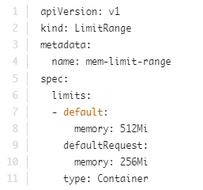
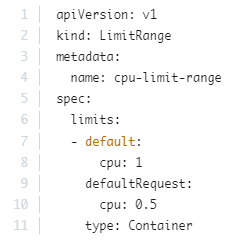
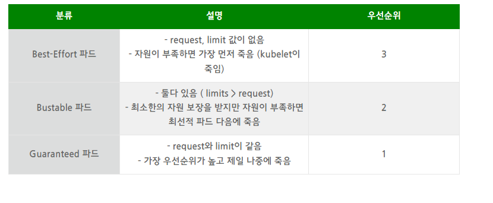

#### Node Selector

- 크기가 큰 파드를 특정 노드에 배치시키고 싶을 떄 사용

```yaml
apiVersion: v1
kind: Pod
metadata:
  name: myapp
spec:
  containers:
    - name: nginx
      image: nginx
  # 노드에 라벨링
  nodeSelector:
    size: Large
```

- 노드에 레이블 정하기

```bash
k lable no node-1 size=Large
```

- 요구사항이 복잡하면 `Node affinity`를 사용해야 한다
  - Medium Or Large
  - Not Small

#### Node Affinity

pod가 특정 노드에서 호스팅 되도록 하기 위해 사용

```yaml
apiVersion: v1
kind: Pod
metadata:
  name: myapp
spec:
  containers:
    - name: nginx
      image: nginx
  affinity:
    nodeAffinity:
      requiredDuringSchedulingIgnoredDuringExecution:
        nodeSelectorTerms:
          - matchExpressions:
              - key: size
                operator: In # In, NotIn, Exists(values 없음)
                # Large Or Mediaum
                values:
                  - Large
                  - Medium
```

**노드선호도**

Avaliable

- requireDuringSechedulingIgnoredDuringExecution(Type1)
- preferredDuringSechedulingIgnoredDuringExecution(Type2)

Planned

- requireDuringSechedulingRequiredDuringExecution(Type3)

|        | DuringScheduling(파드가 존재하지않고 생성될때) | DuringExecution(파드가 실행되어있을 떄) |
| ------ | ---------------------------------------------- | --------------------------------------- |
| Type 1 | Required(일치하는 노드가 없으면 배포 X)        | Ignored                                 |
| Type 2 | Preferred(없으면 노드selector 무시하고 배포)   | Ignored                                 |
| Type 3 | Required                                       | Required(포드는 추출되거나 죽음)        |

#### Node Affinity VS Taints and Tolerations

`Node Affnity`와 `Taints`를 같이 사용하면, 특정 노드에 특정 파드만 배치 시킬 수 있다.

- `Taints`를 설정한 노드에 `Tolerations` 할 수 있는 파드는 다른 노드에도 배치가 가능하다.
- `Node Affinity`는 해당 노드에 특정 파드가 지정 노드에 배포되게 해줌
- 그러나 다른 파드가 그 파드에 배포되지 않을 거라는 보장은 없다
- 결론은 같이 쓰면 특정 노드에 특정파드만 배치가 가능하다

#### Resource Requirements And Limits

- k8s 스케쥴러는 테트리스처럼 특정 파드가 노드에 배포 될떄 적절한 노드에 배치 시킨다.
- CPU, Memory, DISK를 계산하여 배치시킴
- `Pod`, `Deployment`에 리소스 사용량을 배정할 수 있다.

- 스케줄러는 노드에 배치할때 리소스 요청을 보고 충분한 노드를 식별한다.

```yaml
apiVersion: v1
kind: Pod
metadata:
  name: myapp
spec:
  containers:
    - name: nginx
      image: nginx
      ports:
        - containerPort: 8080
      resource:
        requests:
          memory: "1Gi"
          cpu: 1
```

**cpu1은 무엇을 뜻할까?**

- 노드의 CPU 자원은 0.1, 100M(Meely)과 같이 표현할 수 있다.

- 100m의 경우 밀리를 의미하며 이는 0.1CPU와 동일한 의미를 갖는다.

- 1M까지 설정 가능하며 그 이하는 불가능하다

- 1 CPU의 의미는 1 vCPU와 같은 의미를 갖는다.

- 퍼블릭 클라우드에서는 1 GCP Core, 1 Hyperthread, 1Azure Core, 1AWS vCPU를 의미.

  > Pod가 생성되면 컨테이너에 `requests` 에 기본으로 `Cpu: 0.5`와 `Memory: 256Mi`가 할당된다고 말했으나, 기본값이 선택할려면 Namespace에 LimitRange를 생성하여 요청 및 제한에 대한 기본값으로 설정해야 함
  >
  > 
  >
  > 

**memory**

1 G(Gigabyte) = 1,000,000,000 bytes

1 M(Megabyte) = 1,000,000 bytes

1 K(kilobyte) = 1,000 byte

---

1Gi(Gibibyte) = 1,073,741,824 bytes

1 Mi(Mebibyte) = 1,048,576 bytes

1 Ki(kibibyte) = 1,024 bytes

**Resource Limit**

- 노드에 리소스 제한이 없으면 특정 파드가 노드의 모든 자원을 사용하여 이슈 발생
- 쿠버네티스 기본 메모리 제한은 512 Mi이다

```yaml
apiVersion: v1
kind: Pod
metadata:
  name: myapp
spec:
  containers:
    - name: nginx
      image: nginx
      ports:
        - containerPort: 8080
      resource:
        requests:
          memory: "1Gi"
          cpu: 1
        limits:
          memory: "2Gi"
          cpu: 2
```

**리소스를 초과하면**

- 파드가 제한된 `cpu`자원을 넘어서려고 할 경우 `Throttle`이 발생하여 압축 조정
- 컨테이너는 제한보다 많은 CPU리소스를 사용할 수 없다.
- 메모리 자원을 한계치를 넘어서면 `OOM(Out of Memory)` 발생하며 pod가 죽게 됌.
- 메모리의 경우 노드 자원 부족 시 퇴거대상이 된다.



> [resources의 limit과 request의 의미와 파드 우선순위](https://devpouch.tistory.com/135)
>
> - 운영이 아닌 환경에서 하드웨어를 최적으로 활용하고 싶다 → Best-effort와 Burtable을 주로 활용
> - 운영 환경이 안정적으로 예측 가능하길 원한다 → Guaranteed 컨테이너에 약간의 Burstable을 섞어서 사용

#### 시험팁

실행중인 파드는 다음과 같은 부분은 `edit`으로 편집이 안된다

- spec.containers[*].image
- spec.initContainers[*].image
- spec.activeDeadlineSeconds
- spec.tolerations

위에 부분을 변경할려고 저장하면 `tmp`에 저장되며 삭제 후 재 기동할 수 있다.

```bash
# 1. 변경 후 저장하여 tmp/kubectl-edit-vvvrq.yaml이 생성된 후
$ k delete po webapp
$ k create -f /tmp/kubectl-edit-ccvrq.yaml

# 2. yaml로 저장후 삭제 한 후 다시 재생성
$ k get po webapp -o yaml > my-new-pod.yaml
$ vi my-new-pod.yaml
$ k delete po webapp
$ k create -f my-new-pod.yaml
```

#### DemonSet

- 데몬셋은 래플리카셋과 마찬가지로 노드에 배치된다
- 새 노드가 클러스터에 추가될 때마다 포드의 복제본이 해당 노드에 자동으로 추가 됌
- 노드가 제거되면 pod도 자동으로 제거
- 노드 종속적
- 모니터링 에이전트 or 로그수집기 `fluentd`, `kube-proxy`, `networking`
- `nodeName`을 사용해서 배치함

```yaml
apiVersion: apps/v1
kind: DemonSet
metadata:
  name: monitoring-daemon
sepc:
  selector:
    matchLabels:
      app: monitoring-agent
    template:
      meatadata:
        lables:
          app: monitoring-agent
      spec:
        containers:
          - name: monitoring-agent
            image: monitoring-agent
```

**명령어**

```bash
k get ds
```

#### Static Pod

`kubelet`은 `node`를 독립적으로 관리 할 수 있다.

`kubelet`이 `kube-apiserver`와 `etcd`가 없으면 자신에 파드에 노드를 배치하기 위해서 `static pod`를 사용할 수 있다, 즉 `kube-apiserver`의 도움 없이 파드를 생성하면 그것이 `static-pod`이다.

`kube-api-server`가 배포되어도 `static-pod`를 볼 수 있지만 편집은 직접가서 해야된다.

**어떻게 배포 할 수 있는가?**

- 지정된 서버의 디렉토리에 `pod.yaml`파일을 읽도록 `kubelet`을 구성 가능
- `kubelet`은 주기적으로 이 디렉토리에서 파일을 확인하고 호스트에 pod를 배포함
- 변경하면 변경사항이 제거하면 자동으로 제거 동작함
- 당연히 kubelet만 있고, Controller-Manager와 ETCD가 없으므로 레플리카도, 디플로이먼트, 서비스를 생성할 수 없다.
- `kubelet`은 pod수준에서 작동함

> /etc/kubernetes/manifests

**static-pod는 어떻게 알아보는가**

`control-pannel`이 적혀있다.

**디렉토리는 변경 가능한가**

1. `kubelet.service`를 배포 할 때 `--pod-manifest-path={경로}`로 지정한다
2. `--config=kubeconfig.yaml`옵션으로 파일을 지정하여`kubeconfig.yaml`파일에 있는 `staticPodPath: {path}`를 명시 할 수 있음

**패스는 어떻게 확인하는가**

`kube-api-server`가 없기에 `kubectl`도 사용할 수 없다. 그렇기에 `docker`명령어로 찾음

```bash
$ docker ps
$ ps -ef | grep kubelet | grep config
--config=path
$ cat path
$ look static-pod-path
```

**마스터노드를 만들기**

`static-pod`를 통해서 `controller-manager.yaml`, `apiserver.yaml`, `etcd.yaml`을 통해 마스터 노드를 만들 수 있다.

#### **static-pod와 demonset의 차이**

- DeamonSet은 모든 노드의 애플리케이션을 ensure하기 위해 각 노드에 배치된다.
- 이 DeamonSet은 kube-apiserver를 통해 DeamonSet Controller에 의해 컨트롤된다.
- Static Pod는 kubelet에 의해 생성되며 다른 어떤 k8s 오브젝트들의 개입 없이 Control Plane Component를 배포한다.
- 둘의 공통점은 이 두 종류의 파드들 모두 kube-scheduler를 무시한다.

#### Mutiple Schedulers

- k8s 스케쥴러는 확장가능한 구조이다.
- 검증하거나 특별한 요구사항이 있다면, 새로운 스케줄러를 만들수있따.
- 파드에 스케줄러의 이름을 추가하면 사용할수있다.

```yaml
apiVersion: v1
kind: Pod
metadata:
  name: my-custom-scheduler
  namespace: kube-system
spec:
  containers:
    - command:
        - kube-scheduler
        - --address=127.0.0.1
        - --kubeconfig=/etc/kubernetes/scheduler.conf
        - --leader-elect=true
        - --scheduler-name=my-custom-scheduler
      image: k8s.grc.io/kube-scheduler-amd64.v1.11.3
      name: kube-scheduler
```

```yaml
apiVersion: v1
kind: Pod
metadata:
  name: myapp
spec:
  containers:
    - name: nginx
      image: nginx
 schedulerName: my-custom-scheduler
```
