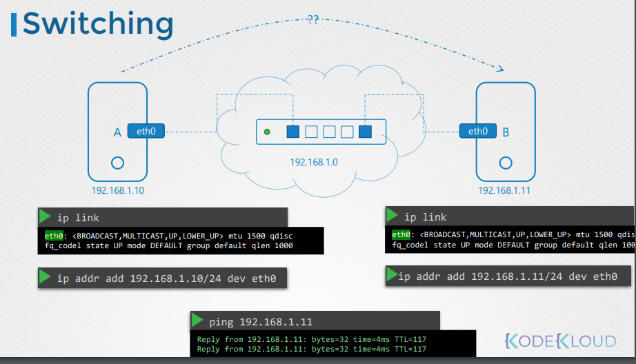
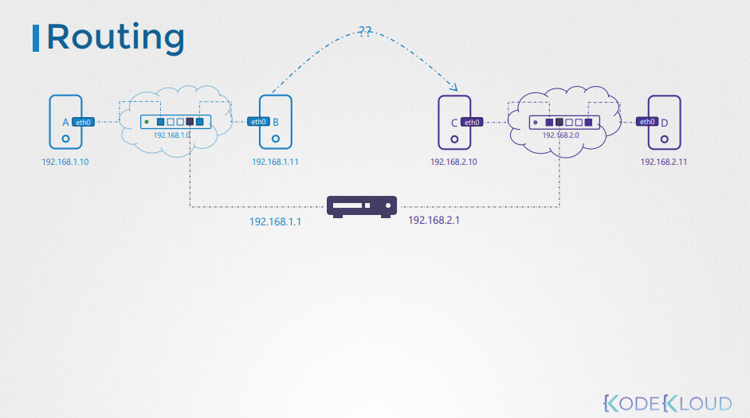
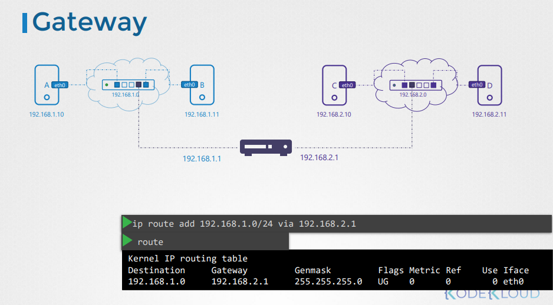
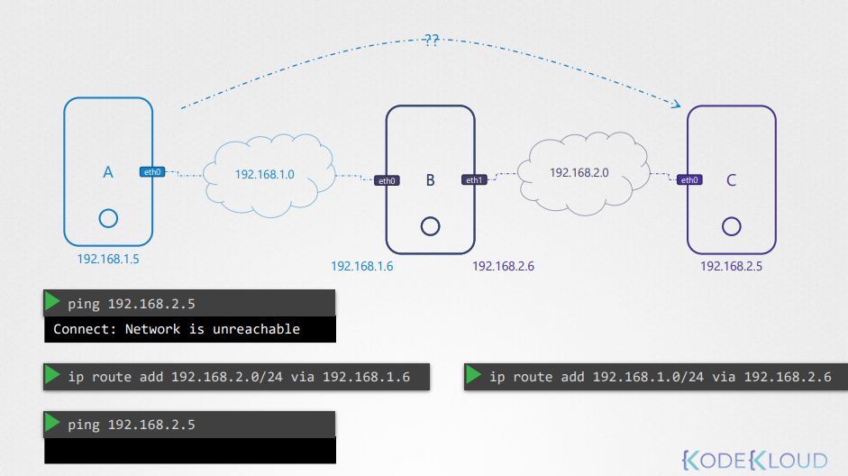
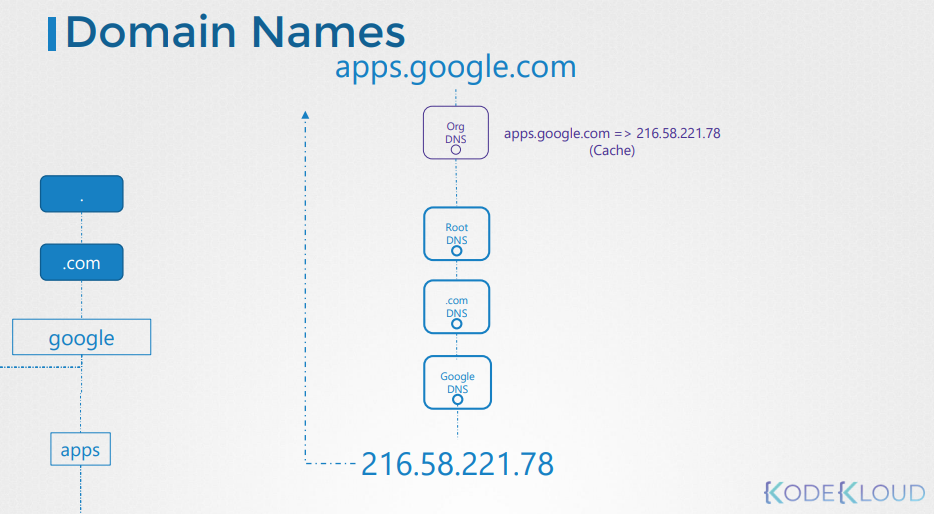
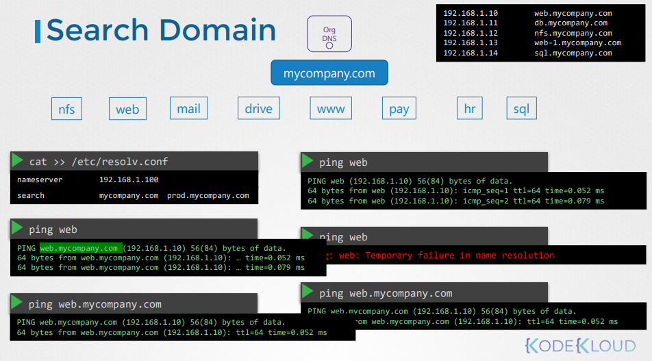

#### Linux Networking Basics

#### Swiching

* A와 B라는 시스템이 서로 통신하기 위해선 스위치가 필요
* 스위치는 A, B시스템의 랜카드에 있는 정보를 연결
* 스위치로 A와 B시스템이 연결되면 `ip addr`명령어를 사용하여 고유 IP주소를 부여할 수 있다. 
* 각자 고유의 IP까지 생성되고 스위치에 연결되있으면 스위치를 통해 상호 통신이 가능



#### Routing

* 한 네트워크 시스템이 다른 네트워크 시스템과 연결하기 위해서는 라우터가 필요하다
* 라우터는 두 개의 네트워크를 연결하는데 사용
* 라우터는 스위치에 연결될 떄 해당 네트워크의 IP를 할당받는다.
* 연결된 라우팅을 통해 네트워크 간 통신이 가능하다



#### GATEWAY

* B에서 C로 패킷을 보낼때 라우터가 어떤 네트워크에 존재할까?
* 라우터는 그냥 장비일 뿐이다.

* 네트워크가 방이었다면 게이트웨이는 외부 세게로의 다른 네트워크나 다른 네트워크로 통하는 문
* 라우터 장비에 있는 게이트웨이에 명시된 IP주소에 따라 라우트 장비로 들어오는 IP대역을 지정할 수 있다.
* 라우팅 테이블에 `Destination IP`를 `0.0.0.0 or default` 로 지정하면 어떤 퍼블릭 네트워크든 인터넷이 연결되어 있는 어떤 곳으로도 패킷을 전송할 수 있다는 의미가 된다.





* linux에서 한 인터페이스에서 다음 인터페이스로 전달되지 않는다.

* 명시적으로 허용
    * /proc/sys/net/ipv4/ip_forward 0 (X)
    * /proc/sys/net/ipv4/ip_forward 1 (O)

* 변경사항을 위지할려면
    * /etc/network/interfaces 파일 설정

#### DNS

* DNS는 일종의 별명이다.
* `/etc/hosts`에 기술작성

```bash
192.168.1.1 db
```

* `/etc/hosts`에 모든서버를 작성하기에는 서버가 많아졌다. 따라서 모든 매핑 정보를 하나로 관리하기 위해 `DNS서버`를 구축한다.

* DNS서버의 주소는 `/etc/resolv.conf`에 정의한다.

```bash
nameserver 192.168.1.100
```

* 호스트는 로컬에 있는 `/etc/hosts`를 확인 후 찾지 못하면, DNS서버에게 물어본다.
* 호스트에 순서는 `/etc/nsswitch.conf`에 정의되어 있다.

```bash
...
hosts: files dns
...
```

* 목록에 없는 서버에 핑을 시도하면 실패한다. 가령 예를 들어 `www.facebook.com`에 핑을 시도하지만 실패한다.
* 이 때 인터넷에서 사용할 수 있는 `8.8.8.8`을 `/etc/resolv.conf`에 지정하면 찾을 수 있다.`8.8.8.8` 공개 호스팅 서버

#### Domain Names

* `.com` `net` `.kr`과 같이 도메인의 마지막은 최상위 도메인을 나타낸다.
* 유저가 `www.google.com`을 주소에 입력하면, 루트인`.`아래에 있는 `.com`을 찾고, 그 아래에 있는 `google`을 찾는다. 그 후 서브 도메인인 `www`을 찾음으로써 찾아간다.
* 이러한 도메인에 매핑된 IP를 알아내기 위해 `nslookup`, `dig` 명령어를 사용할 수 있다.
* `nslookup`은 로컬 호스트 파일은 고려하지 않으며 DNS서버만 쿼리함




