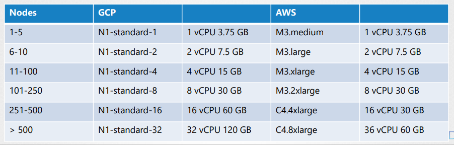

#### Service Networking

* 서비스의 네트워크는 특정 노드에 한정적이지 않으며 클러스터 내 모든 파드들은 서비스에 접근이 가능하다.
* `clusterIP`라 부름
* 특정 서비스를 외부 클러스터에서 노출 시키고 싶다면 `nodePort`타입의 서비스를 생성할 수 있다.

**서비스 생성원리**

* `kubelet`은 `kube-apiserver`와 통신하며 파드의 생성을 담당
* `kube-proxy`가 각 노드의 구동 되는데 서비스가 생성되면 행동을 취한다.
* 파드와 달리 서비스는 특정노드에 할당되지 않으며 클러스터 범위의 컨셉이다.
* 서비스는 `가상의 오브젝트` 이다.
* 서비스 객체를 만들 떄 미리 정의된 범위에서 IP주소를 할당한다.
* 각 노드들은 서비스 아이피와 전달규칙을 생성한다.
* `kube-proxy`는 이 서비스가 생성되거나 삭제되면 룰을 갱신한다.
  * `Ip:Port: 10.9.13.178.80` : `Forward To: 10.244.1.2`
* `kube-proxy`는 따로 설정하지 않으면 `iptables`로 구성됨

```bash
kube-proxy --proxy-mode [userspace | iptables | ipvs ]
```

* pod와 서비스에 동일한 IP주소가 할당되서는 안된다.

```bash
iptables -L -t nat | grep db-service
```

* kube-proxy 로그디렉토리

```bash
cat /var/log/kube-proxy.log
```

#### DNS

* 노드의 이름과 IP는 DNS서버에 저장된다.
* `k8s`클러스터가 설정되면 쿠버네티스 내장 DNS서버를 기본으로 배포한다.
* 파드들 끼리 IP로도 닿을 수 있지만, 서비스 이름으로도 요청을 보낼 수 있다.
* k8s에 내장 DNS에 서비스에 대한 IP가 등록되어 있기 때문이다.
* 다른 네임스페이스에 있다면 해당 서비스이름에 `.`을 붙이고 네임스페이스명을 붙이면된다.
* 가령 서비스 명이 web-service고 네임스페이스가 apps라면 `http://web-service.apps`와 같은 형식이다.
* 이같은 방식이 가능한 이유는 DNS 서버가 서브도메인을 네임스페이스로 사용하고 있기 때문이다.

* 이후 타입을 명시할수 있는데 `svc`는 서비스를 뜻한다
* 루트도메인은 `cluster.local`이 기본으로 명시됨

```bash
# 서비스
HostName + Namespace + Type + Root = IP Address
web-service.apps.svc.cluster.local -> 100.100.37.188

# pod
HostName + Namespace + Type + Root => IP Address
10-244-2-5.apps.svc.cluster.local => 10.244.2.5
```

#### Core DNS in K8s

* 두파드가 호스트명으로 통신하기 위한 가장 쉬운 방법은 `/etc/hosts`파일에 항목을 추가하는 것이다.

```bash
cat >> etc/hosts
web 10.244.2.5
```

* 파드가 많아지면 기입 할 수 없기에 중앙 `DNS`서버를 지정
* `coreDNS`서버는 `kube-system`의 `replica-set`으로 배포

```bash
cat >> /etc/resolv.conf
nameserver 10.96.0.10
```

* `k8s`의 파드는 호스트명을 `.`을 `-`를 바꿔서 부르는데, 이는 `k8s`의 DNS서버에서 사용하는 방식이며 이를 `CoreDNS`라고 부른다
* `/etc/coredns`에 있는 `Corefile`이라는 파일을 사용
* DNS 서버는 DNS 파드를 위한 서비스를 갖고 있으며, 새로운 파드가 생성될 때 `kubelet`이 파드의 `/etc/resolv.conf`에 DNS 서버 주소가 적힌 파일을 생성한다.

```bash
cat /var/lib/kubelet/config.yaml
...
clusterDNS:
- 10.96.0.10
clusterDomain: cluster.local
```

#### Ingress

* 서비스를 외부에 `nodePort`로 노출시킬려고 한다면 도메인에 포트를 기입하여야 접근이 가능하다.(www.store.com:30800)
* 포트번호를 대체 하기 위해 `proxy-server`를 추가로 만들어 외부 요청을 프록시 서버로 받고 프록시 서버가 해당 요청을 `node-ip:30800`으로 넘겨 줄 수 있다.
* 구글같은 퍼블릭클라우드에서는 `로드밸런서`타입의 서비스를 사용할 수 있다.
  * gcp load-balancler는 외부아이피와 파드를 연결한다.
  * 서비스가 확장됨에 따라 로드밸런서는 증가하고 이것은 돈과 연관된다.
  * 따라서 `ingress`를 통해 URL을 리디렉션 하게 변경한다.

**Ingress 등장**

* ingress는 유저가 애플리케이션에 접근하기 위해 여러가지 설정들을 손쉽고, 유지보수하기 쉽게 도와주는 오브젝트이다.
* `ingress 7 Layer`는 로드밸런서이며 쿠버네티스 근본 오브젝트이다.
* ingress 역시 서비스와 마찬가지로 nodePort, LoadBalancer 타입을 설정할수 있다.
* 인그레스는 nginx, haproxy, trakefik과 같은 인그레스 컨트롤러가 필요하다.
* 인그레스 리소스는 인그레스 설정파일을 의미한다.
* 인그레스 컨트롤러는 직접 수동으로 배포해줘야된다.

**ingress controller**

* 인그레스 컨트롤러 솔루션은 여러가지가 있는데 가장 많이 쓰이는 것은 `ngnix, gce`이다.
* 인그레스 컨트롤러는 단순한 `nginx`서버나 로드 밸런서가 아니다.
* 인그레스 컨트롤러는 `k8s`클러스터를 감시하기 위한 부가적인 기능들을 갖고 있다.
* 기본적인 설정은 ConfigMap에서 관리가 가능하다.
* 인그레스 컨트롤러를 위한 서비스를 생성해야한다.
* 인그레스 컨트롤러는 단순히 로드밸런서 기능을 넘어 부가적인 기능들을 제공해주는데, `Service Account`를 활용한 `Role`관리다.

Deployment

```yaml
apiVersion: extensions/v1beta1
kind: Deployment
metadata:
  name: nginx-ingress-controller
spec:
  replicas:
  selector:
    matchLables:
      name: nginx-ingress
  template:
    metadata:
      lables:
        name: nginx-ingress
    spec:
      containers:
        - name: nginx-ingress-controller
          image: quay.io/kubernetes-ingress-controller/nginx-ingress-controller:0.21.0
        args:
          - /nginx-ingress-contoroller
          - --configmap=$(POD_NAMESPCAE)/nginx-configuration
        env:
          - name: POD_NAME
            valueFrom:
              filedRef:
                fieldPath: metadata.name
          - name: POD_NAMESPACE
            valueFrom:
              fieldRef:
                fieldPath: matadata.namespace
       ports:
         - name: http
           containerPort: 80
         - name: https
           containerPort: 443
```

Service

```yaml
apiVersion: v1
kind: Service
metadata:
  name: nginx-ingress
spec:
  type: NodePort
  ports:
  - port: 80
    targetPort: 80
    protocol: tcp
    name: http
  - port: 443
    targetPort: 443
    protocol: tcp
    name: https
 selector:
   name: nginx-ingress
```

ConfigMap

```yaml
kind: ConfigMap
apiVersion: v1
metadata:
  name: nginx-configuration
```

Auth

```yaml
apiVersion: v1
kind: ServiceAccount
metadata:
  name: nginx-ingress-serviceaccount
```


**ingress resource**

* 인그레스에 특정 Rule을 설정하여 트래픽을 어디로 보낼지 결정할수 있다.
  * http://www.wear.my-online-store.com/returns
  * http://www.watch.my-online-store.com/returns
  * Else

한개의 경로

```yaml
apiVersion: networking.k8s.io/v1
kind: Ingress
metadata:
  name: ingress-wear
spec:
  backend: # *
    serviceName: sear-service
    servicePort: 80
```

```yaml
apiVersion: networking.k8s.io/v1
kind: Ingress
metadata:
  name: ingress-wear-watch
spec:
  rules:
  - http:
      paths:
      - path: /wear
        backend:
	      serviceName: wear-service
          servicePort: 80
      - path: /watch
        backend:
	      serviceName: watch-service
          servicePort: 80
```

```bash
* 
  /wear
  /watch
```

두개의 경로로 나눌수도 있음

```bash
- host: wear.my-online-store.com

- host: watch.my-online-store.com
```

#### Design k8s cluster

* k8s 클러스터의 목적으로는 프로덕션 레벨의 애플리케이션의 배포, 개별 테스팅 등등의 목적이 있을 수 있다.
* 응용프로그램의 종류에 따라 리소스 요구 사항이 다를 수 있다.

**purpose**

* Education
  * Minikube
  * Single node cluster with ku
* Development & Testing
  * Multi-node cluster with a single master and multiple workers
  * Setup using kubeadm tool or quick provision on GCP or AWS
* Hosting Production Application
  * High Availability Multi node cluster with multiple master nodes
  * kubeadm or GCP or Kops on AWS or other supported platforms
  * Upto 5000 nodes
  * Upto 150,000 PODs in the cluster
  * Upto 300,000 Total Containers
  * Upto 100 Pods per Node



**Cloud or OnPremiss**

* kubeadm for on-prem
* GKE for GCP
* kops for AWS
* Azure Kubernetes Service(AKS) for Azure

**storage**

* 가상 or 물리장비
* 최소 4개의 노드 클러스터
* 마스터와 워커 노드들
* 리눅스 x86_64 architecture
* 가급적 마스터노드에 애플리케이션 배포 X

**mater node**

* kube-apiserver, controller manager, scheduler와 etcd클러스터로 구성

#### Choosing k8s infrastructure

* 윈도우는 Hyper-V나 Vmware 같은 도구로 리눅스 환경을 구성해야 한다
* `minikube`는 로컬에서 단일노드 k8s를 구축하기 위한 좋은 소프트웨어다
* `kubeadm`역시 `k8s`환경을 구축하는 도구로 사용할 수 있다.

**Trunkey Solution**

* Turnkey 솔루션은 필요한VM을 프로비저닝 하고 일종의 도구 또는 스크립트를 사용하여 `k8s`를 구축

* OpenShift는 OnPrem 환경에서 `k8s`환경을 구축하는 것을 도와주는 오픈소스이다.
* 그외 Cloud Foundary Container Runtime, VMWare Cloud PKS, Vagrant와 같이 온프레 환경에서 k8s를 구축하기 위한 솔루션이 있다.

**Hosted Solutions**

* GKE
* OpenShift online
* Azure K8s Service
* AWS EKS

#### Configure High Availablility

* 클러스터에서 마스터 노드가 손실되면 `worker`가 작동하고 컨테이너가 활성상태인 애플리케이션은 계속 실행됌
  * 파드가 죽었을 경우 마스터의 복제 컨트롤러가 지시해야 하지만 죽었기에 재생성이 안됨
  * `kube-apiserver`도 사용할수 없음
* 고가용성 구성은 필수임
* 마스터노드는 etcd, api, 컨트롤러관리자, scheduler와 같은 오브젝트를 관리한다.

**어떻게 동작하는가**

* `kube-apiserver`는각 노드에서 `active-active`로 동작한다.
  * 동시에 요청을 보내면 안되기에 앞에 로드밸런서를 구성하는 것이 좋음
  * 트래픽 분산
  * `kubectl`유틸리티가 로드밸런서를 가르키도록 변경
* `scheduler`, `controller manager`는 `active-standby`구조로 동작한다.
  * `Leader Election Process`를 통해 리더를 선출함
  * `controller manager`는 `Leader Election Process`의 기본값이 `true`이다.
  * `--leader-elect-lease-duration 15s(지속시간)`, `--leader-elect-retry-period 2s(지도자 당선자 갱신기한)` 
* `etcd`는 두가지 방법이 있다.
  * 마스터 노드에 내장되어 있는 방식
    * `stacked Topology`라 부름
  * 별도로 분리하여 따로 서버를 두는 방식
    * `External ETCD Topology`라 부름
  * `kube-apiserver`옵션의 `etcd`의 호스트를 지정가능
  * `etcd`는 분산 시스템이며 `kube-apiserver`와 다른 오브젝트 모두 `etcd`에 접근할 수 있다.
