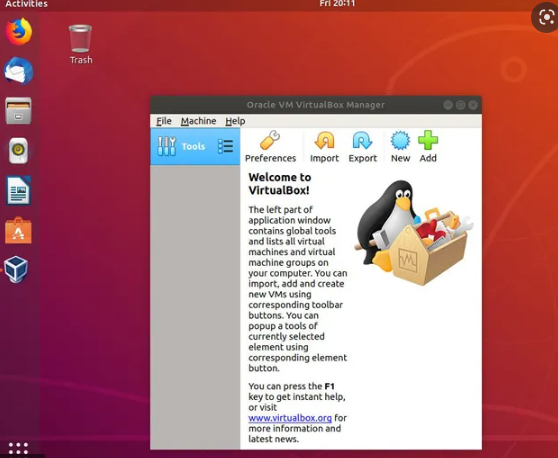
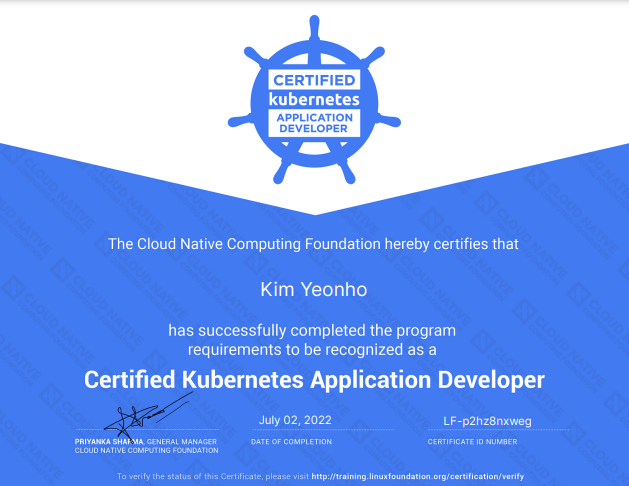

#### 시험후기

최근에 `CAK`도 취득 이후 40% 쿠폰이 생겨서 `CKAD`에 도전하였습니다. 결과는 시험 합격이지만 점수는 조금 마음에 들지 않습니다. 바뀐 시험 환경을 간과했을까요..?

정신을 차리고 살아야겠다고 생각드는 시험이였습니다. 비교적 최신 블로그들도 보고 확인했었는데요. 꼭 시험보시기전에 개인 계정으로 날라오는 메일을 꼭꼭꼭 참조하시기 바랍니다! 기존 유저 브라우저를 사용하던 환경에서 `PSI` 브라우저를 사용하는 환경으로 변경되어 테스트 시 어려움이 있을 수 있습니다. 실제로 많이 당황해서 감독관에게 터미널이 이상한 거 같다고 얘기했네요.

**달라진 점**

* 브라우저 변경
  * 개인 사용자 브라우저에서 `PSI 보안 브라우저`로 바뀌었습니다.
  
* 진행 과정 변경
  * `PSI`에서 먼저 방에 사각과 신분증을 찍습니다.
  
* 시험관 입장
  * 시험관이 도착하여 제가 제출한 신분증과 화면들을 확인하고 확인 질문을 던집니다.
    * 북한이냐 남한이냐..
    * 테이블에 놓인 저 물건은 무엇인가..?
    * 등등....
  
* 시험 환경 변경
  * 시험 환경이 ubuntu 브라우저 환경으로 변경되었습니다.
  * 이 말은 기존 `KodeCloud`에서 보던 터미널 환경에서 바뀌었습니다
    * 감독관한테 비발디 브라우저를 사용해도 되냐고 물었는데 괜찮다 하였으나 저는 화면을 나갈 시 카메라가 꺼지는 현상이 있어 ubuntu에 내장된 firefox로 진행하였습니다.
    * 이게 진짜 느립니다... `CKAD` 문제 자체가 어려운 게 아니라 문서가 보기 너무 힘들었습니다.
    
    
  
  > 이 환경입니다. 여기서 터미널을 켜서 시험에 응시해야됩니다.
  
* 개인 브라우저를 사용하지 못하다 보니, 북마크를 사용하지 못했습니다.

* 공식 문서는 한글 지원이 안됐습니다. 오른쪽 상단 위에 언어 선택은 `영어, 일본어, 중국어` 등 4개 언어만 지원하였습니다.

* 그리고 시험시간 30분 전 입장인데 제 로컬에 설치된 프로그램과 충돌이 되면 진행이 안됩니다. 그래서 삭제한 프로그램들도 있으니 꼭 일찍 들어가셔서 준비하세요
  * TeamViewer
  * Brave Browser

#### 마치며

이 정보를 알고 갔으면 참 좋았을텐데, 허당 짓을 한 제 자신한테 반성합니다. 시험 점수는 마음에 들지 않지만 그래도 딴거에 의의를 두고 싶네요 :) 다들 화이팅 하시기 바랍니다.