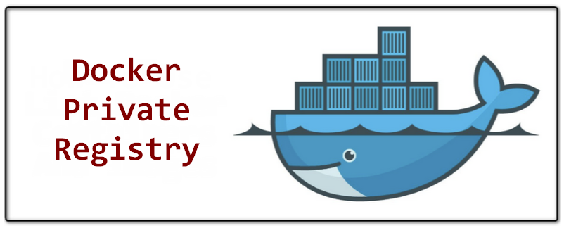
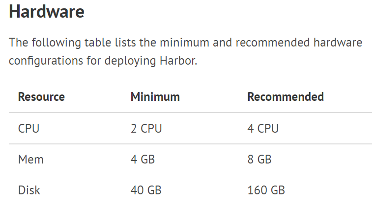
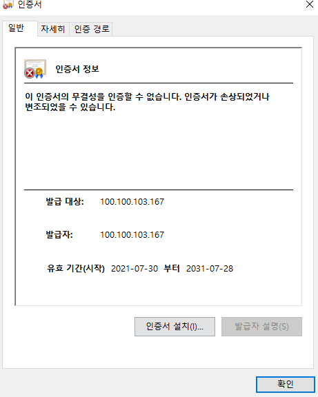
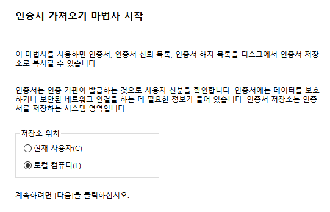
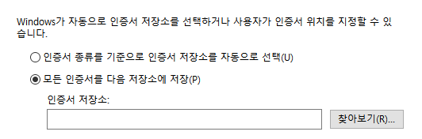
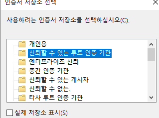
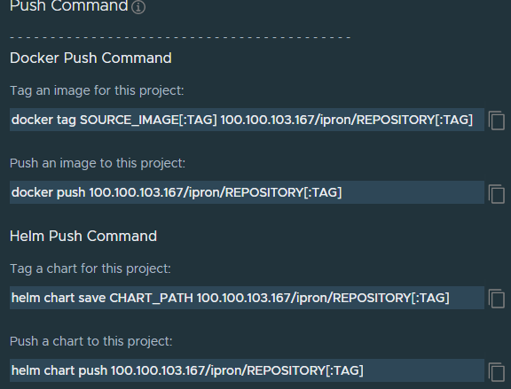

### docker private registry

``docker``를 사용하여 빌드를 하다 보면 이미지들을 저장 할 공간이 필요합니다. 물론 ``docker``에서 지원하는 ``dockerhub``를 사용하여 이미지를 push하거나 pull 할 수 있지만, 운용을 위해 회사나 개인이 저장 할 공간이 필요합니다. 우리는 이미지 등록 서버를 따로 구축 할 수 있고, 이미지 등록 서버는 쿠버네티스에서 이미지를 가져오게 할 수 있습니다!👍

#### Top3

먼저 설치에 앞서 이미지 등록 서버는 어떤게 많이 사용되는지 확인해볼수 있습니다. 도커 이미지 파일을 위한 저장소로는 크게 3가지가 제일 유명합니다.

1. harbor

    

2. nexsus

    

3. docker-registry



이 중 CNCF에서 인증된 Harbor를 설치하는 과정을 기술합니다.

### 설치

>아래 서버 ```100.100.103.167```로 예시입니다.
>
>harbor 버전: v2.3.1

#### 하드웨어



#### 사전설치

* docker
* docker-compose

#### 디렉토리 이동

```bash
cd ~
mkdir -p ~/certs
cd ~/certs
```

#### CA Certificates 생성

```bash
# Root CA의 비밀키 생성
openssl genrsa -out ca.key 4096

# Root CA의 비밀키와 짝을 이룰 공개키 생성
# * CN은 도메인이나 아이피 입력
openssl req -x509 -new -nodes -sha512 -days 3650 \
 -subj "/C=CN/ST=seoul/L=seoul/O=bridgetec/OU=ipron/CN=100.100.103.167" \
 -key ca.key \
 -out ca.crt
```

#### Server Certificates 생성

```bash
# Server의 비밀키 생성 
openssl genrsa -out yourdomain.com.key 4096

# Server의 CSR 파일 생성
# * CN은 도메인이나 아이피 입력
openssl req -sha512 -new \
    -subj "/C=CN/ST=seoul/L=seoul/O=bridgetec/OU=ipron/CN=100.100.103.167" \
    -key 100.100.103.167.key \
    -out 100.100.103.167.csr
```

#### 인증

```bash
cat > v3ext.cnf <<-EOF
subjectAltName = IP:100.100.103.167,IP:127.0.0.1
EOF
```

#### 인증키 생성

```bas
openssl x509 -req -sha512 -days 3650 \
    -extfile v3.ext \
    -CA ca.crt -CAkey ca.key -CAcreateserial \
    -in 100.100.103.167.csr \
    -out 100.100.103.167.crt
```

#### 인증서 복사

```bash
sudo mkdir -p /data/cert
cp 100.100.103.167.crt /data/cert/
cp 100.100.103.167.key /data/cert/
```

#### Cert 파일 생성

```bash
openssl x509 -inform PEM -in 100.100.103.167.crt -out 100.100.103.167.cert
```

#### Docker 인증서 복사

```bash
sudo mkdir -p /etc/docker/certs.d/100.100.103.167
cp 100.100.103.167.cert /etc/docker/certs.d/100.100.103.167/
cp 100.100.103.167.key /etc/docker/certs.d/100.100.103.167/
cp ca.crt /etc/docker/certs.d/100.100.103.167/
```

#### Docker 재시작

```bash
systemctl restart docker
```

#### 다운로드

```bash
wget https://github.com/goharbor/harbor/releases/download/v2.3.1/harbor-offline-installer-v2.3.1.tgz
```

#### tar 해제

```bash
tar xvf harbor-offline-installer-v2.3.1.tgz 
```

#### yaml 파일 복사

```bash
cp harbor.yml.tmpl harbor.yml
```

#### 파일 수정

```bash
vi harbor.yml

# 아래내용 변경
hostname: 100.100.103.167

certificate: /etc/docker/certs.d/100.100.103.167/100.100.103.167.cert
private_key: /etc/docker/certs.d/100.100.103.167/100.100.103.167.key
```

#### harbor 설치

```bash
# 준비
./prepare

# 설치
./install.sh
```

위 내용까지 적용하였을 경우 설치 아이피로 접속하였을때 Harbor 웹페이지가 보입니다. 초기 패스워드는 ``admin``에 ``Harbor12345``이며 harbor.yml을 통해 설치 시 변경할 수 있습니다.

### Harbor 인증서 로컬에 적용하기

#### 필요파일

* 100.100.103.167.crt
* ca.crt

#### 신뢰할 수 있는 인증서 적용

* linux

    ```bash
    cp 100.100.103.167.crt /etc/pki/ca-trust/source/anchors/harbor-server.crt
    cp ca.crt /etc/pki/ca-trust/source/anchors/harbor-ca.crt
    update-ca-trust
    ```

* window









#### docker 재시작

```bash
# 로그인 실패시 인증서 도커를 재시작했는지 확인
docker login 100.100.103.167
Authenticating with existing credentials...
Stored credentials invalid or expired
Username (admin):
Password:
Login Succeeded
```

#### 로그인 후 PUSH



```bash
>docker push 100.100.103.167/test/hello:1
The push refers to repository [100.100.103.167/test/hello]
9728659ae6b2: Pushed
5f70bf18a086: Pushed
6abd1ac79fdf: Pushed
5f1bb7a2979b: Pushed
2969832f55cd: Pushed
2b405234e54c: Pushed
b61e60f59f08: Pushed
d5c54ed8305d: Pushed
1e13ae19bac1: Pushed
d0b5d4ff1582: Pushed
7cbcbac42c44: Pushed
```

### 마치며

해당 자료는 개인적으로 설치하면서 정리했던 소중한 자료입니다. 무단으로 퍼가지 말아주세요.
