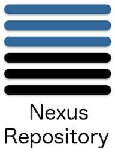

### docker private registry

``docker``를 사용하여 빌드를 하다 보면 이미지들을 저장 할 공간이 필요합니다. 물론 ``docker``에서 지원하는 ``dockerhub``를 사용하여 이미지를 push하거나 pull 할 수 있지만, 운용을 위해 회사나 개인이 저장 할 공간이 필요합니다. 우리는 이미지 등록 서버를 따로 구축 할 수 있고, 이미지 등록 서버는 쿠버네티스에서 이미지를 가져오게 할 수 있습니다!👍

#### Top3

먼저 설치에 앞서 이미지 등록 서버는 어떤게 많이 사용되는지 확인해볼수 있습니다. 도커 이미지 파일을 위한 저장소로는 크게 3가지가 제일 유명합니다.

1. harbor

    

2. nexsus

    

3. docker-registry
