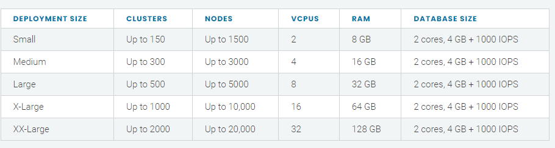
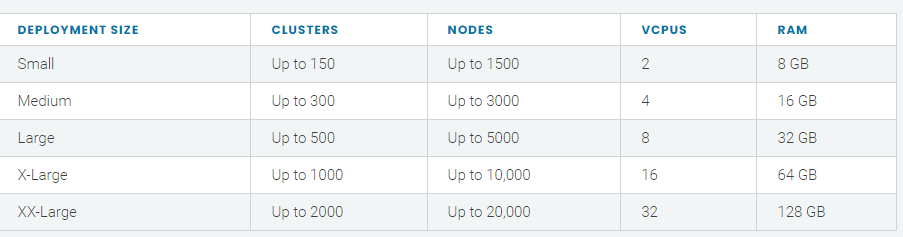
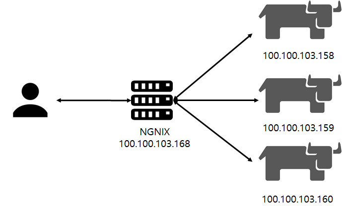
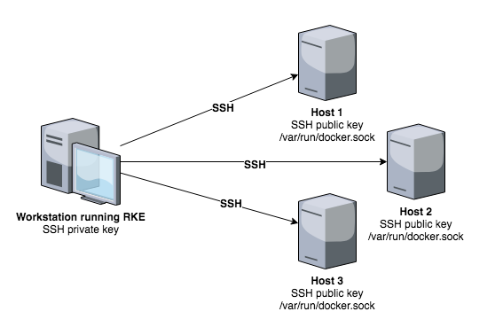
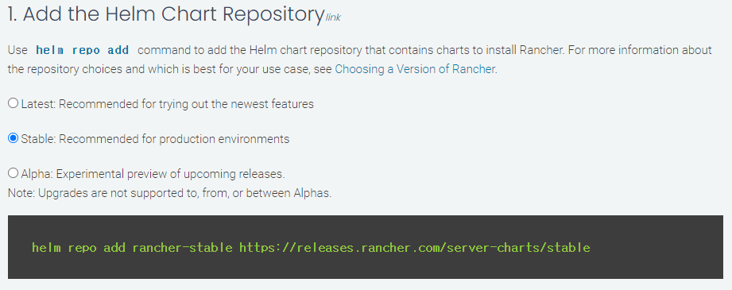

`Rancher` 에 대해서 블로그나 다른 문서들을 보면 검색해보시면 간단하게 `docker-image`에 `rancher-dashboard`를 띄워서 클러스터를 구성하는 모습을 볼 수 있습니다. 하지만 실제 상용서비스에서는 위의 방식으로는 `rancher`를 구성하면 안됩니다:sweat:

`rancher-dashboard` 는 위와 같이 구성시에는 대시보드서버가 하나로 구성되기에 대시보드 서버가 죽을 시 kubernetes를 제어 할 수 없습니다. 그렇기에 공식문서에서도 `docker-image`를 통해 설치하는 방식은 개발용으로 밖에 권장되지 않습니다.

> ### Docker Install
>
> For test and demonstration purposes, Rancher can be installed with Docker on a single node.
>
> The Rancher backup operator can be used to migrate Rancher from the single Docker container install to an installation on a high-availability Kubernetes cluster. For details, refer to the documentation on [migrating Rancher to a new cluster.](https://rancher.com/docs/rancher/v2.5/en/backups/migrating-rancher)

우리는 Rancher를 사용해서 어떻게 운영 클러스터를 구성할 수 있을까요?!:slightly_smiling_face:

공식 문서를 통해 Rancher 설치과정을 기술하였습니다.

### 설치대상 확인:memo:

먼저 `rancher`는 여러가지의 `k8s`를 지원합니다. 먼저 어떤 종류의 쿠버네티스를 설치할 지 그리고 어떤 조건이 필요한지에 대해서 알아봐야 됩니다!

#### k3s (Lightweight Kubernetes)



- k8s 경량화 버전
- containerd를 사용
- etcd가 없으며, sqllite로 대체
- binary 100mb

#### RKE(Rancher Kubernetes Engine)



- Rnacher Kubernetes로 Rancher에서 직접 지원
- docker version: 19.03 종속
- 최소 노드: 3

#### RKE2

- 보안에 집중
- 미국연방정부 보안이슈 해결을 위해 만든 쿠버네티스

#### RanderD

- 실험적인 성격이 강한 쿠버네티스

#### docker-image

- 테스트용도로 설치함

```bash
# 1. docker 버전은 Rancher를 지원하는 버전이여야 합니다.
# 2. --privileged 옵션을 통하여 container에서 system 설정을 변경할 수 있어야 합니다.

# Docker volume 생성
$ docker create volume racher-data

# Docker container 실행
$ docker run -d --restart=unless-stopped -p 80:80 -p 443:443 --privileged -v rancher-data:/var/lib/rancher rancher/rancher:latest
```

### 설치 환경

공식문서를 참조하여 설치하였으며 아래와 같은 환경에서 설치를 진행하였습니다.

**OS: Rhel7.6**

**User: root**

**Engine: RKE(Rancher Kubernetes Engine)**

### 설치 형상



공식 문서를 살펴 보시면, 대시보드를 앞단에서 접근할 수 있게 로드밸런서가 설치가 되어야 됩니다.

저는 `ngnix`를 사용하여 구성하였습니다.

## 사전설치:computer:

### OS 사전 설치 사항

- lock 파일 제거

```bash
rm -rf /etc/*.lock
```

- hostname 변경

```bash
hostnamectl set-hostname ${hostname}
```

- swap off 설정

```bash
swapoff -a

# /etc/fstab 파일에서 "/dev/mapper/centos-swap swap" 설정 주석 처리
sed -i '/swap/s/^/#/g' /etc/fstab
```

- 방화벽 해제

```bash
systemctl stop firewalld
systemctl disable firewalld
```

- SELINUX 해제

```bash
setenforce 0

# /etc/selinux/config 파일에서 SELINUX 값을 permissive 로 변경
sed -i 's/^SELINUX=enforcing$/SELINUX=permissive/' /etc/selinux/config
```

- bridge 설정

```bash
cat <<EOF | tee /etc/sysctl.d/k8s.conf
net.bridge.bridge-nf-call-ip6tables = 1
net.bridge.bridge-nf-call-iptables = 1
net.ipv4.ip_forward = 1
EOF

sysctl --system
```

- ntp 설정

```bash
yum install -y ntp
systemctl start ntpd
systemctl enable ntpd
ntpq -p
```

### Docker 설치

- 설치 패키지 업데이트

```bash
yum -y update
```

- 의존성 패키지 및 네트워크 도구 설치

```bash
yum -y install conntrack socat net-tools
```

- 유틸 설치

```bash
yum -y install yum-utils device-mapper-persistent-data lvm2
```

- docker 저장소 추가

```bash
yum-config-manager --add-repo https://download.docker.com/linux/centos/docker-ce.repo
```

- docker 필요 패키지 설치

```bash
echo "\

[centos-extras]
name=Centos extras - $basearch
baseurl=http://mirror.centos.org/centos/7/extras/x86_64
enabled=1
gpgcheck=0
" >> /etc/yum.repos.d/docker-ce.repo
```

- docker 의존성 패키지 설치

```bash
yum -y install slirp4netns fuse-overlayfs container-selinux
```

- docker 19.03 설치

```bash
curl https://releases.rancher.com/install-docker/19.03.sh | sh
```

- 설치 완료 후 서비스 등록

```bash
# 서비스 등록
systemctl start docker

# 서비스 확인
systemctl status docker

# 부팅시 재 시작 확인
systemctl enable docker
```

- iptables 변경

```bash
# 현재 iptables 리스트 확인
iptables -L

# FORWARD를 ACCEPT로 변경
iptables -P FORWARD ACCEPT

# ACCEPT로 변경된 것을 확인
iptables -L
```

- 방화벽 docker0 인터페이스 추가

```bash
firewall-cmd --permanent --zone=trusted --change-interface=docker0
firewall-cmd --reload
```

## Rancher 설치

### RKE 설치

- wget 설치

```bash
yum install -y wget
```

- RKE 다운로드

```bash
# (2021-07-27기준 v1.2.9) https://github.com/rancher/rke
wget https://github.com/rancher/rke/releases/download/v1.2.9/rke_linux-amd64

# 이름 변경
mv rke_linux-amd64 rke

# 권한 부여
chmod +x rke

# 유저디렉토리로 이동
mv rke /usr/bin/rke
```

### Kubectl 설치

- Kubectl 다운로드

```bash
curl -LO "https://dl.k8s.io/release/$(curl -L -s https://dl.k8s.io/release/stable.txt)/bin/linux/amd64/kubectl"
```

- 바이너리 검증

```bash
curl -LO "https://dl.k8s.io/$(curl -L -s https://dl.k8s.io/release/stable.txt)/bin/linux/amd64/kubectl.sha256"
```

- 체크섬

```bash
echo "$(<kubectl.sha256) kubectl" | sha256sum --check
# kubectl: OK
```

- 설치

```bash
sudo install -o root -g root -m 0755 kubectl /usr/local/bin/kubectl
```

`사용 계정이 루트 계정이 아닌경우에 아래 내용 추가`

```bash
chmod +x kubectl
mkdir -p ~/.local/bin/kubectl
mv ./kubectl ~/.local/bin/kubectl
# and then add ~/.local/bin/kubectl to $PATH
```

### Rancher 사용유저 생성



도커로 설치하면 알아서 클러스터에 설정을 해주지만 RKE로 설치시에는 위와 같은 형상으로 설치하게 됩니다.

설치장비에만 RKE가 필요하며, 각각의 SSH Public Key를 클러스터 내 노드들과 공유되어야 됩니다.

저는 RKE계정을 생성후에 위의 그림에 나오는 과정을 진행하였습니다.

- user 생성

```bash
# root에서 실행
useradd -m -G docker rke

# 패스워드설정
echo '패스워드' | passwd --stdin rke
```

- 계정 변경

```bash
su - rke
```

- .ssh 디렉토리 생성

```bash
mkdir $HOME/.ssh
```

- 권한 부여(중요)

```bash
# 권한부여가 안되면 로그인시 패스워드를 물어보기에 설치시 오류발생
chmod 700 $HOME/.ssh

# 파일 생성
touch $HOME/.ssh/authorized_keys

# docker.socket 접근 테스트
docker version
```

- ssh 키 생성

```bash
ssh-keygen

# 실행 내용
Generating public/private rsa key pair.
Enter file in which to save the key ($HOME/.ssh/id_rsa):
Enter passphrase (empty for no passphrase):
Enter same passphrase again:
Your identification has been saved in $HOME/.ssh/id_rsa.
Your public key has been saved in $HOME/.ssh/id_rsa.pub.
The key fingerprint is:
```

`$HOME/.ssh/id_rsa` (SSH private key, keep this secure)

`$HOME/.ssh/id_rsa.pub` (SSH public key)

- 공개키 전달

```bash
# 공개키 전달
ssh-copy-id -i ~/.ssh/id_rsa.pub rke@[host]

# 권한 부여
chmod 700 ~/.ssh/
chmod 600 ~/.ssh/authorized_keys

# 접근 테스트
ssh -i $HOME/.ssh/id_rsa rke@hostname docker version
```

- rke config 생성

```bash
rke config
# 노드 3개에 RKE를 설치하는 과정이며,
# 100.100.103.158 (control, etcd, worker)
# 100.100.103.159 (control, etcd, worker)
# 100.100.103.160 (control, etcd, worker)
# CNI: Canal

# 실행 결과
[+] Cluster Level SSH Private Key Path [~/.ssh/id_rsa]:
[+] Number of Hosts [1]: 3
[+] SSH Address of host (1) [none]: 100.100.103.158
[+] SSH Port of host (1) [22]:
[+] SSH Private Key Path of host (100.100.103.158) [none]:
[-] You have entered empty SSH key path, trying fetch from SSH key parameter
[+] SSH Private Key of host (100.100.103.158) [none]:
[-] You have entered empty SSH key, defaulting to cluster level SSH key: ~/.ssh/id_rsa
[+] SSH User of host (100.100.103.158) [ubuntu]: rke
[+] Is host (100.100.103.158) a Control Plane host (y/n)? [y]: y
[+] Is host (100.100.103.158) a Worker host (y/n)? [n]: y
[+] Is host (100.100.103.158) an etcd host (y/n)? [n]: y
[+] Override Hostname of host (100.100.103.158) [none]:
[+] Internal IP of host (100.100.103.158) [none]:
[+] Docker socket path on host (100.100.103.158) [/var/run/docker.sock]:
[+] SSH Address of host (2) [none]: 100.100.103.159
[+] SSH Port of host (2) [22]:
[+] SSH Private Key Path of host (100.100.103.159) [none]:
[-] You have entered empty SSH key path, trying fetch from SSH key parameter
[+] SSH Private Key of host (100.100.103.159) [none]:
[-] You have entered empty SSH key, defaulting to cluster level SSH key: ~/.ssh/id_rsa
[+] SSH User of host (100.100.103.159) [ubuntu]: rke
[+] Is host (100.100.103.159) a Control Plane host (y/n)? [y]: y
[+] Is host (100.100.103.159) a Worker host (y/n)? [n]: y
[+] Is host (100.100.103.159) an etcd host (y/n)? [n]: y
[+] Override Hostname of host (100.100.103.159) [none]:
[+] Internal IP of host (100.100.103.159) [none]:
[+] Docker socket path on host (100.100.103.159) [/var/run/docker.sock]:
[+] SSH Address of host (3) [none]: 100.100.103.160
[+] SSH Port of host (3) [22]:
[+] SSH Private Key Path of host (100.100.103.160) [none]:
[-] You have entered empty SSH key path, trying fetch from SSH key parameter
[+] SSH Private Key of host (100.100.103.160) [none]:
[-] You have entered empty SSH key, defaulting to cluster level SSH key: ~/.ssh/id_rsa
[+] SSH User of host (100.100.103.160) [ubuntu]: rke
[+] Is host (100.100.103.160) a Control Plane host (y/n)? [y]:
[+] Is host (100.100.103.160) a Worker host (y/n)? [n]: y
[+] Is host (100.100.103.160) an etcd host (y/n)? [n]: y
[+] Override Hostname of host (100.100.103.160) [none]:
[+] Internal IP of host (100.100.103.160) [none]:
[+] Docker socket path on host (100.100.103.160) [/var/run/docker.sock]:
[+] Network Plugin Type (flannel, calico, weave, canal, aci) [canal]:
[+] Authentication Strategy [x509]:
[+] Authorization Mode (rbac, none) [rbac]:
[+] Kubernetes Docker image [rancher/hyperkube:v1.20.8-rancher1]:
[+] Cluster domain [cluster.local]:
[+] Service Cluster IP Range [10.43.0.0/16]:
[+] Enable PodSecurityPolicy [n]:
[+] Cluster Network CIDR [10.42.0.0/16]:
[+] Cluster DNS Service IP [10.43.0.10]:
[+] Add addon manifest URLs or YAML files [no]:
```

- rke 실행

```bash
rke up
```

- 설치 확인

```bash
kubectl --kubeconfig kube_config_cluster.yml get nodes
```

### Kubectl설정

- alias 설정

```bash
# yum 설치
yum -y install bash-completion
source /usr/share/bash-completion/bash_completion
kubectl completion bash >/etc/bash_completion.d/kubectl

# 설정
echo 'source <(kubectl completion bash)' >>~/.bashrc
echo 'alias k=kubectl' >>~/.bashrc
echo 'complete -F __start_kubectl k' >>~/.bashrc

# 적용
source ~/.bashrc
```

- 복사

```bash
# 폴더생성
mkdir -p ~/.kube

# 복사
cp kube_config_cluster.yml ~/.kube/config
```

### 보관되어야 될 파일(중요)

- `cluster.yaml`은 노드 삭제 및 수정 시에 사용 (rke config)
- `kube_config_cluster.yml`은 서버에서 kubectl로 접근시 필요(rke up)
- `rancher-cluster.rkestate` 은 클러스터 상태를 저장 (rke config)

## Rancher UI(HA)

### helm 설치

```bash
curl -fsSL -o get_helm.sh https://raw.githubusercontent.com/helm/helm/master/scripts/get-helm-3
chmod 700 get_helm.sh
./get_helm.sh
```

### 인증서 확인



### SSL configuration 설정

인증서의 경우 아래와 같이 3가지 방식이 있습니다. 각자 환경에 따라 공식 문서를 참조하시기 바랍니다.

이 문서에서는 `Rancher로 생성`하는 방식으로 진행합니다:walking:

1. Rancher로 생성
2. Let's Encrypt로 인증서 생성
3. 사용자 인증서

#### Cert manager 설치

```bash
# Install the CustomResourceDefinition resources separately
kubectl apply --validate=false -f https://github.com/jetstack/cert-manager/releases/download/v1.0.4/cert-manager.crds.yaml

# **Important:**
# If you are running Kubernetes v1.15 or below, you
# will need to add the `--validate=false` flag to your
# kubectl apply command, or else you will receive a
# validation error relating to the
# x-kubernetes-preserve-unknown-fields field in
# cert-manager’s CustomResourceDefinition resources.
# This is a benign error and occurs due to the way kubectl
# performs resource validation.

# Create the namespace for cert-manager
kubectl create namespace cert-manager

# Add the Jetstack Helm repository
helm repo add jetstack https://charts.jetstack.io

# Update your local Helm chart repository cache
helm repo update

# Install the cert-manager Helm chart
helm install \
  cert-manager jetstack/cert-manager \
  --namespace cert-manager \
  --version v1.0.4
```

#### Rancher 설치

- 설치

```bash
# 설치에서는 stable버전을 사용하기로 한다.
helm repo add rancher-stable https://releases.rancher.com/server-charts/stable
helm repo update

# namespace 추가
kubectl create namespace cattle-system

# rancher 설치
helm install rancher rancher-stable/rancher \
  --namespace cattle-system \
  --set hostname=rancher.ipron.com \
  --set replicas=3 \
  --set ingress.tls.source=rancher

# rollout tail
kubectl -n cattle-system rollout status deploy/rancher
```

- ingress 설정

```bash
# public domain이 없을 경우 Ingress 설정 변경 필요
k edit ingress rancher -n cattle-system

.
.
.
spec:
  rules:
  #- hosts:  주석처리
  - http:
      paths:
      - backend:
          service:
            name: rancher
            port:
              number: 80
        pathType: ImplementationSpecific
```

### NGINX 로드 밸런서

위의 설명드린 형상을 통해 Rancher앞단에 `nginx`를 통해 구성하였습니다.

- nginx repo 추가

```bash
echo "\

[nginx]
name=nginx repo
baseurl=https://nginx.org/packages/rhel/$releasever/$basearch/
gpgcheck=0
enabled=1
" >> /etc/yum.repos.d/nginx.repo
```

- ngnix 설치

```bash
yum -y install nginx
```

- ngnix 실행

```bash
systemctl start nginx
systemctl status nginx
systemctl enable nginx
```

- ngnix 설정

```bash
$ vi /etc/ngnix/nginx.conf

worker_processes 4;
worker_rlimit_nofile 40000;

events {
    worker_connections 8192;
}

stream {
    upstream rancher_servers_http {
        least_conn;
        server 100.100.103.158:80 max_fails=3 fail_timeout=5s;
        server 100.100.103.159:80 max_fails=3 fail_timeout=5s;
        server 100.100.103.160:80 max_fails=3 fail_timeout=5s;
    }
    server {
        listen 80;
        proxy_pass rancher_servers_http;
    }

    upstream rancher_servers_https {
        least_conn;
        server 100.100.103.158:443 max_fails=3 fail_timeout=5s;
        server 100.100.103.159:443 max_fails=3 fail_timeout=5s;
        server 100.100.103.160:443 max_fails=3 fail_timeout=5s;
    }
    server {
        listen     443;
        proxy_pass rancher_servers_https;
    }

}
```

- nginx 재시작

```bash
nginx -s reload
```

## 트러블슈팅

#### k8s 재 설치 시 주의사항

- docker 리소스 삭제

```bash
docker rm -f $(docker ps -qa)
docker rmi -f $(docker images -q)
docker volume rm $(docker volume ls -q)
```

- unmount

```bash
# mount가 해제가 안될 경우 직접 입력하여 unmount 실행
for mount in $(mount | grep tmpfs | grep '/var/lib/kubelet' | awk '{ print $3 }') /var/lib/kubelet /var/lib/rancher; do umount $mount; done
```

- 설정 삭제

```bash
rm -rf /etc/ceph \
       /etc/cni \
       /etc/kubernetes \
       /opt/cni \
       /opt/rke \
       /run/secrets/kubernetes.io \
       /run/calico \
       /run/flannel \
       /var/lib/calico \
       /var/lib/etcd \
       /var/lib/cni \
       /var/lib/kubelet \
       /var/lib/rancher/rke/log \
       /var/log/containers \
       /var/log/kube-audit \
       /var/log/pods \
       /var/run/calico
```

- docker 서비스 종류

```bash
systemctl stop docker

# docker 종료 실패시
systemctl stop docker.socket
```

- ip link 삭제

```bash
ip a
# 아래 주석관련된 인터페이스 삭제
# flannel.1
# cni0
# tunl0
# caliXXXXXXXXXXX
# vethXXXXXXXX

ip link delete interface_name
```

- iptables 확인

```bash
iptables -L -t nat
iptables -L -t mangle
iptables -L
```

- 재시작

```bash
reboot
```

### 마치며

축하합니다:tada:

운영환경에 RKE 설치를 완료했습니다!

더 필요하신 내용들은 공식문서에서 더 상세한 내용을 보실 수 있습니다!

해당 자료는 제가 공식문서를 보며 설치하며 경험했던 내용들을 찾아 수정하면서 설치했던 소중한 자료입니다.

다른 분들께 도움이 되기위해 공유드리오니 무단으로 퍼가지 말아주세요:cry:
