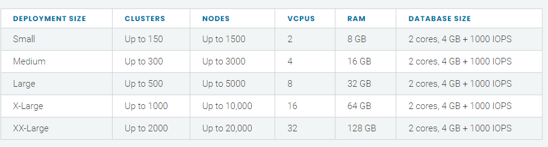

저는 윈도우에 도커를 `docker-desktop`을 활용하여 구성하여 사용하고 있었습니다. 근데 갑자기 동료가 `docker-desktop`이 기업에서 유료로 전환이 된다고 하더군요. :sweat:

그래서 오늘은 `docker-desktop`을 대체 할 수 있는 `rancher-desktop`에 대해서 기술합니다.

> ### Rancher-desktop
>
> [설치파일]
>
> https://rancherdesktop.io/
>
> [gitgub]
>
> https://github.com/rancher-sandbox/rancher-desktop

우리는 지난 rancher에 대해 알아 보던 중 `k3s, rke, rke2`등에 대해서 간략하게나마 알아봤었습니다.

그 중 `k3s`는 경량화에 초점을 둔 `kubernetes`인데요. 라즈베리파이 환경에서 돌아가며, 계산대 포스에서 사용한다고 알고 있었습니다.

`rancher`에서 `k3s`를 가지고 쉽게 개발 환경을 구축할 수 있게 `rancher-desktop`을 새로 발표했네요:smiley:

이미 알고 계신 분들도 많겠지만 공식 문서를 토대로 기술해보겠습니다.

### 설치형상:memo:

먼저 `rancher`는 여러가지의 `k8s`를 지원합니다. 먼저 어떤 종류의 쿠버네티스를 설치할 지 그리고 어떤 조건이 필요한지에 대해서 알아봐야 됩니다!

#### k3s (Lightweight Kubernetes)



- k8s 경량화 버전
- containerd를 사용
- etcd가 없으며, sqllite로 대체
- binary 100mb

#### 형상


형상을 확인해보면 docker뿐 아니라 containerd도 지원하는 것을 확인 할 수 있습니다.

### 사전설치:computer:

- window 10
- wsl2

### 설치:coffee:


설치는 더 할 나위 없이 간편합니다. 각자 OS에 맞는 환경으로 설치하시면 됩니다.


저에 경우에는 친숙한 docker로 설치하였습니다. `docker`, `k3d`를 사용하는 것을 알 수 있습니다. 설치가 끝나면 `kubectl`을 그냥 입력하세요!

```bash
$kubectl get po
I0311 17:04:32.495985    1699 versioner.go:58] Get https://kubernetes.docker.internal:6443/version?timeout=5s: x509: certificate signed by unknown authority
Unable to connect to the server: x509: certificate signed by unknown authority
```

뭔가 문제가 있어보이네요.. 수정이 필요해보입니다.

## 트러블슈팅

#### docker-desktop 설치 후 재 설치 시

위에 `kubectl`을 입력하였을때 `x509`에러가 나오면 `config`파일을 확인 할 필요가 있습니다. `rancher-desktop`은 `~/.kube/config`에 구성되어 있습니다.

```bash
$ vi ~/.kube/config
# 변경
current-context: rancher-desktop 
```

### 마치며

축하합니다:tada:

윈도우에 kubernetes 설치를 완료했습니다!

더 필요하신 내용들은 공식문서 및 slack에서 더 상세한 내용을 보실 수 있습니다!

docker에서 영리를 취하니 저도 containerd 명령어에 익숙해질 필요가 있겠네요.

해당 자료는 제가 공식문서를 보며 설치하며 경험했던 내용들을 찾아 수정하면서 설치했던 소중한 자료입니다.

다른 분들께 도움이 되기위해 공유드리오니 무단으로 퍼가지 말아주세요:cry:
