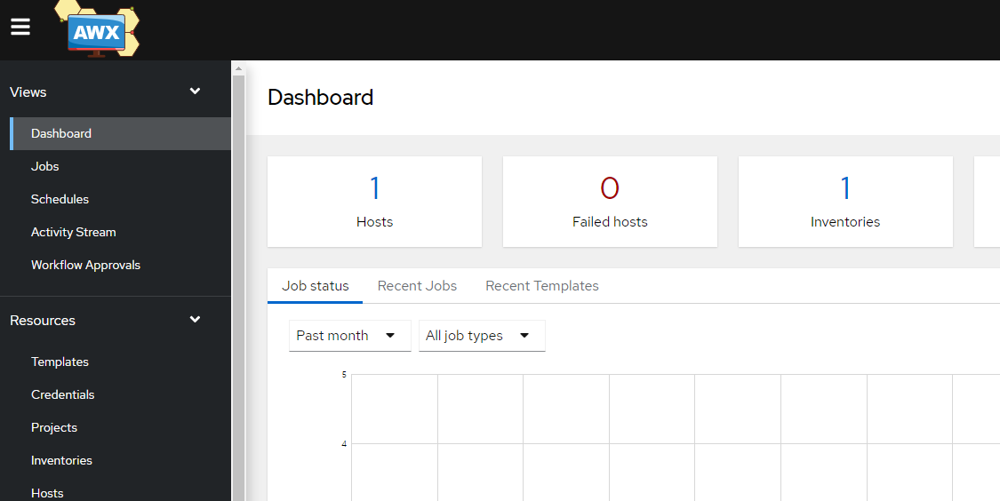

### AWX

#### AWX?

`awx`는 `ansible tower`오픈소스 버전입니다. `ansible`을 `gui`환경에서 관리할 수 있도록 합니다

#### 설치

* centos(7.3)
* AWS (v17)
* python (3.10.5)
* docker
* docker-compose (v2.6.1)

> awx는 ver17 기준으로 docker환경이 아닌 k8s환경으로 변경되었습니다. 현 문서에서는 v17 기준으로 설치 후 추후 v18 버전 이후 설치에 대해 다룹니다.

#### 진행 과정

**공통**

```bash
yum -y update
```

필요 패키지 설치

```bash
yum install epel-release vim -y
```

**파이썬**

* 최신 버전 파이썬을 위한 openssl 버전 업

파이썬 v3.10.x부터 openssl을 v1.1.1 버전으로 사용하여야 하나 centos는 v1.0.2 입니다.

```bash
yum install openssl11 openssl11-devel -y
```

* openssl 11 확인

```bash
$ openssl11 version
OpenSSL 1.1.1k  FIPS 25 Mar 2021
```

* 필요 패키지 설치

```bash
sudo yum install gcc zlib-devel openssl openssl-devel libffi-devel wget -y
```

* 파이썬 다운로드 및 설치

```bash
wget https://www.python.org/ftp/python/3.10.5/Python-3.10.5.tar.xz
tar xvf Python-3.10.5.tar.xz
cd Python-3.10.5
export CFLAGS=$(pkg-config --cflags openssl11)
export LDFLAGS=$(pkg-config --libs openssl11)
./configure
make
sudo make install
```

* 파이썬 버전 확인

```bash
$ python3 --version
Python 3.10.5
```

**ansible & docker**

* ansible 설치

```bash
pip3 install ansible
```

* docker 필요 패키지 설치

```bash
sudo yum install -y yum-utils device-mapper-persistent-data lvm2
```

* docker-repo 등록

```bash
sudo yum-config-manager --add-repo https://download.docker.com/linux/centos/docker-ce.repo
```

* docker 설치

```bash
sudo yum install -y docker-ce docker-ce-cli containerd.io
```

* docker 서비스 등록

```bash
sudo systemctl start docker
```

```bash
sudo systemctl enable docker
```

* docker-compose 설치

```bash
curl -SL https://github.com/docker/compose/releases/download/v2.6.1/docker-compose-linux-x86_64 -o /usr/local/bin/docker-compose
sudo chmod +x /usr/local/bin/docker-compose
sudo ln -s /usr/local/bin/docker-compose /usr/bin/docker-compose
docker-compose --version
```

**user 생성**

* ansible 계정 생성

```bash
$ sudo useradd -m ansible
$ sudo passwd ansible
$ sudo usermod -aG docker ansible
```

* ansible 계정 docker 확인

```bash
$ su - ansible
$ docker container ls
```

**git 설치**

```bash
sudo yum install -y curl-devel expat-devel gettext-devel perl-ExtUtils-MakeMaker
```

```bash
$ yum install http://opensource.wandisco.com/centos/7/git/x86_64/wandisco-git-release-7-1.noarch.rpm
$ yum remove git
$ yum install git
$ git --version
git version 2.31.1
```

**nodejs 설치**

```bash
$ curl -sL https://rpm.nodesource.com/setup_10.x | sudo bash -
$ sudo yum install -y nodejs
```

**awx 설치**

여기부터 위에 만들어둔 `ansible` 계정으로 진행합니다.

* 파이썬 가상환경 추가

```bash
pip3 install virtualenv
```

* 가상환경 추가

```bash
virtualenv awxenv --python=python3
```

* bashrc 추가

```bash
source ~/awxenv/bin/activate
alias vi='vim -b'
alias anp='ansible-playbook'
source ~/.bashrc
```

* 디렉토리 추가

```bash
mkdir ~/.downloads
cd ~/.downloads
```

```bash
git clone -b 17.1.0 https://github.com/Ansible/awx.git aws_git
ln -s aws_git aws
cd /awx/installe
```

* inventory 구성

```bash
$ vim inventory
admin_user=admin
# admin_password=password

# project_data_dir은 지정하지 않으면 도커 내부 스토리지를 사용
project_data_dir="~/.awx/data"
```

* 플레이북 실행

```bash
ansible-playbook -i inventory install.yml
```

* 정상 설치 확인

```bash
docker container ls
```



#### 참조

[NHN CLOUD](https://meetup.toast.com/posts/258)

[PLAN-B BLOG](https://lifeplan-b.tistory.com/196)
