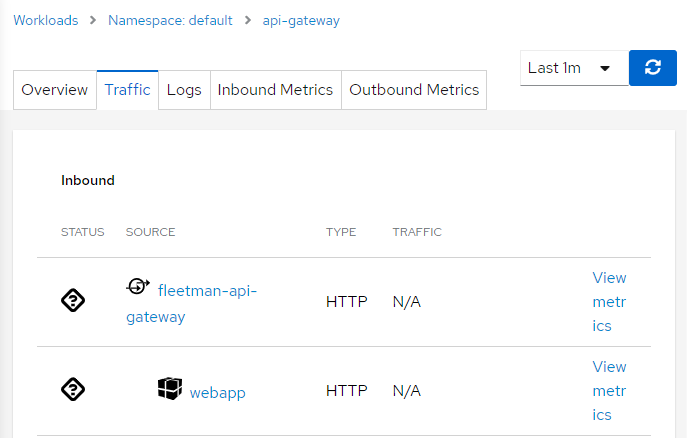
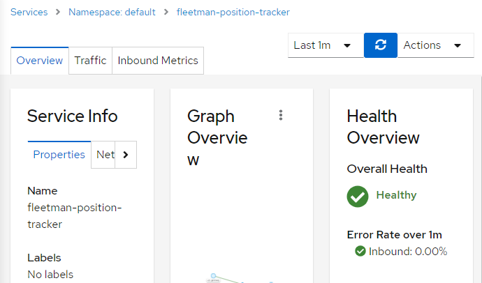
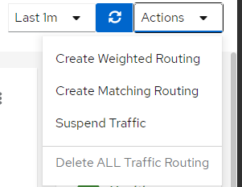
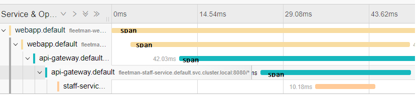
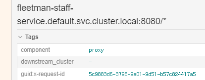
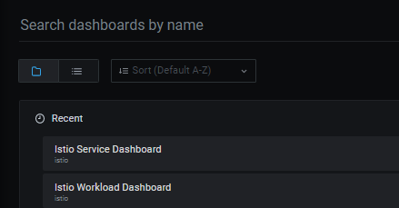

#### 4가지의 GUI 도구

* istio
* kiali
* jaeger
* grafana

### kiali

`Response Time`은 `Workload graph`에서만 볼 수 있다.

`workload graph`와 `service graph`의 `detail`은 다른다. 

**workload graph**



* Overview
* pod logging
* inbound/outbound

**Service graph**



* Overview
* pod metric



`graph`에서 바로 트래픽을 컨트롤 할 수 있다.

```bash
k get vs(virtualservices)
k get dr(destinationroles)
```

#### Tracing Tool

* zipkin
* jaeger
* Yeager

### Jaeger



#### Header를 확장시켜야 하는 이유



모든 span이 동일한 `x-request-id`를 사용하는 것을 확인 할 수 있다.

즉 동일한 아이디로 그룹화 된다.

`x-request-id`: 고유한 아이디로 추적에 사용, istio가 자동으로 생성

애플리케이션은 `request`로부터 다음 헤더를 수집해 전달해야한다.

- `x-request-id`
- `x-b3-traceid`
- `x-b3-spanid`
- `x-b3-parentspanid`
- `x-b3-sampled`
- `x-b3-flags`
- `x-ot-span-context`

```python
def getForwardHeaders(request):
    headers = {}

    # x-b3-*** headers can be populated using the opentracing span
    span = get_current_span()
    carrier = {}
    tracer.inject(
        span_context=span.context,
        format=Format.HTTP_HEADERS,
        carrier=carrier)

    headers.update(carrier)

    # ...

    incoming_headers = ['x-request-id', 'x-datadog-trace-id', 'x-datadog-parent-id', 'x-datadog-sampled']

    # ...

    for ihdr in incoming_headers:
        val = request.headers.get(ihdr)
        if val is not None:
            headers[ihdr] = val

    return headers

```

```bash
-> webapp -(xrequest-id=47)> Proxy -> proxy -> API Gateway -(xrequest-id=47)> Proxy
```

**모든 애플리케이션에서 구현하여야 한다.**

### Grafana

* istio workload
* istio servicedashboard



