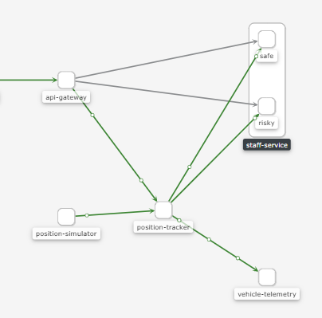
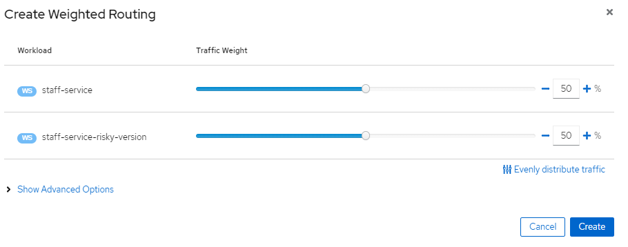

### Traffic management

#### Canary Release

- `k8s`에서 1%의 카나리 배포를 위해선 올드 버전 파드가 99개가 필요하다.

- `istio`에서는 정교한 `Canary Release`가 가능하다. (1%, 10%)

- `workload`: istio와 kiali에서 만든 용어로 파드의 집합을 나타냄
- 배포는 라운드로빈이 아니라 랜덤이다.

- `kiali`는 `app, version` 레이블에 특별한 의미를 부여한다.
  - app으로 실행중인 파드 분리
  - version으로 트래픽 분리

```yaml
---
# Safe version
apiVersion: apps/v1
kind: Deployment
metadata:
  name: staff-service
spec:
  selector:
    matchLabels:
      app: staff-service
  replicas: 2
  template:
    metadata:
      labels:
        app: staff-service
        version: safe # version tag 추가
    spec:
      containers:
        - name: staff-service
          image: richardchesterwood/istio-fleetman-staff-service:6-placeholder
          env:
            - name: SPRING_PROFILES_ACTIVE
              value: production-microservice
          imagePullPolicy: Always
          ports:
            - containerPort: 8080
---

---
# Risk Version
apiVersion: apps/v1
kind: Deployment
metadata:
  name: staff-service-risky-version
spec:
  selector:
    matchLabels:
      app: staff-service
  replicas: 1
  template: # template for the pods
    metadata:
      labels:
        app: staff-service
        version: risky
    spec:
      containers:
        - name: staff-service
          image: richardchesterwood/istio-fleetman-staff-service:6
          env:
            - name: SPRING_PROFILES_ACTIVE
              value: production-microservice
          imagePullPolicy: Always
          ports:
            - containerPort: 8080
```





`graph`에 `service-graph`에서 `detail`로 들어가 가중치를 쉽게 조절 할 수 있다.

#### Istio Virtual Service

```yaml
kind: VirtualService
apiVersion: networking.istio.io/v1alpha3
metadata:
  name: fleetman-staff-service
  namespace: default
spec:
  hosts: # The Service DNS(is the regular k8s service) name that we're apply routing
    - fleetman-staff-service.default.svc.cluster.local
  http:
    - route:
        - destination: # The Target DNS
            host: fleetman-staff-service.default.svc.cluster.local
            subset: safe # desetionation Rule
          weight: 100
        - destination: # The Target DNS(다른 서비스도 등록가능)
            host: fleetman-staff-service.default.svc.cluster.local
            subset: risky # The name defined in the DestinationRule
          weight: 0

---
kind: DestinationRule
apiVersion: networking.istio.io/v1alpha3
metadata:
  name: fleetman-staff-service
  namespace: default
spec:
  host: fleetman-staff-service.default.svc.cluster.local #SERVICE
  subsets:
    - labels: # SELECTOR
        version: safe # find pods with label 'safe'
      name: safe
    - labels: # SELECTOR
        version: risky
      name: risky
```

- virtual service = route configuration
- `k8s`서비스가 필요없다 생각할 수 있지만, `DNS`구성을 위해 필요
- `virtual Service`와 `Service`는 다른 일을 한다

```bash
              [ clien     ]
              [ container ]
              [ proxy     ]

DNS
self-service 172.17.0.18
self-service 172.17.0.6
self-service 172.17.0.12

1. istio-pilot(pod)에게 요청
2. Virtual Service 생성
3. pilot이 분배
  - istio Load Balancing(DestinationRules)

[ istio-pilot(pod)     ]
[ virtualService(yaml) ]

     |              \           \

172.17.0.18      172.17.0.6     172.17.0.12
[ pod       ]   [ pod       ]  [ pod       ]
[ container ]   [ container ]  [ container ]
[ proxy     ]   [ proxy     ]  [ proxy     ]
```

### 로드 밸런싱

`virtual service`에서 만약 90:10으로 카나리 배포를 한 후 같은 유저의 요청에 대해서는 같은 응답을 하도록 하는게 가능한가? **불가능하다**

하지만, 다른 방법으로는?

#### Consistent Hashing(일관된 해싱)

로드 밸런싱 옵션은 기본적으로 `round-robin`이다. 그외로 `consistent-hasing`도 있다.

```bash
# 예시로) 해쉬 값이 홀수이면 1, 짝수이면 2로 라우팅이 가능할 것이다.
# 만약 IP주소가 동일하다면 하나의 파드로만 전달 할 수 있다.
[ client      ] -> [ load Balancer ] -> [ POD ]
 89.376.19.121       Hash 알고리즘    -> [ POD ]
```

```yaml
kind: DestinationRule # Defining which pods should be part of each subset
apiVersion: networking.istio.io/v1alpha3
metadata:
  name: fleetman-staff-service
  namespace: default
spec:
  host: fleetman-staff-service.default.svc.cluster.local # SERVICE
  trafficPolicy:
    loadBalancer:
      consistentHash:
        useSourceIp: true
  subsets:
    - labels: # SELECTOR.
        version: safe # find pods with label 'safe'
      name: safe-group
    - labels: # sSELECTOR.
        version: risky # find pods with label 'risky'
      name: risky-group
```

> 중요) Envoy Proxy는 가중치 서브셋과 세션 어피니티는 동시에 동작하지 않는다.
>
> 순서를 보면 가중치가 먼저 동작함으로 세션 유지가 어렵다.
>
> [Client] -> [Weigting] -> [LoadBalancer] -> [Pod]

[ISTIO Consistent Hash](https://istio.io/latest/docs/reference/config/networking/destination-rule/#LoadBalancerSettings-ConsistentHashLB)

- httpHeaderName
- httpCookie
- useSourceIp
- httpQueryParameterName
- minimumRingSize

```yaml
kind: VirtualService
apiVersion: networking.istio.io/v1alpha3
metadata:
  name: a-set-of-routing-rules-we-can-call-this-anything # "just" a name for this virtualservice
  namespace: default
spec:
  hosts:
    - fleetman-staff-service.default.svc.cluster.local # The Service DNS (ie the regular K8S Service) name that we're applying routing rules to.
  http:
    - route:
        - destination:
            host: fleetman-staff-service.default.svc.cluster.local # The Target DNS name
            subset: all-staff-service-pods # The name defined in the DestinationRule
          # weight: 100 not needed if there's only one.
---
kind: DestinationRule # Defining which pods should be part of each subset
apiVersion: networking.istio.io/v1alpha3
metadata:
  name: grouping-rules-for-our-photograph-canary-release # This can be anything you like.
  namespace: default
spec:
  host: fleetman-staff-service # Service
  trafficPolicy:
    loadBalancer:
      consistentHash:
        httpHeaderName: "x-myval"
  subsets:
    - labels: # SELECTOR.
        app: staff-service # find pods with label "safe"
      name: all-staff-service-pods
```

반드시 100%같은 파드로 전송되지 않으니, 성능상 이점에 있을때만 사용하고 그게 아니면 지양한다.
