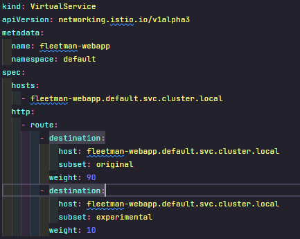
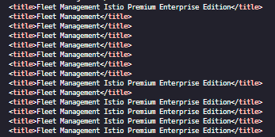
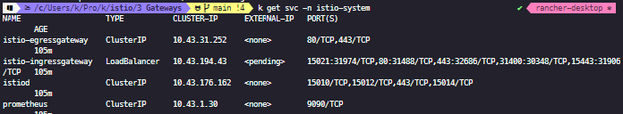
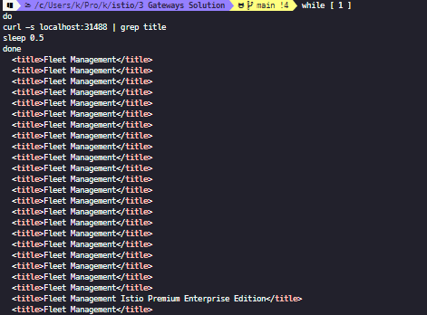

### Ingress Gateway

**Why?**

이스티오 서비스메시에서는 `ingress controller`말고 `Ingress Gateway`를 쓰는게 좋다. 왜 그럴까?





분명 90:10으로 지정하였으나, 예상한대로 동작하지 않는다. 최초 진입점이 `NodePort`이기에 50:50으로 동작한다.

* 서비스간의 차이: 브라우저에서 바로 접근함(프록시를 거치지 않는다)
* 프록시가 실행된 시간은 컨테이너가 요청할 시점임 최초시점은 없음
* 엣지 프록시를 위해선 `Ingree Gateway`가 필요하다.

```bash
사용자 -> `Ingress Gateway(Proxy)` => webapp
```

클라우드이면 물리적 로드밸런서에 `ServiceType: LoadBalancer`로 구성되어 할당된다.



> 개발 환경에서는 `NodePort`로 구성할 수 있다.

```yaml
apiVersion: networking.istio.io/v1alpha3
kind: Gateway
metadata:
  name: ingress-gateway-configuration
spec:
  selector:
    istio: ingressgateway # use Istio default gateway implementation
  servers:
  - port:
      number: 80
      name: http
      protocol: HTTP
    hosts:
    - "*"   # Domain name of the external website
---
kind: VirtualService
apiVersion: networking.istio.io/v1alpha3
metadata:
  name: fleetman-webapp
  namespace: default
spec:
  hosts:      # which incoming host are we applying the proxy rules to???
    - "*" # Copy the value in the gateway hosts - usually a Domain Name
  gateways: # 여기서 지정해준다 위에 설정한 gateway를
    - ingress-gateway-configuration
  http:
    - route:
        - destination:
            host: fleetman-webapp
            subset: original
          weight: 90
        - destination:
            host: fleetman-webapp
            subset: experimental
          weight: 10
---
kind: DestinationRule
apiVersion: networking.istio.io/v1alpha3
metadata:
  name: fleetman-webapp
  namespace: default
spec:
  host: fleetman-webapp
  subsets:
    - labels:
        version: original
      name: original
    - labels:
        version: experimental
      name: experimental
```



> 이제는 잘 동작한다.

#### Tip

* 브라우저마다 `캐시문제가`있으니 `curl`로 테스트하자.

* `kiali`에서 graph에 `Versioned app graph`에서 서비스 명도 같이 볼려면 `display`에서 `Service-node`도 선택


