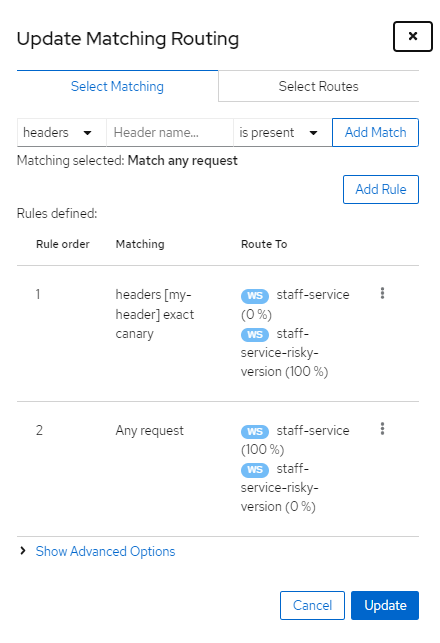

#### Header

Header를 넣어 실험버전으로 돌릴 수 있다.

```bash
curl -H "app: tester" 127.0.0.1:30080
```

```yaml
---
kind: VirtualService
apiVersion: networking.istio.io/v1alpha3
metadata:
  name: fleetman-webapp
  namespace: default
spec:
  hosts: # which incoming host are we applying the proxy rules to???
    - "*"
  gateways:
    - ingress-gateway-configuration
  http:
    - match:
        - headers: # IF
            my-header:
              exact: canary
      route: # THEN
        - destination:
            host: fleetman-webapp
            subset: experimental
    - route: # CATCH ALL
        - destination:
            host: fleetman-webapp
            subset: original
```

#### Dark Release

스테이징은 모든 환경을 가져와서 구성해야 하는데 테스트 시 과금이 된다던가 하는 위험이 있을 수 있다.

스테이징의 대안으로 `Dark Release`를 사용

- 테스트를 실제 라이브 환경에서 진행이 가능하다.

- Istio의 강점
- 테스트 환경을 따로 구성할 필요 없다.

---

`Dark Release`는 라이브 클러스터 안에 실험버전을 올려서 테스트가 가능

- 특정 유저만 `헤더`를 통해 은밀히 테스트 가능
- 테스트가 완료 된 후 카나리 배포를 통해 성공적으로 배포가 가능하다.



```yaml
kind: VirtualService
apiVersion: networking.istio.io/v1alpha3
metadata:
  name: fleetman-staff-service
  namespace: default
spec:
  hosts:
    - fleetman-staff-service
  http:
    - match:
        - headers:
            x-my-header:
              exact: canary
      route:
        - destination:
            host: fleetman-staff-service
            subset: risky
    - route:
        - destination:
            host: fleetman-staff-service
            subset: safe
---
kind: DestinationRule
apiVersion: networking.istio.io/v1alpha3
metadata:
  name: fleetman-staff-service
  namespace: default
spec:
  host: fleetman-staff-service
  subsets:
    - labels:
        version: safe
      name: safe
    - labels:
        version: risky
      name: risky
```

`kiail`나 `yaml`을 통해 정의할 수 있음.
