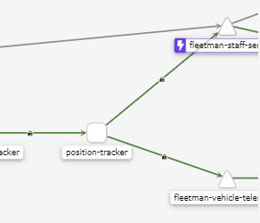
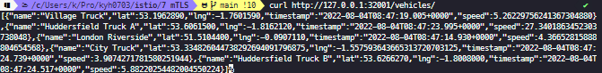
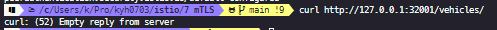

#### 클러스터 내부인데 TLS가 왜 필요할까?

단순하게 생각했을 때 `private`한 환경에서는 클러스터 내부에 `TLS`가 있을 필요가 없다. 하지만 `public cloud`에 배포 하였을 떄 노드 간 경유되는 패킷은 공격자가 감시할 수 있기에 내부 패킷들에도 `TLS`를 적용하는 것이 좋다. `istio`에서는 `TLS`를 쉽게 적용시킬 수 있다.

#### How?

```yaml
# This will enforce that ONLY traffic that is TLS is allowed between proxies
apiVersion: "security.istio.io/v1beta1"
kind: "PeerAuthentication"
metadata:
  name: "default"
  namespace: "istio-system"
spec:
  mtls:
    mode: STRICT
```

`Envoy Proxy`에서 `HTTPS`로 구성한다.

!! `istio`에서 이미 기본값으로 할당되어있다.

> 아래 그림에서 요청 온 `protocol`이 HTTP이다.



> 예전에는 `istio-citadel`이 인증서도 관리하고 분할되어 떨어져있었으나 하나로 합쳐지면서 보이진 않지만 컴포넌트가 동작중이다.

1. Enforce a policy that BLOCKS all non TLS traffic
2. Automatically upgrade all proxy-proxy communication to use mTLS

#### STRICT VS PERMISSIVE

`istio`는 기본적으로 다른 파드를 호출 할 때 `TLS`가 자동으로 설정되어있다.

**Permissive mTLS**

`istio`의 `mTLS`기본값은 `Permissive`이다.

```bash
# 1번 MSA ISTIO X
# 2번 MSA ISTIO O
# 보내는 쪽에 `ISTIO`가 없다
1. MSA                     2. MSA
[ Container ]  -> HTTP -> [   Proxy   ]
                          [ Container ]
```

`Permissivce`는 암호화되지않은 연결을 수락하고 `response`를 보낸다.

```yaml
# This will enforce that ONLY traffic that is TLS is allowed between proxies
apiVersion: "security.istio.io/v1beta1"
kind: "PeerAuthentication"
metadata:
  name: "default"
  namespace: "istio-system"
spec:
  mtls:
    mode: PERMISSIVE
```



**Strict mTLS**

`http`로 연결요청이 오면 허용하지 않는다.

- Inbound
- outbount

> 둘 다 적용된다.

```yaml
# This will enforce that ONLY traffic that is TLS is allowed between proxies
apiVersion: "security.istio.io/v1beta1"
kind: "PeerAuthentication"
metadata:
  name: "default"
  namespace: "istio-system"
spec:
  mtls:
    mode: STRICT
```


