### SSH 리모트 호스트 제어하기

SSH로 리모트 호스트를 제어하기 위해선 SSH 플러그인을 먼저 설치해줍니다.

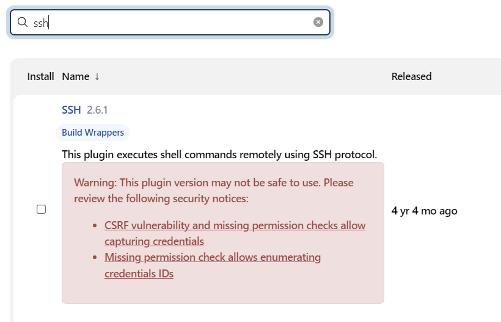

 SSH HOST를 추가합니다.

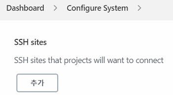

### Jenkins & Maven(CENTOS7)

1. epel-release 설치

```bash
yum install -y epel-release
```

2. java  설치

```bash
yum install java-11-openjdk-devel.x86_64
```

3. bash_profile

```bash
# .bash_profile

# Get the aliases and functions
if [ -f ~/.bashrc ]; then
        . ~/.bashrc
fi
M2_HOME=/opt/maven
M2=/opt/maven/bin
JAVA_HOME=/lib/jvm/java-11-openjdk-11.0.10.0.9-1.el7_9.x86_64
# User specific environment and startup programs

PATH=$PATH:$HOME/bin:$JAVA_HOME:$M2_HOME:$M2

export PATH                     
```

4. maven 플러그인 설치

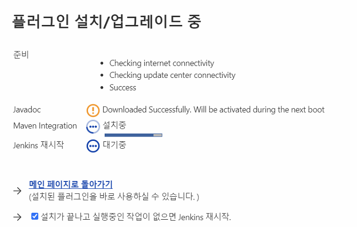

5. jenkins 설정

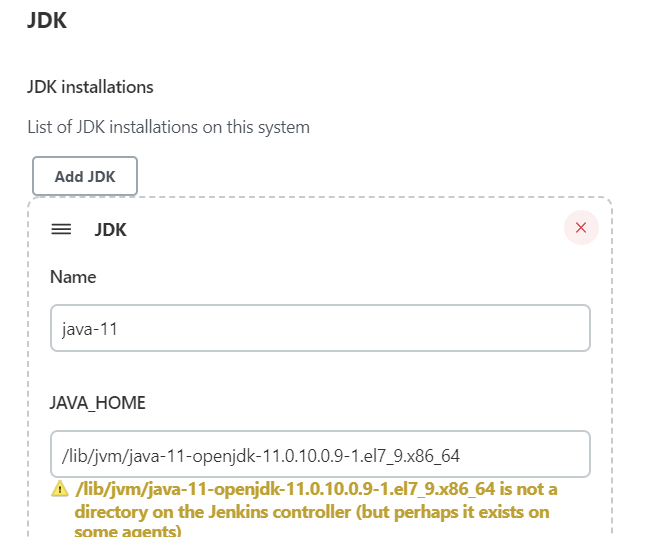

6. 프로젝트 확인

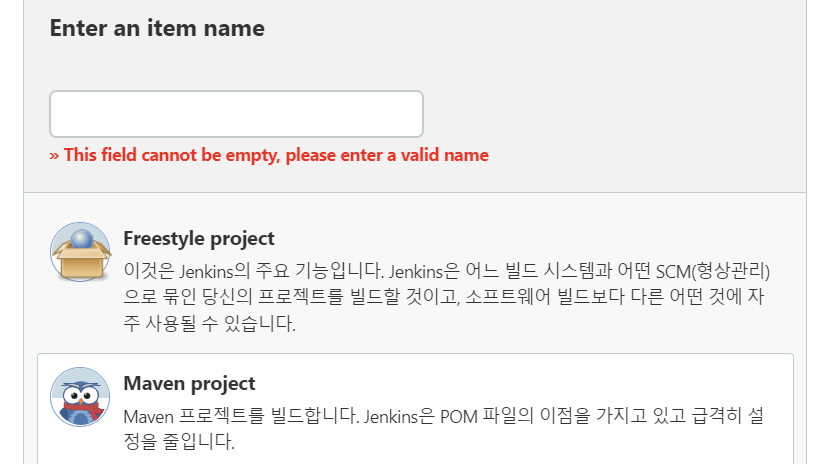

### Jenkins & Tomcat

1. tomcat 장비 설치
2. `deploy to container` plugin 설치
3. `빌드 후 조치` 추가

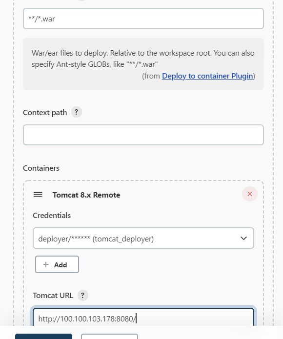

### Jenkins & Git

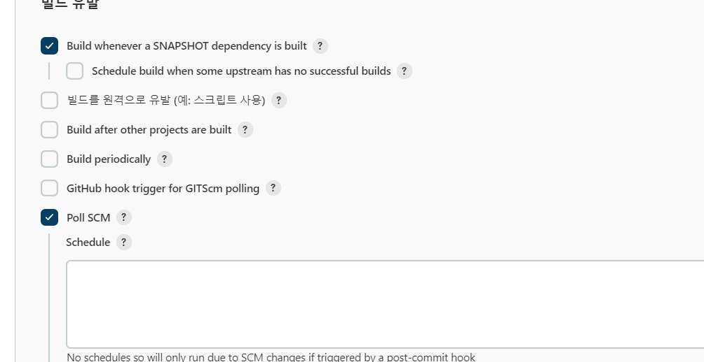

* Poll SCM: 빌드 정책에 따라 지속적 확인(cronjob)
* BUild Periodically: 지속적인 감시

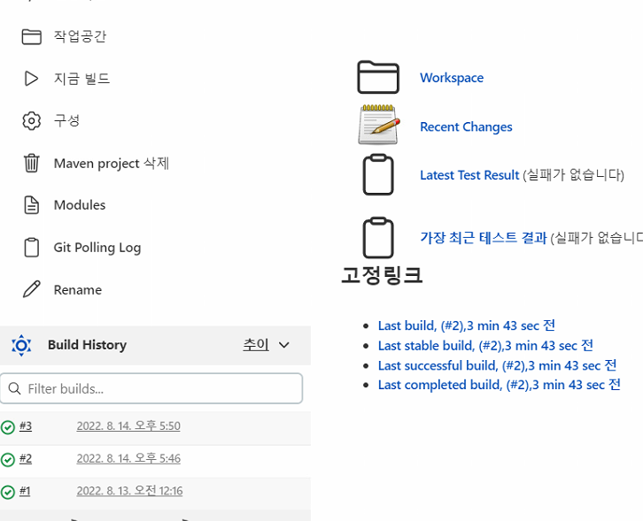

빌드가 주기적으로 감시하여 변경사항이 있으면 재 빌드 시킴.

### Jenkins & Security Value

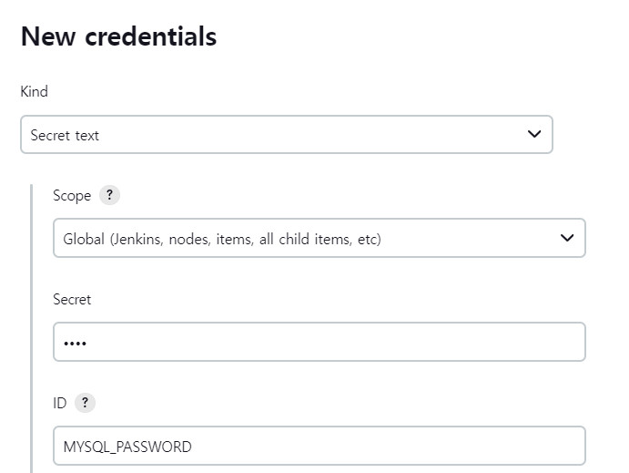

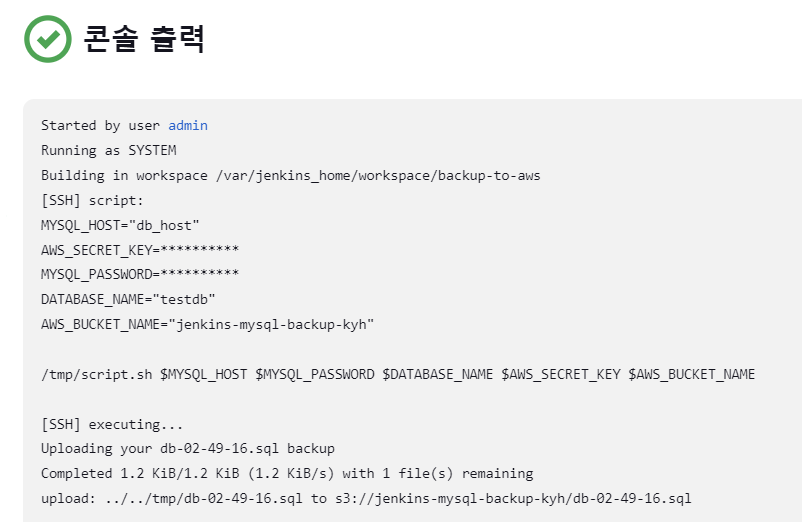

### Jenkins & Ansible

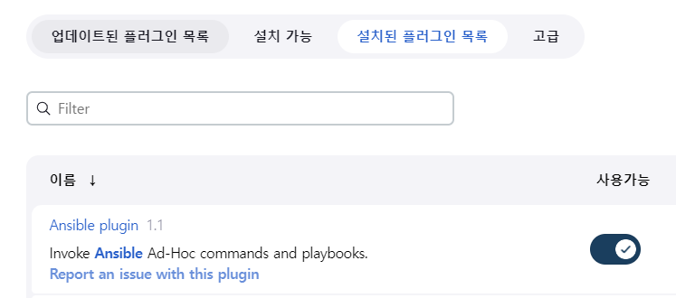


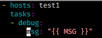

환경 변수도 넣을 수 있다.

### Jenkins & Color

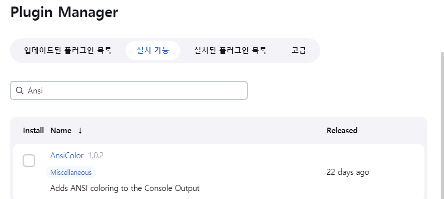

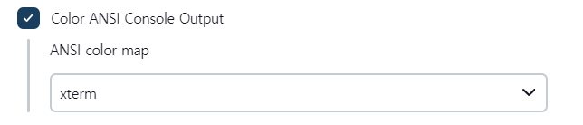

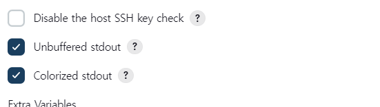

### Jenkins & Security

**유저가입허용**

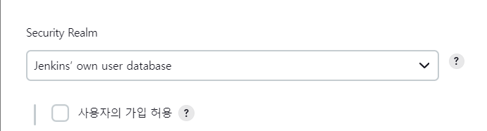

**보안플러그인 설치**

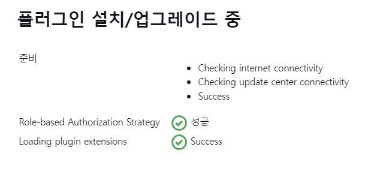

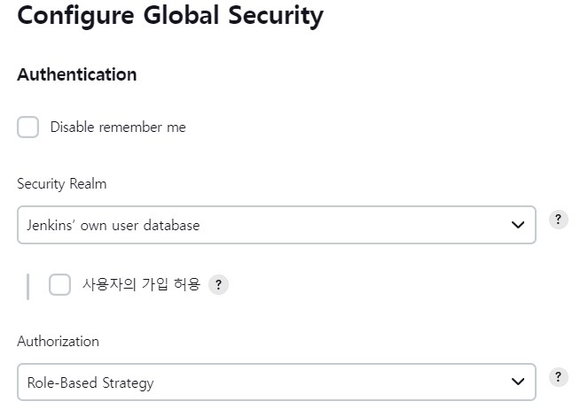

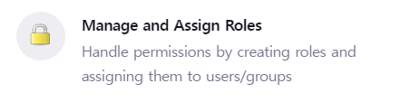

플러그인 설치 후에는 로그인 시 `access denine`이 발생한다.

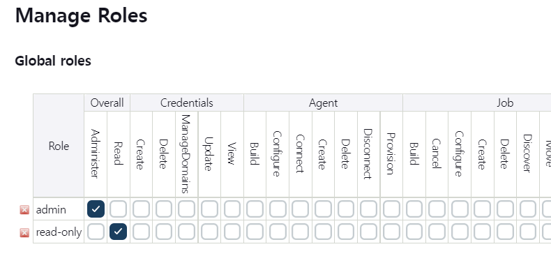

롤을 추가한다.

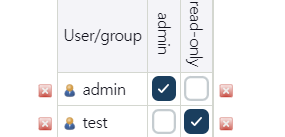
