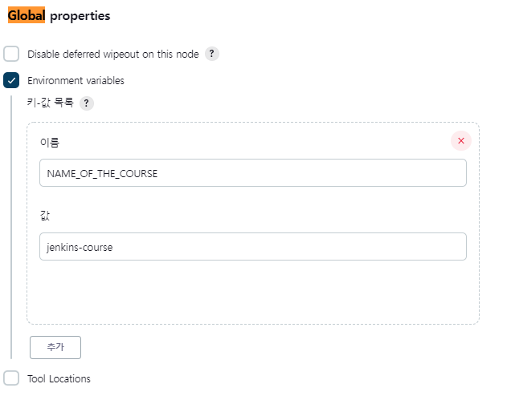
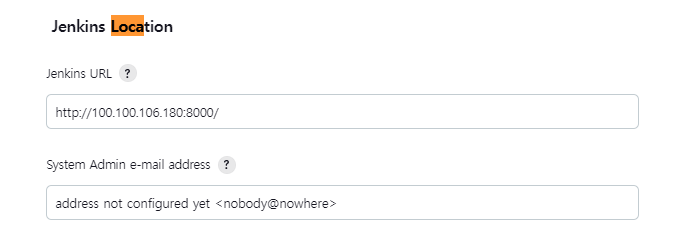
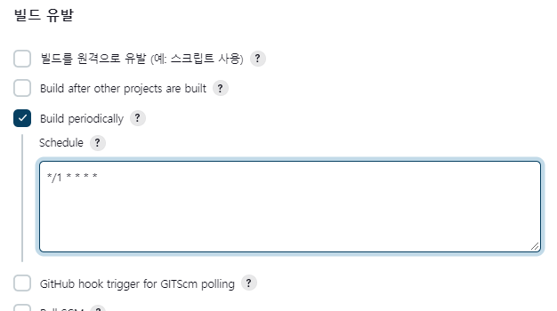
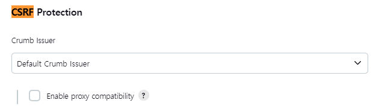
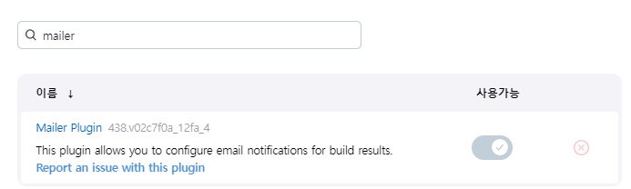
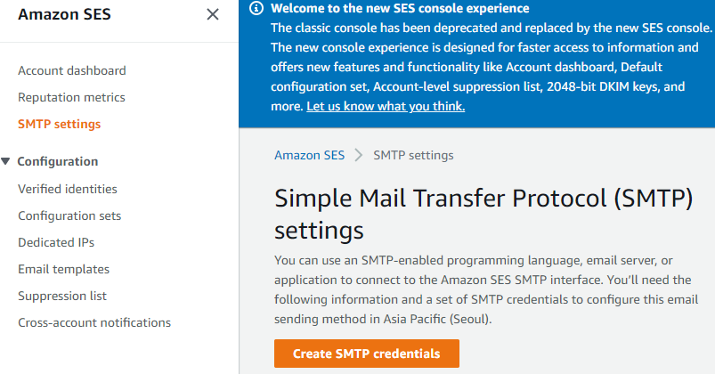
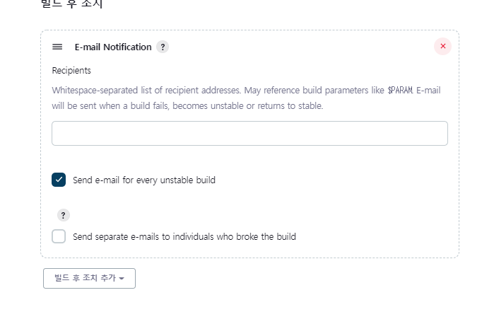

### Jenkins & Tip

**Global Environment**

[wiki](https://wiki.jenkins.io/display/JENKINS/Building+a+software+project)

전역으로 사용할 수 있는 상수들이 있다.

**Custom Environment**

**Jenkins URL**

**Jenkins Cron**

[크론탭](https://crontab.guru/#*_*_*_*_*)

**Trigger**

### Jenkins & email

