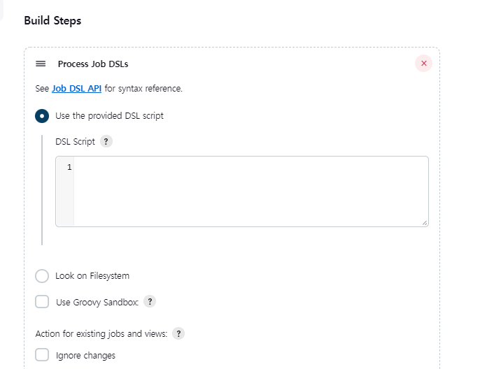

### DSL(Domain Specific Language)

[DSL문서](https://jenkinsci.github.io/job-dsl-plugin/#path/pipelineJob)

* 코드를 사용한 작업을 생성함
* dsl을 사용하여 생성하는 job의 단위를 `seed`라고 함

**플러그인 설치**



```bash
job('job_dsl_example') {
    description('This is my awesome Job')
    
    # Parameter
    parameters {
        booleanParam('FLAG', true)
        choiceParam('OPTION', ['option 1 (default)', 'option 2', 'option 3'])
    }
    
    # SCM
    scm {
        git('https://github.com/jenkins-docs/simple-java-maven-app', 'master')
    }
    
    # 트리거 유발
    triggers {
        scm('@daily')
    }
    
    steps {
        shell("""
              echo 'Hello World'
              echo 'Hello World2'
              """)
    }
    publishers {
        mailer('me@example.com', true, true)
    }
}
```

#### Git으로 관리


### ERROR: script not yet approved for use

jenkins 최초 설치 시 `Scipt Security Plugin`이 자동으로 설치되고 악의적인 스크립트의 실행을 막기 위해 발생하는 조치.

* 스크립트 콘솔
* Jenkins Pipeline
* Extenede Email Plugin
* JobDSL


`Groovy Sandbox`는 이러한 관리자의 수동 개입을 최소화하기 위해 제공됩니다.

이러한 기능을 사용하기 위해  [Authorize Project](https://plugins.jenkins.io/authorize-project/) 플러그인이 필요합니다.


