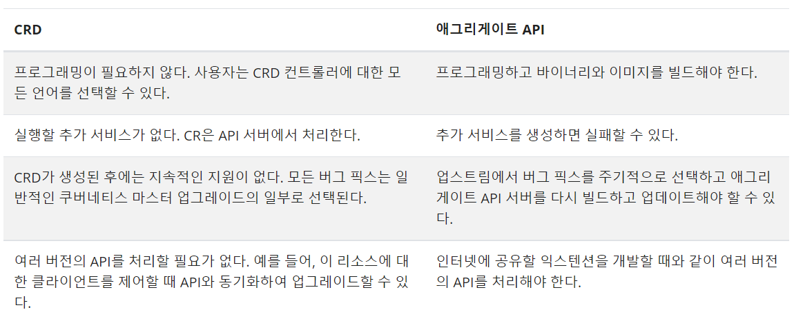
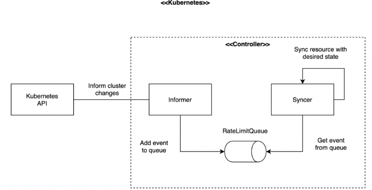
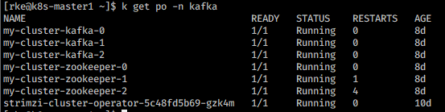
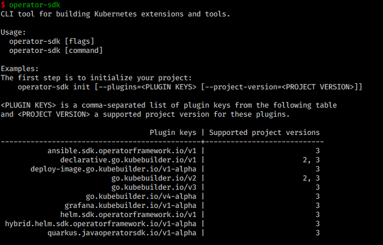

### Require

* k8s 버전의 이해
* golang

### Link

* [sample-controller](https://github.com/kubernetes/sample-controller/blob/master/pkg/apis/samplecontroller/register.go)
* [operator-sdk](https://github.com/operator-framework/operator-sdk)

### Resource

`Custom Resource`만드는 방식으로는 2가지 방식이 있습니다만, 최근에는 CRD 방식으로 대부분 구현합니다.

* 애그리게이트 API
* CRD



**동작방식**

기본적으로 `k8s resource`를 만들면 `etcd`에 저장 한 후 `controller`가 관리합니다. 따라서 사용자가 새로운 리소스를 생성한다고 하면, 새로운 리소스를 처리하는 `contorller`가 필요합니다.

먼저 우리는 `k8s`에 새로운 리소스를 등록해주어야 합니다.

k8s에 버전 형상을 기억하고 버전을 지정하여 생성하여줍니다.

#### 사용자 리소스 정의

**CustomResource**

```yaml
apiVersion: flights.com/v1
kind: FlightTicket
metadata:
  name: my-flight-ticket
spec:
  from: Mumbai
  to: London
  number: 2
```

**CustomResourceDefinition**

```yaml
apiVersion: apiextensions.k8s.io/v1
kind: CustomResourceDefinition
metadata:
  name: flighttickets.flights.com
spec:
  scope: Namespced
  group: flights.com # 사용자 지정 리소스에 apiVersion
  names:
    kind: FlightTicket
    singular: flightticket
    plural: flighttickets
    shortnames:
      - ft
  versions:
    - name: v1
      served: true
      storage: true
  schema: #사양 섹션에서 지정할 수 있는 모든 매개 변수를 정의
    openAPIV3Schema:
      type: object
      properties:
        spec:
          type: object
          properties:
            from:
              type: string
            to:
              type: string
            number:
              type: integer
              minimum: 1
              maximum: 10
```

#### 컨트롤러 구조



`Infomer`는 클러스터와 `Controller`사이의 중개자 역할로 지정한 리소스를 큐에 넣어주는 역할을 합니다. 컨트롤러는 그 큐에서 이벤트들을 받아 처리하면 됩니다.

컨트롤러를 만들기 위해서는 제공되는 [샘플컨트롤러](https://github.com/kubernetes/sample-controller/blob/master/pkg/apis/samplecontroller/register.go)를 복사하여 참조 및 수정하여 빌드 후 올리는 방법이 있습니다. 이 컨트롤러에 좀 더 복잡한 로직을 넣을 수 있는것이 `operator`입니다.



#### Operator-SDK

**Require**

* git
* go 1.18

**Install**

[Install guide](https://sdk.operatorframework.io/docs/installation/)를 보면서 인스톨을 진행합니다.

> Window는 설치가 안됩니다.



**Make Project Directory**

```bash
mkdir $HOME/projects/monitor-operator
```

**Init Project**

```bash
operator-sdk init \
    --domain=kyh0703.github.io \
    --repo=github.com/kyh0703/memcached-operator
```

> ```sh
> /usr/local/go/src/net/cgo_linux.go:13:8: no such package located
> Error: not all generators ran successfully
> run `controller-gen object:headerFile=hack/boilerplate.go.txt paths=./... -w` to see all available markers, or `controller-gen object:headerFile=hack/boilerplate.go.txt paths=./... -h` for usage
> make: *** [Makefile:95: generate] Error 1
> Error: failed to create API: unable to run post-scaffold tasks of "base.go.kubebuilder.io/v3":
> 
> 위와 같은 에러가 뜨면.. 당황하지말고 gcc가 설치되어있는지 확인!
> ```

**vertify Project File**

```bash
domain: kyh0703.github.io
layout:
- go.kubebuilder.io/v3
plugins:
  manifests.sdk.operatorframework.io/v2: {}
  scorecard.sdk.operatorframework.io/v2: {}
projectName: monitor-operator
repo: github.com/kyh0703/k8s-custom-controller
version: "3"
```

#### CRDS

```bash
operator-sdk create api --group=cache --version=v1alpha1 --kind=Memcached
```

`api`, `controller`폴더가 생깁니다.

**modify api types file**

`/api/v1alpha1/*_types.go` 

사용할 필드를 정의하여 줍니다.  `make generate` 명령어로 변경사항을 반영합니다.

```go
// MemcachedSpec defines the desired state of Memcached
type MemcachedSpec struct {
	// INSERT ADDITIONAL SPEC FIELDS - desired state of cluster
	// Important: Run "make" to regenerate code after modifying this file

	// Foo is an example field of Memcached. Edit memcached_types.go to remove/update
	Size string `json:"size,omitempty"`
}

// MemcachedStatus defines the observed state of Memcached
type MemcachedStatus struct {
	// INSERT ADDITIONAL STATUS FIELD - define observed state of cluster
	// Important: Run "make" to regenerate code after modifying this file
	Nodes []string `json:"nodes"`
}
```

**Generating CRD manifests**

```bash
$ make generate
$ make manifests
```

#### **컨트롤러 정의**

```go
import (
	...
	appsv1 "k8s.io/api/apps/v1"
	...
)

func (r *MemcachedReconciler) SetupWithManager(mgr ctrl.Manager) error {
	return ctrl.NewControllerManagedBy(mgr).
		For(&cachev1alpha1.Memcached{}).
		Owns(&appsv1.Deployment{}).
        WithOptions(controller.Options{
            MaxConcurrentReconciles: 2,
        }).Complete(r)
}
```

* NewControllerManagedBy: Controller Builder 생성
* For: 컨트롤러가 관찰하기 위한 우선적인 리소스를 특정한 후 이벤트에 대해 `Reconcil`을 요청함
* Owns: 컨트롤러가 관찰하기 위한 추가 리소스를 지정
* WithOption: 동시 사용 개수 등 다양한 옵션을 지정할 수 있음

**구현**

```go
func (r *MemcachedReconciler) Reconcile(ctx context.Context, req ctrl.Request) (ctrl.Result, error) {
	_ = log.FromContext(ctx)

	// TODO(user): your logic here

	return ctrl.Result{}, nil
}
```

`Reconcile`에서 이벤트 발생 시에 대한 코드를 구현합니다.

[sample](https://github.com/kyh0703/elasticsearch-operator/blob/main/controllers/elasticsearch_controller.go)

**return**

* With the error:

```go
return ctrl.Result{}, err
```

* Without an error:

```go
return ctrl.Result{Requeue: true}, nil
```

* Therefore, to stop the Reconcile, use:

```go
return ctrl.Result{}, nil
```

* Reconcile again after X time:

```go
 return ctrl.Result{RequeueAfter: nextRun.Sub(r.Now())}, nil
```

#### Build

```bash
make install # crd install
make deploy # create deployment 
make run # 실행
make run ENABLE_WEBHOOKS=false
make undeploy
make uninstall
```

