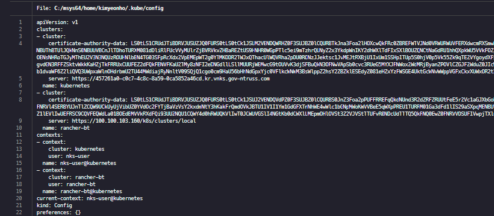
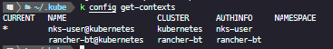
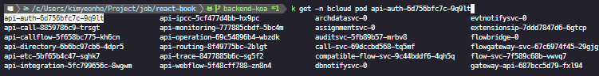
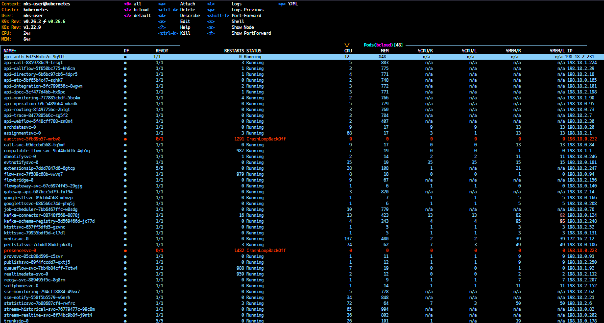
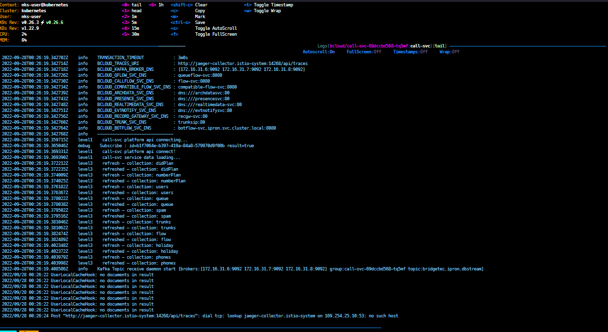

#### Kubeconfig

```bash
~/.kube/config
```

명령을 통하거나 수동으로 여러 개의 `kubeconfig`파일을 병합하여 `context` 구성





```bash
k config use-context {context}
```

위의 명령어를 통해 여러 클러스터에 접근 할 수 있습니다.

### kubectl

[k8s doc](https://kubernetes.io/docs/reference/kubectl/cheatsheet/)

#### Bash

```bash
source <(kubectl completion bash) # setup autocomplete in bash into the current shell, bash-completion package should be installed first.
echo "source <(kubectl completion bash)" >> ~/.bashrc # add autocomplete permanently to your bash shell.
```

```bash
alias k=kubectl
complete -o default -F __start_kubectl k
```

#### Zsh

```bash
source <(kubectl completion zsh)  # setup autocomplete in zsh into the current shell
echo '[[ $commands[kubectl] ]] && source <(kubectl completion zsh)' >> ~/.zshrc # add autocomplete permanently to your zsh shell
```

#### 적용 확인

적용 후 `tab`키를 통해서 자동완성으로 `resource`들을 확인 할 수 있습니다.



### k9s

**kubectl TUI**

```bash
$k9s -n bcloud
```





> `?`를 통해서 사용 명령어 확인이 가능합니다.
