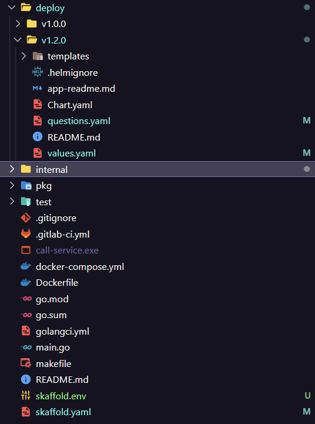
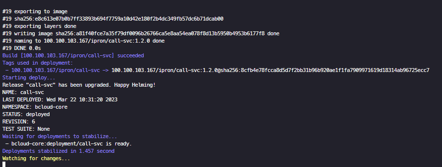
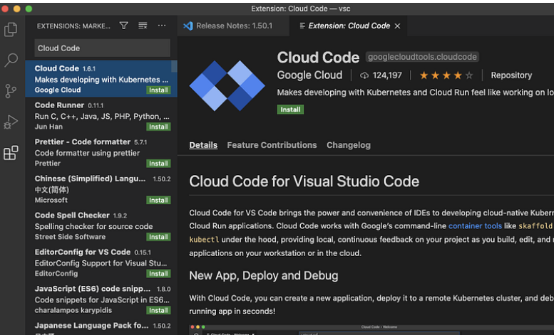
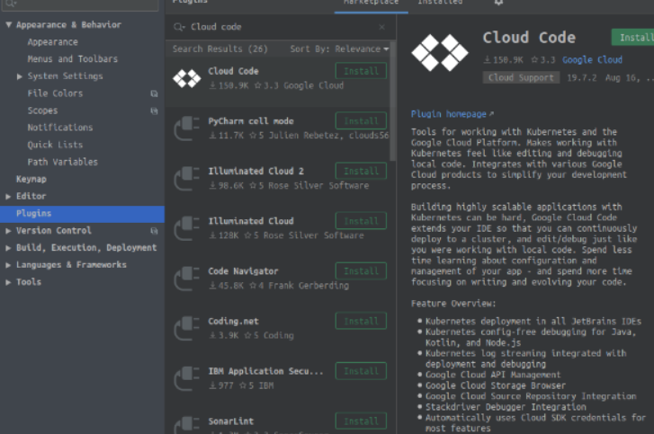

회사에 `devops`조직이 있는 곳이라면 `CI/CD`가 구성되어 빌드와 관련하여 개발자들이 따로 신경 쓰지 않아도 진행이 가능합니다. 하지만 개발을 하다보면 변경사항을 수정하고 k8s 반영하는 부분은 사람을 힘들게 하는데요. kubernetes에서도 `nodemon, nano`같이 지속적인 개발을 가능하게 하는 도구가 있습니다.

#### skaffold

k8s에 지속적인 개발을 가능하게 하는 도구로써 `helm`에도 연동이 됩니다. 여담이지만 조대협님의 블로그를 보면 5년전에 `skaffold`에 대해서 기술하셨던데 대단하신 거 같습니다.

**install**

[다운로드](https://skaffold.dev/)

**directory**

`deploy`에 사용할 `helm`차트를 넣어줍니다.



**skaffold.env**

```yaml
IMAGE_VERSION=1.2.0
```

**skaffold.yaml**

```yaml
apiVersion: skaffold/v4beta2
kind: Config
metadata:
  name: call-service
build:
  tagPolicy:
    envTemplate:
      template: {{.IMAGE_VERSION}}
  local:
    push: true
    useDockerCLI: true
  artifacts:
    - image: 100.100.103.167/ipron/call-svc
      docker:
        buildArgs:
          CI_USER: kyh0703
          CI_TOKEN: hkUy7Pv-xDrBZmabUYW7
        dockerfile: Dockerfile
      sync:
        manual:
          - dest: .
            src: '*.go'
deploy:
  helm:
    releases:
      - name: call-svc
        chartPath: deploy/v1.2.0
        valuesFiles:
          - deploy/v1.2.0/values.yaml
        version: 1.2.0
        namespace: bcloud-core

```

**command**

```bash
$ skaffold dev
```



지속적인 모니터링을 하며, `sync`에 기술한 파일이 변경되면 재빌드를 진행합니다. 여러가지 옵션들도 많고 `portPorwading`과 같이 `k8s`를 쉽게 사용할 수 있도록 `yaml`에 기술하여 사용할 수 있습니다.

```yaml
        
portForward:
- resourceType: deployment
  resourceName: call-deploy
  namespace: core
  port: 8080
  localPort: 9000 # *Optional*
```

#### vscode, inteliJ





`skaffold`와 연계된 플러그인을 통해 디버그 및 개발을 좀 더 용이하게 해줍니다.

[조대협님 블로그 vscode](https://bcho.tistory.com/1351)

[조대협님 블로그 intelij](https://bcho.tistory.com/1350)
