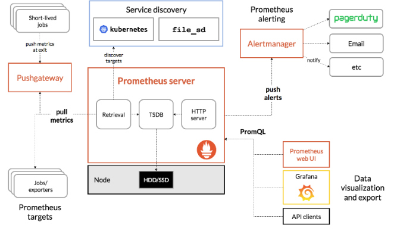

### 역할

#### Monitoring

* 메트릭 정보를 수집함

#### Alert/Alerting

* 알람을 설정할 수 있음

#### AlertManage

* 이메일, slack등 사용자에게 통보

### 구성요소

#### Target

* 스크랩할 개체의 정의
* 메트릭이 있는 개체

#### Instance

* 스크랩하려는 주소
  * 1.2.3.4:5080

#### Job

* 동일한 목적을 가진 인스턴스의 모음
* 유사한 프로세스 그룹을 모니터링함

### Prometheus Server 구조

#### 검색

프로메테우스는 집계에 두가지 방식을 사용함

* pull
  * Jobs/Exportes에 metrics을 주기적으로 pull하여 가져옴
* push
  * short-lived jobs --(전송)--> pushGateway <-- (pull) Prometheus
  * 짧은 주기의 job은 수집하기전에 죽을 수 있기에 직접 push 함
* discover target
  * kubenetes에 질의

#### 저장

* TSDB/Storage
* HDD, SDD 저장

#### Http 서버

* Prometheus Web UI
* Grafana(visualization)
* API client

#### 알람 매니저

* Email
* Slack
* etc

