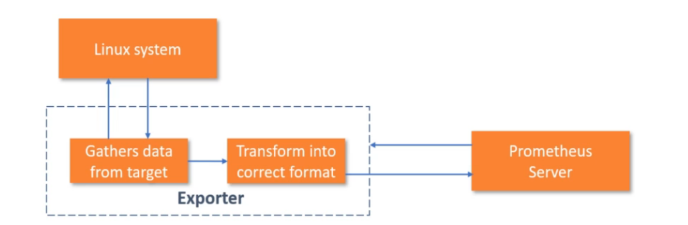

### Exporters



* 프로그램은 메트릭을 구현하여야 한다.
* 운영체제커널의 정보같은 경우에는 측정항목을 직접 추가하여야 한다.
* 이러한 시스템을 모니터링 하기 위해서는 `exporter`가 필요하다.
* 프로메테우스가 이해 할 수 있는 형식으로 변경

### node_exporter

* 노드 exporter는 커널 수준을 노출한다.
* linux, unix 표준 메트릭 제공
* CPU, memory, disk, I/O, Network

* 운영체제에 맞게 노드 익스포터 설치

```yaml
# my global config
global:
  scrape_interval: 15s # Set the scrape interval to every 15 seconds. Default is every 1 minute.
  evaluation_interval: 15s # Evaluate rules every 15 seconds. The default is every 1 minute.
  # scrape_timeout is set to the global default (10s).

# Alertmanager configuration
alerting:
  alertmanagers:
    - static_configs:
        - targets:
          # - alertmanager:9093

# Load rules once and periodically evaluate them according to the global 'evaluation_interval'.
rule_files:
  # - "first_rules.yml"
  # - "second_rules.yml"

# A scrape configuration containing exactly one endpoint to scrape:
# Here it's Prometheus itself.
scrape_configs:
  # The job name is added as a label `job=<job_name>` to any timeseries scraped from this config.
  - job_name: 'prometheus'

    # metrics_path defaults to '/metrics'
    # scheme defaults to 'http'.

    static_configs:
      - targets: ['localhost:9090']

  # new Job
  - job_name: 'node_exporter'
    static_configs:
      - targets: ['localhost:9100']
```

