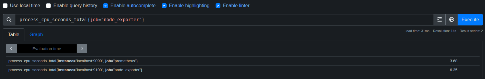

### PromQL

* Select 뿐만 아니라 모든 종류의 작업을 수행할 수 있는 기능을 제공
* 집계, 분석 및 자동 작업 수행

#### 데이터 유형 4가지

* 인스턴트 벡터
* 범위 벡터
* 스케일러
* 문자열

**인스턴트 벡터**

* 쿼리 평가 시점 전 가장 최근 샘플의 데이터
* 모든 값에 대해 타임 스탬프를 가지고 있다.


**범위 벡터**

* 범위를 포함하는 시계열 집합
* 쿼리시점까지 Time Duration에 대해 일치하는 모든 시계열을 가지고 있다.


**스케일러**

* 차원이 없는 단일 숫자
* 레이블이 없는 그냥 숫자

**문자열**

* 레이블이 없는 문자열

### Selectors & Matchers



```bash
process_cpu_seconds_total{job="node_exporter",instance="localhost:9100"}
```

* `{}`를 이용해서 필터링을 할 수 있다.
* `{}`이 중괄호를 프로메테우스에서는 `matcher`라고 한다.
* 다중 조건은 `,`를 통하여 구성할 수 있다.

#### Matcher Types

* Equality matcher (=)
* Negative Equality Matcher (!=)
* Regular expression matcher (=~)
  * ex) =~"/api.*"
* Negative Regular expression matcher (!~)


### 연산자


산술 연산자

```bash
$ node_memory_MemTotal_bytes/1024/1024
$ prometheus_http_requests_total*2
```

비교 연산자

```bash
$ node_cpu_seconds_total>500
```

논리연산자

```bash
$ prometheus_http_requests_total or promhttp_metric_handler_requests_total
```

#### 무시 & 켜기

ignoring

```bash
$ prometheus_http_requests_total and ignoring(handler) promhttp_metric_handler_requests_total
```

on

```bash
$ promhttp_metric_handler_requests_total and on(code) prometheus_http_requests_total 
```

#### 집계연산자

프로메테우스는 내장 집계 연산자를 지원함

* sum
* min
* max
* avg
* stddev
* stdvar
* count
* count_values
* bottomk
* topk
* quantile

```bash
# 그룹별로 합산
$ sum(prometheus_http_requests_total) by (code)

# 탑 3개 
$ topk(3, sum(node_cpu_seconds_total) by (mode))

# 아래 3개
$ bottomk(3, sum(node_cpu_seconds_total) by (mode))

# 카운트
$ count(node_cpu_seconds_total)
```

### Function

* 약 40개의 내장 함수를 제공

**rate**


* 주로 카운터 유형 메트릭과 함께 사용하며 초당 계산함.
* 초당 평균 변화율을 계산함
* 느리게 변화하는 카운터에는 rate를 사용

**irate**

* 초당 순간 변화율을 계산함.
* 변화율은 마지막 데이터 포인트 두개를 가지고 계산
* 변덕 스럽고 빠르게 변화하는 카운터를 그래프로 표현할 때 좋음

**changes**

```bash
changes(process_start_time_seconds{job="node_exporter"}[1h])
```

* 한시간동안 변경됬는지

**deriv**

* 게이지가 얼마나 빨리 변하는지 확인가능

**predict_linear**

* 게이지의 이전 패턴을 확인하여 미래 가치를 예측

**max_over_time**
