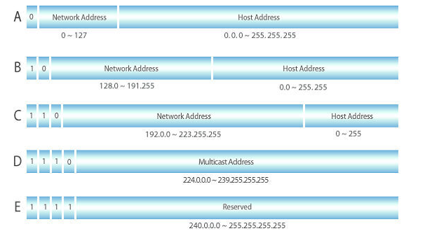
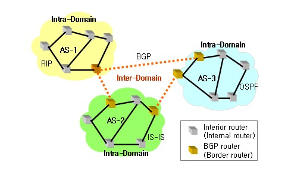

[실습링크](https://terraform101.inflearn.devopsart.dev/preparation/aws-configure/)

### VPC

Amazon VPC는 Amazon에서 제공하는 private한 네트워크 망

* `VPC(Virtual Private Cloud)` 사용자의 AWS 계정 전용 가상 네트워크
* `서브넷` VPC의 IP 주소 범위
* `라우팅 테이블` 네트워크 트래픽을 전달할 위치를 결정하는 규칙집합
* `인터넷 게이트웨이` VPC리소스와 인터넷 통신을 연결하는 게이트웨이
* `NAT 게이트웨이` 네트워크 주소 변환을 통해 "프라이빗 서브넷"에서 공인망 연결하는 게이트웨이
* `시큐리티 그룹` 인바운드 아웃바운드 트래픽을 제어하는 가상 방화벽 열할을 하는 규칙 집합
* `VPC 엔드포인트` 인터넷 게이트웨이, NAT 디바이스, VPN 연결 또는 AWS Direct Connect 연결을 필요로 하지 않고 PrivateLink 구동 지원 AWS 서비스 및 VPC 엔드포인트 서비스에 VPC를 비공개로 연결

> 외부공인망으로 나갈때 인터넷 게이트웨이면, 퍼블릭 서브넷
>
> 공인 IP를 가지고 있지만 NAT GW를 통해 인터넷을 할수 있으면 프라이빗 서브넷

### 사이더(네트워킹)

`사이더`(Classless Inter-Domain Routing, CIDR)는 클래스 없는 `도메인 간 라우팅 기법`으로 기존 할당방식인 네트워크 클래스를 대체하는 최신의 IP주소 할당 방법이다.

[잘정리된 블로그](https://kim-dragon.tistory.com/154)

* 기존 클래스체계보다 유연하다.





* `Intra-Domain`과 같이 각 네트워크 대역을 구분 짓고 `Inter-Domain`과 같이 구분된 네트워크 간 통신을 위한 주소체계

```bash
      - Octet - IP를 표현하는 방식이 옥텟이라는 단위로 나누어짐 
[1 0 0 0 1 1 1 1] [0 0 0 0 0 1 1 1] [0 1 0 0 0 0 0 1] [1 1 0 0 1 0 1 1]
[     143       ].[       7       ].[        65     ].[       203     ]

# /24이면 24비트 이후에 오는 4번째 옥텟을 전부 사용할 수 있다는 표현
```

