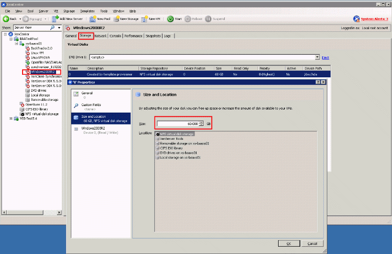

### XEN 서버 디스크 용량 확장

`VM`을 사용하다 보면 디스크를 파티션을 재 할당하거나 디스크를 확장해야되는 경우가 있습니다. 저는 많이 해맸었던 기억이 납니다😂

그래서 제가 정리했던 내용을 공유할려고 합니다!

#### VM종료

먼저 VM을 작업하기 위해서 VM을 종료시켜줍니다.

#### VM DISK Storage 증가



`XenCenter`를 사용하여 `Storage`를 증가시켜줍니다.

> XenCenter를 사용하여 변경 불가시 아래와 같이 작업을 해줍니다.

```bash
# VM UUID는 XenCenter에서 확인가능
$> xe vm-disk-list vm {VM UUID}

# Storage UUID는 vm-disk-list를 통해 확인 가능
# 1GB=1073741824
# 1073741824 * GB
$> xe vdi-resize uuid={VM Storage UUID} disk-size={size}
```

#### 스토리지 부여

1. LVS (논리볼륨 확인)

```bash
$> lvs
VG   #PV #LV #SN Attr   VSize   VFree
rhel   1   2   0 wz--n- <49.52g    0
```

`lvs`명령어를 통해 논리볼륨을 확인합니다. 현재 장비는 PV를 하나만 사용하고 있는 것을 알 수 있습니다.

2. PVS(물리볼륨 확인)

```bash
$> pvs
PV         VG   Fmt  Attr PSize   PFree
/dev/xvda2 rhel lvm2 a--  <10.07g    0
```

`pvs` 명령어를 통해 물리볼륨을 확인합니다. 현재 장비는 PV하나만 있으면서 기존 디스크를 할당 한 것을 확인 할 수 있습니다.

3. parted(파티션)

```bash
$> parted /dev/xvda
GNU Parted 3.1
Using /dev/xvda
Welcome to GNU Parted! Type 'help' to view a list of commands.

# command (p) == print
(parted) p
Model: Xen Virtual Block Device (xvd)
Disk /dev/xvda: 32.2GB
Sector size (logical/physical): 512B/512B
Partition Table: msdos
Disk Flags:

# 10 GB가 할당되어 있으며 Flags를 보면 lvm으로 설정되어있음
Number  Start   End     Size    Type     File system  Flags
 1      1049kB  1000MB  999MB   primary  xfs          boot
 2      1000MB  10.7GB  10.2GB  primary               lvm

# resizepart NUMBER END 명령어를 통해 partion 디스크 할당
(parted) resizepart 2
End?  [10.7GB]? 100%

# 할당 후 재 확인
(parted) p
Model: Xen Virtual Block Device (xvd)
Disk /dev/xvda: 32.2GB
Sector size (logical/physical): 512B/512B
Partition Table: msdos
Disk Flags:
Number  Start   End     Size    Type     File system  Flags
 1      1049kB  1075MB  1074MB  primary  xfs          boot
 2      1075MB  32.2GB  31.1GB  primary               lvm
```

`parted` 명령어를 통해 파티션에 디스크를 할당 할 수 있습니다. `parted` 명령어는 `fdisk`명령어로도 대체가 가능합니다. 이어서 보시면 `p(print)`명령어를 통하여 상세 설정을 확인합니다. PVS에서 확인했던 10GB가 할당된 파티션을 확인 할 수 있고, `resizepart`명령어를 통해 확장했던 메모리를 부여 후 다시 한번 재 확인합니다.

4. PVS 재 확인

```bash
$> pvs
PV         VG   Fmt  Attr PSize   PFree
/dev/xvda2 rhel lvm2 a--  <9.00g    20.00g
```

결과를 보면 추가 한 사이즈만큼 `PFree`에 남아있는 것을 확인 할 수 있습니다.

5. LVM 확장

```bash
$> lvextend -l +100%FREE -r /dev/rhel/root
```

`lvextend`명령어를 통해 남은 사이즈 전체를 논리 볼륨에 할당 합니다.

> 디스크 용량을 정해서 할당 할 수도 있습니다.
>
> lvextend -L 10G -r /dev/rhel/root

6. 디스크 확장 확인

```bash
$> df -h
```

### 마치며

용량을 확장하는 작업의 경우 리스크가 크지 않습니다만 항상 주의하여 작업해주세요👏
