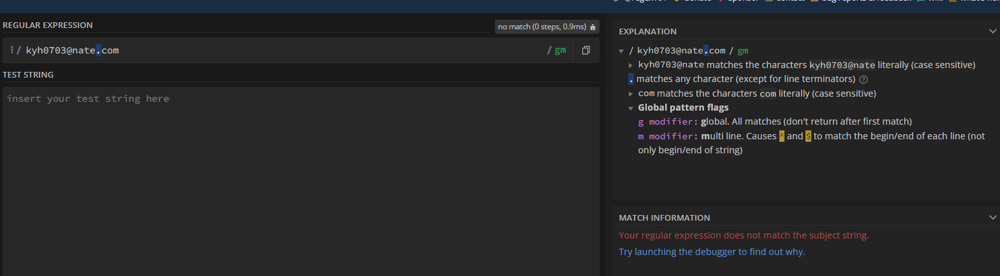

## 소개

### Regex(Regular expressions)

* 상세한 주석을 코드에 추가

```js
// find all filenames without space that end with js / jsx/ ts
const jsFilnameRe = /^\S.(jsx?|ts)$/
```

* 가독성이 좋은 정규식을 작성하는 것은 추후의 코드를 읽게 될 때 도움이 된다.

### 사용할 도구

* [regex101.com](https://regex101.com/)



* javascript: 정규식의 `/` 시작과 끝을 의미

## 명시적 문자 및 정량자

### 명시적 문자

* 있는 그대로의 문자를 말함

```js
// [Testcase]
// O hey
// O they
// X Hey
const regex = /hey/
```

### 정량자

* 하나의 문자가 연속으로 몇 번이나 이어질 수 있는지를 결정하는 정량자

| ?    | 0 또는 1번 연속될 수 있음                           |
| ---- | --------------------------------------------------- |
| +    | 상한 없이 한번 이상을 의미하지만 최소 한번이 필요함 |
| *    | 0 또는 그 이상의 연속을 의미 (제한 없이)            |

* `+`

```js
// [Testcase]
// O hey
// O they
// X Hey
// X h e y
// O heeeeeeeeeeeeey
const regex = /he+y/
```

* `?`

```js
// [Testcase]
// O kittens!
// O kitten!
// X kttenssssss!
// ---------
// 여기에서 ?가 있기에 "s?"로 정규식이 잡힘
// 0 또는 1번의 s를 의미한다.
const regex = /Kittens?!/
```

* `*`

```js
// [Testcase]
// O kittens
// O kittens!!!!
// O kittens!
// O kittens!!!!!!!!!!!
// ---------
// 여기에서 ?가 있기에 "!?"로 정규식이 잡힘
// 0 또는 1개이상의 !를 의미한다.
const regex = /Kittens!*/
```

### 특수문자

`.`:  newLine을 제외한 모든 문자라는 의미

```js
// [Testcase]
// X kittens
// O kittens!!!!
// O kittens!
// O kittens!!!!!!!!!!!
const regex = /Kittens.+/
```

`.`을 의도한 것이라면 `\.`로 문자를 지정하여야 한다.

`\` 필요한 특수 문자들(+ ? * . {} [] 9 0 ^ $...)

```js
// [Testcase]
// O Kittens........
// X Kittens!!!
const regex = /Kittens\.+/
```

### 중괄호 정량자

0 이나 1이 아닌 최소 3번연속의 정량자를 지정할 경우를 생각해 볼 수 있다.

이 경우 중괄호`{}`를 사용할 수 있다.

| {1, 3} | between   |
| ------ | --------- |
| {3}    | exactly   |
| {3, }  | more then |

```js
// [Testcase]
// O kittens....... (kittens...)
// O kittens.
// O kittens..
const regex = /Kittens\.{1,3}/

// [Testcase]
// O kittens....... (kittens...)
// X kittens.
// X kittens..
const regex = /Kittens\.{3}/

// [Testcase]
// O kittens....... (kittens.......)
// X kittens.
// X kittens..
const regex = /Kittens\.{3,}/
```

